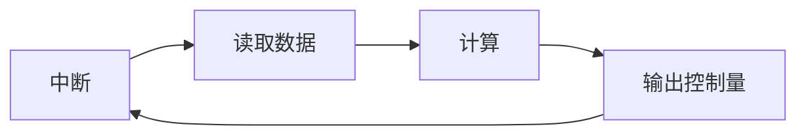

### **连续时间系统**

一般来说系统的状态变化都是连续的

### 离散时间系统

数字控制器，有时候计算时需要将系统的状态离散化，控制器是离散的输出。这就需要将离散系统和连续系统结合起来，需要用到一些模块。首先是通过ADC将传感器信号采样并转化为离散输出，同时其他的参数都将是离散的形式。随后控制器的输出将会通过DAC转化为连续的系统输出，控制量的输出需要使用到保持器来保证在一个控制周期之内的控制量保持不变。

对于采样，采样频率太快会使数据堆积，需要大量的存储数据，采样频率太小，小于控制周期，会产生误差，采样频率一般采用被采样数据频率的2倍甚至是5-10倍，如果在中断中采样并且处理数据的话，采样周期一定要大于处理所用的时间，否则这段期间内的采样就没有了意义。

有时候会把连续系统近似为离散的系统之后设计算法来控制系统，连续系统与离散系统的转换

### 采样周期的选取

- 一般来说肯定是采样周期越小越好 $T→0 \Rightarrow y[k]\rightarrow y(t)$，需要存储大量数据，内存占用多
- $T\uparrow$ 会导致产生混叠，根据采样定理，采样频率至少为信号最高频率的2倍，一般选择5~10倍

对于实时控制器来说

读取数据，计算和输出控制量需要在一个采样周期内完成

- 测量频率太低，会忽略掉很多系统变化的数据，输出的控制量也就跟不上实际的情况
- 测量频率过高，会产生两个问题，可能会采集到大量的重复信息，无法实施计算好的控制量

### 控制器的设计

将连续的系统近似转化成离散系统之后，直接使用离散系统中设计的控制器来进行分析，最后再运用到混合系统中

### 离散化

对于系统

$$
\dot{x(t)}=Ax(t)+Bu(t)
$$

解为

$$
x(t)=e^{A(t-t_0)}x(t_0)+\int_{t_0}^te^{A(t-\tau)}Bu(\tau)d\tau
$$

一般会使用零阶保持器，所以可以选取

$$
kT\leq t\leq (k+1)T\\u(\tau)=u(kT)
$$

得

$$
x(t_{k+1})=e^{A(t_{k+1}-t_k)}x(t_k)+\int_{t_k}^{t_{k+1}}e^{A(t_{k+1}-\tau}Bu(\tau)d\tau
$$

即

$$
x(t_{k+1})=e^{A(t_{k+1}-t_k)}x(t_k)+Bu(kT)\int_{t_k}^{t_{k+1}}e^{A(t_{k+1}-\tau}d\tau 
$$

可以写作

$$
x[k+1]=e^{AT}x[k]+Bu[k]\int_0^Te^{AT}d\tau
$$

一般来说会对 $e^{AT}$ 进行泰勒展开

$$
e^{AT}=1+AT+\frac{A^2}{2!}T^2+...
$$

相对来说会更精确一些