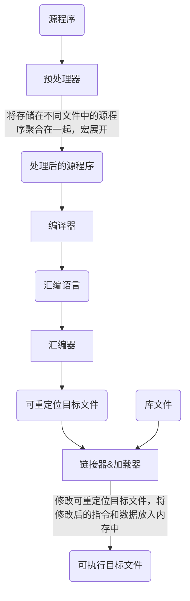
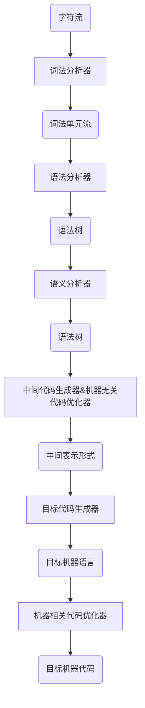
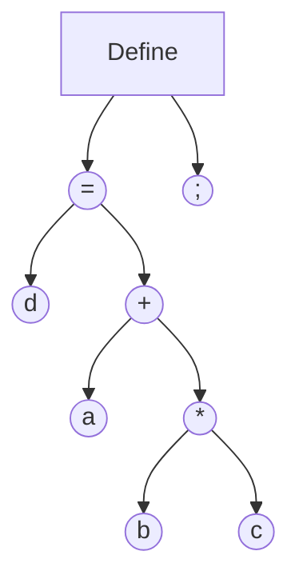
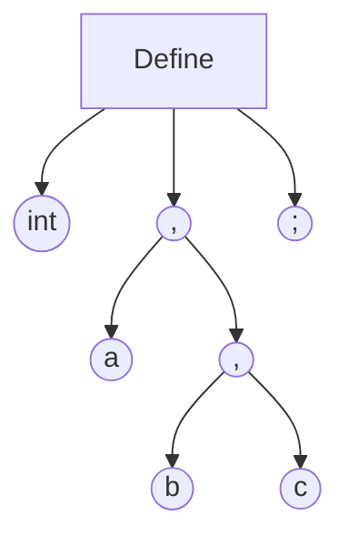
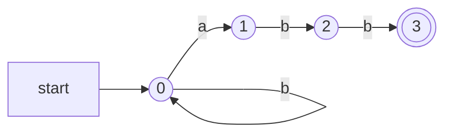
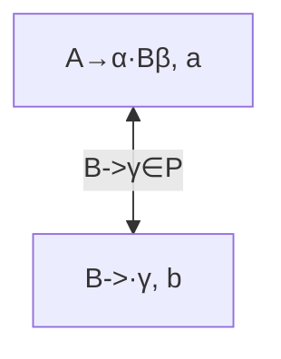
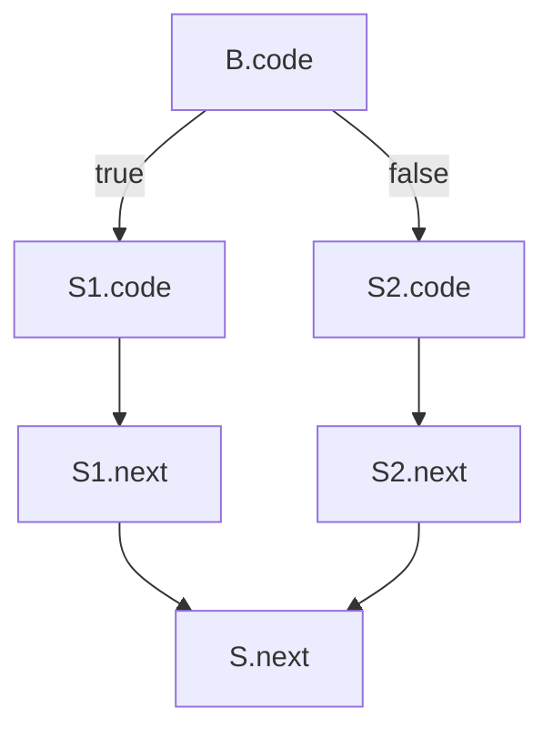
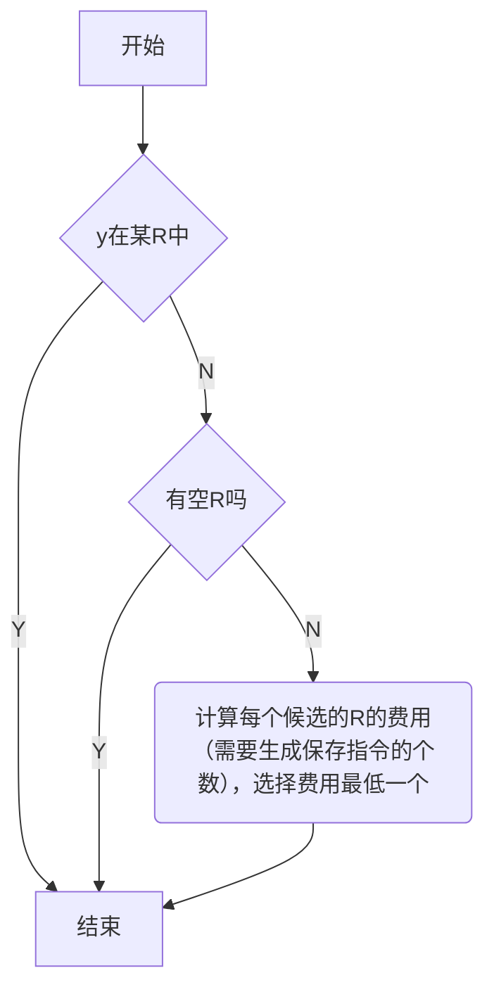
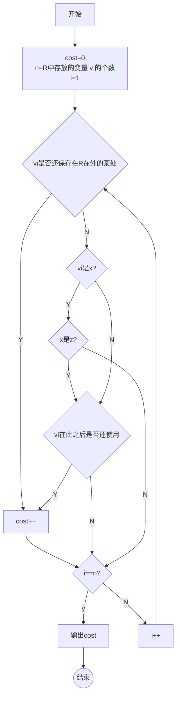

## 编译器的结构介绍


编译流程



编译器结构



其中机器无关代码优化器之前的部分都是属于前端，与源语言相关，之后的部分属于后端，与目标语言相关

### 词法分析

任务：

从左向右逐行扫描源程序的字符，识别出各个单词，确定单词的类型，将识别出的单词转换成统一的机内表示——词法单元(token)形式

其中token是一个二元组，<种别码，属性值>

| 单词类型 | 种别             | 种别码                                     |
| -------- | ---------------- | ------------------------------------------ |
| 关键字   | program, if…     | 一词一码                                   |
| 标识符   | 变量名，过程名   | 多词一码（太多了，不确定性，所以多词一码） |
| 常量     | 整形             | 一型一码                                   |
| 运算符   | 算数，关系，逻辑 | 一词一码或者一型一码                       |
| 界限符   | ; = {} ()        | 一词一码                                   |

可以检测的错误的类型：

1. 单词拼写错误
2. 非法字符

词法错误检测：

如果当前状态与当前输入符号在转换表中对应的信息为空，则报错，调用错误处理程序

错误处理：

查找已扫描字符串中最后一个对应于某终态的字符：

- 如果找到了，将该字符与其前面的字符识别成一个单词，然后将输入指针退回到该字符，扫描器重新回到初始状态，继续识别下一个单词
- 没找到，确定出错，采用错误恢复策略

### 语法分析

任务：

从词法分析器输出的token序列中，识别出各类短语，并构造语法分析树

- 对于赋值语句 `d=a+b*c;`



- 对于声明语句 `int a, b, c;`



### 语义分析

高级程序语言中的语句分为两类

- 声明语句
    
    任务：
    
    收集标识符的属性信息
    
    1. 种属——简单变量，复合变量，过程。。。
    2. 类型——整形，字符。。。。
    3. 存储位置和长度
    4. 值
    5. 作用域
    6. 对于过程还有参数和返回值信息
    
    标识符存放在符号表中，通常还有一个字符串表，用于存放标识符和字符常数。在符号表中的name字段分成两个部分，第一个部分是在字符串表中的起始位置，另一个部分是标识符的长度
    
- 执行语句
    
    任务：
    
    语义检查
    
    常见的语义错误
    
    - 变量或过程未经声明就使用
    - 变量或过程名重复声明
    - 运算分量类型不匹配 （可以进行自动类型转换）
    - 操作符与操作数之间类型不匹配
        - 数组下标不是整数
        - 对于非数组使用数组访问形式
        - 对于非过程名使用过程调用操作符
        - 过程调用得到参数类型或数目不匹配
        - 函数返回类型有误

### 中间代码生成和编译器后端

- 中间代码生成
    
    源程序的中间表示可以有多种形式
    
    - 三地址码
        
        三地址指令码由类似于汇编语言的指令序列组成，每个指令**最多**有三个操作数
        
        其中的地址可以有三种形式
        
        - 源程序中的名字
        - 常量
        - 编译器生成的临时变量
        
        将指令表示成数据结构有三种形式
        
        - 四元式 (运算符, 源操作数1, 源操作数2, 目的操作数)
        - 三元式
        - 间接三元式
    - 语法结构树/语法树
- 目标代码生成器
    
    以源程序的中间表示形式作为输入，并且把它映射到目标语言
    
    任务：
    
    为程序中使用的变量合理分配寄存器
    
- 代码优化
    
    为改进代码所使用的等价程序变换，使其运行得更快，占用空间更小
    
    - 机器无关代码优化
    - 机器相关代码优化

## 语言及其文法

### 基本概念

- 字母表$\Sigma$
    
    是一个有穷符号集合 （ASCII，UNICODE）
    
    其中包括：字母，数字，标点符号…
    
    运算：
    
    - 乘积 $\Sigma_1\Sigma_2={ab\ |a\in\Sigma_1,b\in\Sigma_2}$
    - 幂运算 $\left\{\begin{aligned}\Sigma^0&={\varepsilon}\\\Sigma^n&=\Sigma^{n-1}\Sigma&&n\geq1\end{aligned}\right.$为长度为n的符号串构成的集合
    - 正闭包 $\Sigma^+=\Sigma \bigcup \Sigma^2 \bigcup \Sigma^3…$ 正整数次幂的并集
    - 克林闭包 $\Sigma^*=\Sigma^0 \bigcup \Sigma^+$ 任意符号串构成的集合，并且符号串长度可以为0
- 串
    
    对于一个字母表，字母表的克林闭包的每个元素都是字母表上的一个串，串是字母表中符号的一个有穷序列，串s的长度记作 |s| ，是指串中符号的个数。长度为0的串为空串，记为 $\varepsilon$
    
    运算：
    
    - 连接 $x连接y=xy$， $x\varepsilon = \varepsilon x = x$
    - 幂运算 $\left\{\begin{aligned}s^0&={\varepsilon}\\s^n&=s^{n-1}s&&n\geq1\end{aligned}\right.$

### 文法的定义

$G=(V_T,V_N, P, S)$

- $V_T$ 终结符集合
    
    是文法所定义的语言的基本符号，有时也称为 token
    
- $V_N$ 非终结符集合
    
    用来表示语法成分的符号，也称为语法变量
    
    $V_T \cap V_N = \Phi$
    
    $V_T \cup V_N = 文法符号集$
    
- $P$ 产生式集合
    
    描述了将终结符和非终结符组合成串的方法
    
    产生式一般形式： $\alpha → \beta$ 读作 $\alpha$ 定义为 $\beta$
    
    - $\alpha\in(V_T\cup V_N) ^+$ 并且其中至少包含一个 $V_N$ 中的元素，称为产生式的头或者左部
    - $\beta\in(V_T\cup V_N) ^*$ 常委产生式的体或者右部
    - 简写 $\alpha→\beta_1,\alpha→\beta_2 ⇒ \alpha→\beta_1|\beta_2$
- $S$ 开始符号
    
    $S \in V_N$ 表示该文法中的最大的语法成分
    

### 语言的定义

- 推导
    
    给定文法 $G=(V_T, V_N, P, S)$ 如果 $\alpha → \beta \in P$ 那么可以将符号串 $\gamma \alpha \delta$ 中的 $\alpha$ 替换成 $\beta$，记作  $\gamma \alpha \delta \Rightarrow \gamma \beta \delta$。  $\gamma \alpha \delta$ 直接推导出 $\gamma \beta \delta$，就是用产生式的右部替换左部
    
    $\alpha \Rightarrow^n \alpha_n$称作n步推导
    
    - $\Rightarrow^+$ 正数步推导出
    - $\Rightarrow^*$ 若干步推导出
- 归约
    
    利用产生式的右部替换成左部
    
- 句型
    
    如果 $S \Rightarrow^* \alpha，\alpha \in (V_T\cup V_N)^*$ 则称 $\alpha$ 是 $G$ 的一个句型。
    
    句型既可以包含终结符，也可以包含非终结符，也可能是空串
    
- 句子
    
    如果 $S \Rightarrow^* w, w \in V_T$ 则称 $w$ 是 $G$ 的一个句子。
    
    是不包含非终结符的句型
    
- 语言
    
    由文法 $G$ 的开始符号 $S$ 推导出的所有句子构成的集合称为文法 $G$ 的生成语言，记作 $L(G)$
    
    $L(G)={w|S\Rightarrow^*w, w\in V_T^*}$
    
    
    

### 文法的分类

- chomsky 文法分类体系
    - 0型
        
        无限制文法，要求产生式的左部至少包含一个非终结符
        
    - 1型
        
        上下文有关文法，要求产生式左部的长度不能大于产生式右部的长度
        
    - 2型 CFG
        
        上下文无关文法，产生式左部必须是一个非终结符
        
    - 3型
        
        正则文法
        
        1. 右线性文法，产生式右部，要么是一个终结符号串，要么是在终结符号串右侧加一个非终结符号
        2. 左线性文法，产生式右部，要么是一个终结符号串，要么是在终结符号串左侧加一个非终结符号
        
        最多只能有一个非终结符，而且位于一侧
        
    
    四级文法逐级限制， $0 \supset 1 \supset 2 \supset 3$
    

### CFG的分析树

定义

- 根节点的标号为文法开始符号
- 内部节点表示对一个产生式的应用，该节点的标号是此产生式的左部A，该节点的子节点的标号从左到右构成了产生式的右部
- 叶节点的标号既可以是非终结符号，也可以是终结符，从左到右排到叶节点得到的符号串称为是这棵树的产出或边缘
- 分析树中每一棵子树的边缘被称为该句型的一个短语，如果子树只有父子两代节点，那么这棵子树的边缘被称为该句型的一个直接短语，即高度为2的子树。直接短语一定是给定句型的产生式的右部，反之不成立

二义性文法

如果一个文法可以为某个句子生成多棵分析树，则称这个文法是二义性的

## 正则表达式

代数定律


### 正则定义

给一些正则表达式命名，并且在之后的正则表达式中像使用字母表中的符号一样使用这些名字

### 有穷自动机FA

对具有一系列离散的输入输出信息和有穷数目的内部状态（概括了对过去输入信息处理的状况）的一类处理系统建立的数学模型。系统只需要根据当前所处的状态和当前所面临的输入信息就可以决定系统的后继行为。每当系统处理了当前的输入之后，系统的内部状态也将发生改变


- 输入带：用于存放输入符号串
- 读头：从左向右逐个读取输入符号，不能修改，只读，不能往返移动
- 有穷控制器：具有有穷个状态数，根据当前的状态和当前输入符号控制进入下一个状态



**FA定义接收**

给定输入串x，如果存在一个对应于串x的从初始状态到某个终止状态的转换序列，则称串x被该FA接收。

**最长子串匹配原则**

- 当输入串的多个前缀与一个或多个模式匹配时，总是选择最长的前缀进行匹配
- 在到达某个状态之后，只要输入带上还有符号，FA就继续前进，以便寻找尽可能长的匹配

### 有穷自动机分类

正则文法 $\Leftrightarrow$ 正则表达式 $\Leftrightarrow$ FA

- 确定的有穷自动机 DFA
    
    $M=(S,\Sigma,\delta,s^0,F)$ 
    
    - S 有穷状态集
    - $\Sigma$ 输入字母表，即输入符号集合
    - $\delta$ 将 $S*\Sigma$ 映射到S的转换函数。 $\forall s \in S, a\in \Sigma, \delta(s, a)$ 表示从状态s出发，沿着标记为a的边所能够到达的**状态**
    - $s_0$ 开始状态， $s_0\in S$
    - F 接收状态集合， $F\subseteq S$
- 非确定的有穷自动机 NFA
    
    $M=(S,\Sigma,\delta,s^0,F)$ 
    
    - S 有穷状态集
    - $\Sigma$ 输入字母表，即输入符号集合
    - $\delta$ 将 $S*\Sigma$ 映射到 $2^S$ 的转换函数。 $\forall s \in S, a\in \Sigma, \delta(s, a)$ 表示从状态s出发，沿着标记为a的边所能够到达的**状态集合**
    - $s_0$ 开始状态， $s_0\in S$
    - F 接收状态集合， $F\subseteq S$
- 带有 $\varepsilon -边$ 的NFA
    
    $M=(S,\Sigma,\delta,s^0,F)$ 
    
    - S 有穷状态集
    - $\Sigma$ 输入字母表，即输入符号集合
    - $\delta$ 将 $S*(\Sigma \cup \{\varepsilon\})$ 映射到 $2^S$ 的转换函数。 $\forall s \in S, a\in (\Sigma \cup \{\varepsilon\}), \delta(s, a)$ 表示从状态s出发，沿着标记为a的边所能够到达的**状态集合**
    - $s_0$ 开始状态， $s_0\in S$
    - F 接收状态集合， $F\subseteq S$
    - 空边表示不需要任何输入就可以进行状态转变0
- 子集构造法
    
    输入： NFA
    
    输出： 接收同样语言的DFA
    

## 语法分析

### 自顶向下的语法分析

是从分析树的顶部向分析树的底部方向构造分析树，可以看成是从文法开始符号S推导出词串的过程

每一步推导中，都需要做两个选择

- 替换当前句型中的哪个非终结符
- 用该非终结的哪个候选式进行替换

**最左推导**

总是选择每个句型的最左非终结符进行替换

根据下一个终结符选择最左非终结符的一个候选式

**最右归约**

是最左推导的逆向式

**最右推导——规范推导**

总是选择每个句型的最右非终结符进行替换

**最左归约——规范归约**

是最右推导的逆向式

**最左推导和最右推导是唯一的**

**递归下降分析**

由一组过程组成，每个过程对应一个非终结符

从文法开始符号S对应的过程开始，其中递归调用文法中其他的非终结符对应的过程。如果S对应的过程体恰好扫描了整个输入串，则完成语法分析。否则可以回溯来重新扫描

**预测分析**

是递归下降分析的一个特例，在输入中向前看固定个数的符号来选择正确的产生式

预测n步的LL(n)  文法

### 文法转换

当同一个非终结符的多个候选式存在共同前缀时，将导致回溯现象

**左递归**

- 直接左递归——直接左递归经过一次推导就可以看出文法存在左递归 $A→A\alpha$
- 间接左递归——间接左递归侧需多次推导才可以看出文法存在左递归 $A→beta→A\alpha$

左递归文法会使递归下降分析器陷入无限循环，需要消除，可以把左递归转换成右递归

栗子：

$A→A(\alpha|\beta)$ ⇒ $A→(\beta|\alpha) A'\ A'→(\alpha|\beta)A'|\varepsilon$

**消除左递归算法**

- 输入：不含循环推导和空产生式的文法G
- 输出：等价的无左递归文法
- 方法
    
    
    

**提取左公因子**

将推导式中最左侧公共部分提取出来

栗子：

$S→aAd|aBe\\A→c\\B→b$

$S→aS’\\S’→Ad|Be\\A→c\\B→b$

实际上是改写产生式来推迟决定，等读入足够多的输入，获得足够的信息再做出正确的选择

### 预测分析的文法

**预测分析法的工作过程**

从文法开始符号出发，在每一步推导中根据当前句型的最左非终结符A和当前输入符号a，选择正确的A-产生式，为保证分析的确定性，选出的候选式必须是唯一的

**S_文法——简单的确定性文法**

- 每个产生式的右部都以终结符开始
- 同一非终结符的各个候选式的首终结符的都不同
- 不包含空产生式
- 根据当前输入符号最多选取一个候选式，不产生冲突

**非终结符的后继符号集**

可能在某个句型中紧跟在 A 后边的终结符的集合，记作 $FOLLOW(A)$， $FOLLOW(A)={a| S\Rightarrow^*\alpha A a \beta, a \in V_T, \alpha, \beta \in (V_T \cup V_N)^*}$

如果 A 是某个句型的最右符号，则将结束符 ”$” 添加到 $FOLLOW(A)$ 中

**产生式的可选集**

- 产生式 $A→\beta$ 的可选集是指可以选用该产生式进行推导时对应的输入符号的集合，记作 $SELECT(A→B)$
- 如果 $\varepsilon \in FIRST(\alpha)$，那么 $SELECT(A→\alpha)=(FIRST(\alpha)-\{\varepsilon\})\cup FOLLOW(\alpha)$
- 如果 $\varepsilon \notin FIRST(\alpha)$，那么 $SELECT(A→\alpha)=FIRST(\alpha)$

**q_文法**

- 每个产生式的右部或为 $\varepsilon$，或以终结符开始
- 具有相同左部的产生式右不相交的可选集
- 不含右部为非终结符开头的产生

**串首终结符集**

- 串首终结符：串首的第一个符号并且是终结符
- 给定一个文法符号串 $\alpha$，α的串首终结符 FIRST(α) 被定义为可以从 α 推导出的所有串首终结符构成的集合。如果 $\alpha ⇒^* \varepsilon$，那么 $\varepsilon$ 也存在 FIRST(α) 中
- 对于 $\forall \alpha \in (V_T\cup V_N)^+, FIRST(\alpha) = \{a|\alpha⇒^*a \beta, a \in V_T, \beta \in (V_T \cup V_N)^*\}$
- 如果 $\alpha⇒^*\varepsilon$ 则 $\varepsilon \in FIRST(\alpha)$

**LL(1)文法**

文法G是LL(1)的，当且仅当G的任意两个具有相同左部的产生式 $A→\alpha|\beta$ 满足以下条件

- 如果 α 和 β 均不能推导出 ε，则 $FIRST(\alpha)\cap FIRST(\beta)=\Phi$
- α 和 β 至多有一个能推导出 ε
- 如果 $\beta⇒^*\varepsilon$，则 $FIRST(\alpha)\cap FOLLOW(A)=\Phi$
- 如果 $\alpha⇒^*\varepsilon$，则 $FIRST(\beta)\cap FOLLOW(A)=\Phi$
- 同一非终结符的各个产生式的可选集互不相交

### FIRST集与FOLLOW集的计算

**FIRST集的计算**

不断应用下列规则，直到没有新的终结符或者空串可以被加入到任何FIRST集合中为止

- 如果X是一个终结符，那么FIRST(X)={X}
- 如果X是一个非终结符，且 $X→Y_1…Y_k \in P (k\geq 1)$，那么如果对于某个i，a在 $FIRST(Y_i)$ 中且空串在所有的 $FIRST(Y_1),,,,FIRST(Y_{i-1})$ 中（即 $Y_1….y_{i-1}⇒^*\varepsilon$），就把a加入到 FIRST(X) 中。如果对于所有的 j=1, 2…..,k, ε 在 $FIRST(Y_j)$ 中，那么将空串加入到 FIRST(X)
- 如果 $X→\varepsilon \in P$，那么将空串加入到 FIRST(X)中

**计算串 $X_1, X_2….X_n$ 的FIRST集合**

- 将 $FIRST(X_1, X_2…X_n)$加入 $FIRST(X_i)$中所有的非空串符号
- 如果非空串在 $FIRST(X_1)$中，再加入 $FIRST(X_2)$中的所有非 ε 符号，如果ε在 $FIRST(X_1)$ 和 $FIRST(X_2)$ 中，再加入 $FIRST(X_3)$ 中的所有非 ε 符号，以此类推
- 最后，如果对于所有的 i，ε都再 $FIRST(X_i)$ 中，那么将 ε 加入到 $FIRST(X_1. X_2…X_n)$ 中

**FOLLOW集的计算**

不断应用下列规则，直到没有新的终结符或者空串可以被加入到任何FOLLOW集合中为止

- 将 “$” 放入FOLLOW(S) 中，其中S是开始符号，$ 是输入右端的结束标记
- 如果存在一个产生式 A→αBβ，那么FIRST(β)中除了ε之外的所有符号都在FOLLOW(B)中
- 如果存在一个产生式 A→αB，或存在产生式 A→αBβ且FIRST(β)包含ε，那么FOLLOW(A)中的所有符号都在FOLLOW(B)中

FIRST与FOLLOW集都计算出来之后就可以计算出SELECT集

### LL(1)文法的分析方法

- 递归分析方法
    
    在递归下降分析中，编写每一个非终结符对应的过程，根据预测分析表进行产生式的选择
    
- 非递归的预测分析法
    
    不需要为每个非终结符编写递归下降过程，而是根据预测分析表构造一个自动机，也叫表驱动的预测分析
    
    
    
    下推自动机与有穷自动机相比多了一个栈，也叫下推存储器，有了记忆的功能，比有穷自动机识别能力更强
    
    **表驱动的预测分析法**
    
    - 输入：一个串w和文法G的分析表
    - 输出：如果w在L(G)中，输出w的最左推导，否则给出错误指示
    - 方法：最初，语法分析器的格局如下：输入缓冲区中是w$，G的开始符号位于栈顶，其下面是$。下面的程序使用预测分析表M生成了处理这个输入的预测分析过程
    
    
    

对比

|          | 递归的预测分析               | 非递归的预测分析法                 |
| -------- | ---------------------------- | ---------------------------------- |
| 程序规模 | 程序规模大，不需要载入分析表 | 主控程序规模小，须载入分析表       |
| 直观性   | 较好                         | 较差                               |
| 效率     | 较低                         | 分析时间大约正比于待分析程序的长度 |
| 自动生成 | 较难                         | 较容易                             |

**预测分析法实现步骤**

1. 改造文法
2. 改造文法：消除二义性，消除左递归，消除回溯
3. 求每个变量的 FIRST 集和 FOLLOW 集，从而求得每个候选式的 SELECT 集
4. 检查是不是 LL(1) 文法。若是，构造预测分析表
5. 对于递归的预测分析，根据预测分析表为每一个非终结符编写一个过程；对于非递归的预测分析，实现表驱动的预测分析算法

### 预测分析中的错误检测

**下面两种情况下可以检测到错误**

- 栈顶的终结符和当前输入符号不匹配
- 栈顶非终结符号与当前输入符号在预测分析表对应项中的信息为空

**预测分析中的错误恢复**

- 恐慌模式：
    - 忽略输入中的一些符号，直到输入中出现由设计者选定的同步词法单元集合中的某个词法单元
        
        效果依赖于同步集合的选取，集合的选取应该使得语法分析器能从实际遇到的错误中快速恢复
        
    - 如果终结符在栈顶而不能匹配，一个简单的办法就是弹出此终结符

分析表的使用方法：（A表示栈顶的非终结符，a表示当前输入的符号，M表示预测分析表）

- 分析表中synch表示根据响应非终结符的FOLLOW集得到的同步词法单元
- 如果 M[A, a] 是空的，表示检测到错误，根据恐慌模式，忽略输入符号a
- 如果 M[A, a] 是synch，则弹出栈顶的非终结符A，试图继续分析后面的语法成分
- 如果栈顶的终结符和输入符号不匹配，则弹出栈顶的终结符

### 自底向上的语法分析

- 从分析树的底部向顶部方向构造分析树
- 可以看成是将输入串w归约为文法开始符号S的过程
- 语法分析采用最左归约方式
- 通用框架是：**移入-归约分析**
    
    就是将输入符号串从左向右不断移入栈中，并且判断栈顶的符号串是否能规约成某个文法的左部，如果可以将其推出然后压入对应的文法的左部。语法分析器不断地重复这个过程直到它检测到一个语法错误，或者栈中包含了开始符号且输入缓冲区为空为止，完成了语法分析
    
    1. 移入：将下一个输入符号移到栈的顶端
    2. 归约：被归约的符号串的右端必然处于栈顶。语法分析器在栈中确定这个串的左端，并决定用哪个非终结符来替换这个串
    3. 接收：宣布语法分析过程成功完成
    4. 报错：发现一个语法错误，并调用错误恢复子例程

### LR分析法

是最大的，可以构造出相应移入-归约语法分析器的文法类

- L：对输入进行从左到右扫描
- R：反向构造出一个最右推导序列

LR(k) 需要向前查看k个输入符号的LR分析，对于k=0和k=1这两种情况有实践意义

**基本原理**

- 自顶向下分析的关键问题：如何正确的识别句柄
- 句柄是逐步形成的，用”状态”表示句柄识别的进展程度
    
    
    | S→bBB  |          |
    | ------ | -------- |
    | S→·bBB | 移进状态 |
    | S→b·BB | 待约状态 |
    | S→bB·B | 待约状态 |
    | S→bBB· | 归约状态 |
    
    S→bBB
    
    S→·bBB 移进状态
    

**总体结构**


**算法**

- 输入：串w和LR语法分析表，该表描述了文法G的ACTION函数和GOTO函数
    - ACTION函数参数：状态编号和输入符号，函数值对应语法分析动作
    - GOTO函数参数：状态编号和非终结符，函数值对应后继状态
- 输出：如果w在L(G)中，则输出w的自底向上语法分析过程中的归约步骤，否则给出一个错误指示
- 方法：初始时，语法分析器栈中内容为初始状态 $s_0$，输入缓冲区中的内容为 w$。然后，语法分析器执行下面的程序
    
    
    

### LR(0) 分析

**LR(0)项目**

右部某位置标有圆点得到产生式称为相应文法的一个LR(0)项目，一般形式为： $A→\alpha_1·\alpha_2$

对于 $A→\varepsilon$ 只能是 $A→·$

**增广文法**

如果G是一个以S为开始符号的文法，则G的增广文法G’就是在G中加上新开始符号S’和产生式S’→S而得到的文法

目的是使文法开始符号仅出现在一个产生式的左边，使分析器只有一个可接收状态

把所有等价的项目组成一个项目集(I)，称为项目集闭包，每个项目集闭包对应着一个自动机的一个状态

**分析表构造**

需要构造函数

- CLOSURE函数
    
    计算给定项目集I的闭包
    
    $CLOSURE(I)=I\cup \{B→·\gamma |A→\alpha · B\beta\in CLOSURE(I), B→\gamma \in P\}$
    
    
    
    如果两个项目集除了展望符之外都相同，就说这两个项目集是同心的
    
- GOTO函数
    
    返回项目集I对应于文法符号X的后继项目集闭包
    
    $GOTO(I,X)=CLOSURE(\{A→\alpha X·\beta|A→\alpha·X\beta \in I\})$
    
    
    

构造LR(0)项集族——状态集

$C=\{I_0\}\cap \{I| \exist J \in C, X\in V_N\cup V_T, I=GOTO(J, X)\}$


分析表构造算法

$M=(C, V_N\cup V_T,GOTO,I_0,F)$

初始状态： $I_0=CLOSURE(\{S'→·S\})$

终止状态集合： $F=\{CLOSURE(\{S'→S·\})$

- 构造 G’ 的规范LR(0)项集族 $C=\{I_0, I_1….I_n\}$
- 令 $I_i$ 对应状态i。状态i的语法分析动作按照下面的方法决定
    - $if\ A→\alpha·a\beta\in I_i \ and\  GOTO(I_i,a)=I_j\ then\ ACTION[i, a]=sj$
    - $if\ A→\alpha·B\beta\in I_i \ and\ GOTO(I_i,B)=I_j\ then\ GOTO[i, B]=j$
    - $if\ A→\alpha·\in I_i \ and\ A\not= S'\ then\ for\ \forall a\in V_T\cup \{\$\}\ do\ ACTION[i,a]=rj$  (j是A→α的编号)
    - $if\ S'→S·\in I_i\ then\ ACTION[i,\$]=acc$
- 没有定义的所有条目都设置为 “error”

分析过程中的冲突

- 移进/归约冲突，也就是对于同一个输入符号，有了两种处理方式
- 归约/归约冲突，对于同一个需要归约的符号，有两种归约方式

如果LR(0)分析表中没有语法分析动作冲突，那么给定文法就是 LR(0) 文法。不是所有的CFG都能进行LR(0)方法进行分析，CFG不总是 LR(0) 文法。

### SLR分析法

**基本思想**

对于已知项目集I：

$m个移进项目\left\{\begin{aligned}&A_1→\alpha_1 ·a_1\beta_1\\&A_2→\alpha_2 · a_2 \beta_2\\&…\\&A_m→\alpha_m · a_m\beta_m\end{aligned}\right.$ $n个归约项目\left\{\begin{aligned}&B_1→\gamma_1·\\&B_2→\gamma_2 ·\\&…\\&B_n→\gamma_n ·\end{aligned}\right.$

如果集合 $\{a_1,a_2,…,a_m\}$ 和 $FOLLOW(B_1)$， $FOLLOW(B_2)$，… $FOLLOW(B_n)$两两不相交，仅通过FOLLOW集就可以化解冲突，则项目集I中的冲突可以按以下原则解决：

设a是下一个输入符号

- 若 $a\in \{a_1, a_2,…a_m\}$，则移进a
- 若 $a\in FOLLOW(B_i)$，则用产生式 $B_i→\gamma_i$ 归约
- 此外报错

**分析表构造算法**

$M=(C, V_N\cup V_T,GOTO,I_0,F)$

初始状态： $I_0=CLOSURE(\{S'→·S\})$

终止状态集合： $F=\{CLOSURE(\{S'→S·\})$

- 构造 G’ 的规范LR(0)项集族 $C=\{I_0, I_1….I_n\}$
- 令 $I_i$ 对应状态i。状态i的语法分析动作按照下面的方法决定
    - $if\ A→\alpha·a\beta\in I_i \ and\  GOTO(I_i,a)=I_j\ then\ ACTION[i, a]=sj$
    - $if\ A→\alpha·B\beta\in I_i \ and\ GOTO(I_i,B)=I_j\ then\ GOTO[i, B]=j$
    - $if\ A→\alpha·\in I_i \ and\ A\not= S'\ then\ for\ \forall a\in FOLLOW(A)\ do\ ACTION[i,a]=rj$  (j是A→α的编号)
    - $if\ S'→S·\in I_i\ then\ ACTION[i,\$]=acc$
- 没有定义的所有条目都设置为 “error”

**存在的问题**

SLR只是简单的考察下一个输入符号b是否数据与归纳项目 A→α 相关联的FOLLOW(A)，但 $b\in FOLLOW(A)$ 只是归纳 α 的一个必要条件，而非充要条件，只能排除不合理的归约，不能选出正确的归约

### LR(1)分析法

**基本思想**

- 对于产生式 A→α 的归约，在不同使用位置，A会要求不同的后继符号
- 在特定位置，A的后继符号集合是 FOLLOW(A) 的子集

**一般形式**

将一般形式为 [A→α·β,a] 的项称为 LR(1) 项，其中 A→αβ 是一个产生式，a是一个终结符（将$视为一个特殊的终结符），表示当前状态下，A后面要求紧跟的终结符，称为该项的**展望符**

- LR(1) 中的1指的是项的第二个分量的长度
- 在形如 [A→α·β, a] 且 $\beta \not= \varepsilon$ 的项中，展望符 a 没有任何作用
- 但是一个形如 [A→α·β, a] 的项在只有一个输入符号等于 a 时才可以按照 A→α 进行归约
    
    这个 a 集合总是 FOLLOW(A) 的子集，而且通常是一个真子集
    

**LR(1) 等价项目**



其中 $b\in FIRST(\beta a)$，当 $\beta⇒^+\varepsilon$ 时，此时 b=a 叫继承的后继符，否则叫自生的后继符

**LR(1) 项目集闭包的计算**

- $CLOSURE(I)=I\cup \{[B→·\gamma , b] | [A→\alpha · B\beta , a]\in CLOSURE(I),B→\gamma \in P, b\in FIRST(\beta a)\}$
    
    
    
- $GOTO(I,X)=CLOSURE(\{[A→\alpha X · \beta, a]|[A→\alpha · X \beta, a]\in I\})$
    
    
    
- 为文法构造规范LR(1)项集族的函数也要修改
    
    
    
- LR分析表构造算法
    - 构造 G’ 的规范LR(1)项集族 $C=\{I_0, I_1….I_n\}$
    - 令 $I_i$ 对应状态i。状态i的语法分析动作按照下面的方法决定
        - $if\ [A→\alpha·a\beta, b]\in I_i \ and\  GOTO(I_i,a)=I_j\ then\ ACTION[i, a]=sj$
        - $if\ [A→\alpha·B\beta, b]\in I_i \ and\ GOTO(I_i,B)=I_j\ then\ GOTO[i, B]=j$
        - $if\ [A→\alpha·,a]\in I_i \ and\ A\not= S'\ then\ for\ \forall a\in FOLLOW(A)\ do\ ACTION[i,a]=rj$  (j是A→α的编号)
        - $if\ S'→S·\in I_i\ then\ ACTION[i,\$]=acc$
    - 没有定义的所有条目都设置为 “error”
    
    如果其中没有语法分析动作冲突，给定文法就称为 LR(1) 文法
    

### LALR分析法

**基本思想**

- 寻找具有相同核心的 LR(1) 项集，并将这些项集合并为一个项集。所谓项集的核心就是其第一分量的集合
- 然后根据合并后得到的项集族构造语法分析表
- 如果语法分析表中没有语法分析动作冲突，给定的文法可称为 LALR(1) 文法，就可以根据该分析表进行语法分析
- 相当于是把 LR(1) 的状态项合并了，但是可能会出现归约-归约冲突，不会产生移进-归约冲突。合并后的展望符集合仍为 FOLLOW 集的子集

**特点**

- LALR分析法可能会做多余的归并操作，但是绝对不会做错误的移进操作
- 合并同心项目集会节省空间，可能会推迟错误的发现
- 形式上与 LR(1) 相同
- 大小上与 LR(0)/SLR 相当
- 分析能力 SLR < LALR(1) < LR(1)

### 二义性文法的LR分析

**二义性文法**

特点：

- 每个二义性文法都不是LR的
- 某些类型的二义性文法在语言的描述和实现中很有用
    - 更简短，更自然
- 会出现冲突，可以定义优先级和结合性来解决冲突

### LR分析中的错误处理

**错误语法检测**

- 当LR分析其前妻在查询分析表并发现一个报错条目时，就检测到了一个语法错误

**错误恢复策略**

- 恐慌模式错误恢复
    1. 从栈顶向下扫描，直到发现某个状态 $s_i$，它有一个对应于某个非终结符A的GOTO目标，可以认为从这个A推导出的串中包含错误
    2. 丢弃0个或多个输入符号，直到发现一个可能合法地跟在A之后的符号a为止
    3. 之后将 $s_{i+1}-GOTO(s_i,A)$ 压入栈中，继续进行语法分析
- 短语层次错误恢复
    1. 检查LR分析表中的每一个报错条目，并根据语言的使用方法来决定程序员所犯的何种错误最有可能引起这个语法错误
    2. 然后构造出适当的恢复过程

## 语法制导翻译

**概述**

语法制导翻译相当于是把语法分析，语义分析，中间代码生成合并成的步骤

语法制导翻译使用CFG来引导对语言的翻译，是一种面向文法的翻译技术

**基本思想**

- 为CFG中的文法符号设置语义属性，用来表示语法成分对应的语义信息
- 文法符号的语义属性值是用与文法符号所在的产生式（语法规则）相关联的语义规则来计算的
    
    对于给定的输入串x，构建x的语法分析树，并利用于产生式（语法规则）相关联的语义规则来计算分析树中各结点对应的语义属性值
    

将语义规则同语法规则联系起来要涉及两个概念  

### 语法制导定义SDD

SDD是对CFG的推广

- 将每个文法符号和一个语义属性集合相关两
- 将每个产生式和一组语义规则相关联，这些规则用于计算该产生式中各文法符号的属性

栗子：如果X是一个文法符号，a是X的一个属性，则用X.a表示属性a在某个标号为X的分析书结点上的值

**特点**

- 是关于语言翻译的高层次规格说明
- 隐蔽了许多具体实现细节，使用户不必显式地说明翻译发生的顺序

**文法符号的属性**

- 综合属性
    
    在分析树结点N上的非终结符A的综合属性只能通过**N的子节点**或**N本身**的属性值来定义
    
    终结符可以具有综合属性。终结符的综合属性值是由词法分析器提供的词法值，因此在SDD中没有计算终结符属性值的语义规则
    
    只有当所有的子节点被计算完之后才能计算
    
- 继承属性
    
    在分析树结点N上的非终结符A的继承属性只能通过**N的父节点**、**N的兄弟节点**或**N本身**的属性值来定义
    
    终结符没有继承属性。终结符从词法分析器处获得的属性值被归为综合属性值
    
    属性值在即将出现的时刻进行计算
    

**属性文法**

一个没有副作用的SDD有时也称为属性文法

- 属性文法的规则仅仅通过其他属性值和常量来定义一个属性值

**求值顺序**

SDD为CFG中的文法符号设置语义属性。对于给定的输入串x，应用语义规则计算分析树中各结点对应的属性值

语义规则建立了属性之间的依赖关系，在对语法分析树节点的一个属性求值之前，必须首先求出这个属性值所依赖的所有属性值

**依赖图**

- 依赖图是一个描述了分析树种节点属性间依赖关系的有向图
- 分析树中每个标号为X的结点的每个属性a都对应着依赖图中的一个结点
- 如果属性X.a的值依赖于属性Y.b的值，则依赖图中有一条从Y.b的结点指向X.a的结点的有向边
    
    
    
- 在依赖图中，将综合属性放在左侧，继承属性放在右侧
- 图中最下面两个L为虚属性节点

**属性值的计算顺序**

- 可行的求值顺序是满足下列条件的结点序列 $N_1, N_2,…,N_k$：如果依赖图中有一条从结点Ni到Nj的边( $N_i→N_j$ ), 那么 i < j（即：在节点序列中， $N_i$ 排在 $Nj$ 前面）。这样的排序将一个有向图变成了一个线性排序，这个排序称为这个图的·拓扑排序(topological sort)
- 对于只具有综合属性的SDD ，可以按照任何自底向上的顺序计算它们的值
- 对于同时具有继承属性和综合属性的SDD，不能保证存在一个顺序来对各个节点上的属性进行求值。有可能会出现环，就没有办法确定先计算哪一个属性了。如果依赖图中没有环，至少存在一个拓扑顺序

### **S-属性定义与L-属性定义**

**S-属性定义**

- 仅仅使用综合属性的SDD称为S属性的SDD，或S-属性定义，S-SDD
- 如果一个SDD是S属性的，可以按照语法分析树节点的任何自底向上顺序来计算它的各个属性值
- S-属性定义可以自底向上的语法分析过程中实现

**L-属性定义**

L-属性定义(也称为L属性的SDD或L-SDD)的直观含义：在一个产生式所关联的各属性之间，依赖图的边可以从左到右，但不能从右到左

正式定义：一个SSD是L-属性定义，当且仅当它的每个属性要么是一个综合属性，要么是满足如下条件的继承属性：假设存在一个产生式 $A→X_1X_2…X_n$，其右部符号 $X_i$ 的继承属性仅依赖于下列属性：

- A的继承属性
- 产生式 $X_i$ 左边的符号 $X_1,X_2,…X_{i-1}$ 的属性
- $X_i$ 本身的属性，但 $X_i$ 的全部属性不能在依赖图中形成环路

每个S-属性定义都是L-属性定义

### 语法制导翻译方案SDT

SDT是在产生式右部嵌入了程序片段的CFG，这些程序片段称为语义动作。按照惯例，语义动作放在花括号内。

特点

- 可以看作是对SDD的一种补充，是SDD的具体实施方案
- 显式地指明了语义规则的计算顺序，以便说明某些实现细节

可以在语法分析过程中实现：

- 基本文法可以使用LR分析技术，且SDD是S属性的
- 基本文法可以使用LL分析技术，且SDD是L属性的

**将S-SDD转换为SDT**

方法：将每个于一动作都放在产生式的最后

实现：如果一个S-SDD的基本文法可以使用LR分析技术，那么它的SDT可以在LR语法分析过程中实现

过程中需要扩展LR的语法分析栈：在分析栈中附加一个域来存放综合属性值，对于多个综合属性的存储就需要：

- 使栈记录变得足够大
- 在栈记录中存放指针

**将L-SDD转换为SDT**

方法：

- 将计算某个非终结符号A的继承属性的动作插入到产生式右部中紧靠在A的本次出现之前的位置上
- 将计算一个产生式左部符号的综合属性的动作放置在这个产生式右部的最右端

实现：如果一个 L-SDD 的基本文法可以使用 LL分析技术，那么它的SDT可以在LL或LR语法分析过程中实现

### 在非递归预测分析中进行翻译

**扩展语法分析栈**

| action | 指向将被执行的语义动作代码的指针 |
| ------ | -------------------------------- |
| A      | A的继承属性                      |
| Asyn   | A的综合属性                      |

分析栈中每一个记录都对应着一段执行代码

- 综合记录出栈时，要将综合属性值复制给后面特定的语义动作
- 变量展开式（即变量本身的记录出栈时），如果其含有继承属性，则要将继承属性值赋值给后面特定的语义动作

### 在递归预测分析中进行翻译

每一个非终结符都对应一个过程，可以把这个过程扩展为一个函数，函数的参数就是这个非终结符的各个继承属性，函数返回值就是非终结符的综合属性

**算法**

- 为每个非终结符A构造一个函数，A的每个继承属性对应着该函数的一个形参，函数的返回值是A的综合属性值。对出现在A产生式中的每个文法符号的每个属性都设置一个局部变量
- 非终结符A的代码根据当前的输入决定使用哪个产生式
- 与每个产生式有关的代码执行如下动作：从左到右考虑产生式右部的词法单元，非终结符以及语义动作
    - 对于带有综合属性x的词法单元X，把x值保存在局部变量X.x中，然后产生一个匹配X的调用，并继续输入
    - 对于非终结符B，产生一个右部带有函数调用的赋值语句 $B(b_1, b_2,…b_k)$，其中， $b_1,b_2, …b_k$ 是代表B的继承属性的变量，c是代表B的综合属性的变量
    - 对于每个动作，将其代码复制到语法分析器，并把对属性的引用改为对相应变量的引用

### L属性定义的自底向上翻译

给定一个以LL文法为基础的L-SDD，由于该SDD的产生式的中间右部中间位置会嵌入一些语义动作，可以修改这个文法，把语义动作移动到产生式的末尾，并在LR语法分析过程中计算这个新文法之上的SDD。修改后的SDT，所有语义动作都位于产生式末尾。

## 中间代码生成

### 类型表达式

- 类型的结构用类型表达式来表示
- 基本类型是类型表达式
    - integer
    - real
    - char
    - boolean
    - type_error
    - void
- 可以为类型表达式命名，类型名也是类型表达式
- 将类型构造符作用于类型表达式可以构成新的类型表达式
    - 数组构造符 array
    - 指针构造符 pointer
    - 笛卡尔乘积构造符 x
    - 函数构造符 →
    - 记录构造符 record

### 声明语句的翻译

**局部变量的存储分配**

- 对于声明语句，语义分析的主要任务就是收集标识符的类型等属性信息，并为每一个名字分配一个相对地址
    - 从类型表达式可以知道该类型在运行时刻所需的存储单元数量称为类型(type) 的宽度(width)
    - 在编译时刻，可以使用类型的宽度为每一个名字分配一个相对地址(offset)
- 名字的类型和相对地址信息保存在相应的符号表记录中

**声明语句的SDT**

$$
\left\{\begin{aligned}&P\rightarrow \{offset=0\}D\\&D\rightarrow T\ id;\{enter(id.lexeme,T.type,offset);offset=offset+T.width;\}D\\&D\rightarrow \varepsilon\\&T\rightarrow B\{t=B.type;\ w=B.width;\}\ C\{T.type=C.type;T.width=C.width;\}\\&T\rightarrow \uparrow T_1\{T.type=pointer(T_1.type);T.width=4;\}\\&B->int\{B.type=int;B.width=4;\}\\&B->real\{B.type=real;B.width=8\}\\&C\rightarrow\varepsilon \{C.type=t;C.width=w;\}\\&C\rightarrow [num]C_1\{C.type=aray(num.val,C_1.type);\ C.width =num.val*C_1.width;\}\end{aligned}\right.
$$

- $enter(name, type, offset)$ 在符号表中为名字 name 的创建记录，将 name 的类型设置为 type ，相对地址设置为 offset

### 简单赋值语句的翻译

**赋值语句的翻译任务**

- 基本文法
    - 
- 赋值语句翻译的主要任务
    - 生成对表达式求值的三地址码

**赋值语句的SDT**

$$
\left\{\begin{aligned}&S\rightarrow id=E;\{p=lookup(id.lexeme);if\ p==nil\ then\ error;\ S.code = E.code||gen(p=E.addr);\}\\&E\rightarrow E_1+E_2;\{E.addr=newtemp();\ E.coder =E_1.code||E_2.code||gen(E.addr=E_1.addr+E_2.addr);\}\\&E\rightarrow E_1*E_2;\{E.addr=newtemp();\ E.code=E_1.code||E_2.code||gen(E.addr=E_1.addr*E_2.addr);\}\\&E\rightarrow -E_1;\{E.addr=newtemp();\ E.code=E_1.code||gen(E.addr=nminus\ E_1.addr);\}\\&E\rightarrow (E_1);\{E.addr=E_1.addr;\ E.code=E_1.code\}\\&E\rightarrow id;\{E.addr=lookup(id.lexeme);\ if\ E.addr== nil\ then\ error;\ E.code='';\}\end{aligned}\right.
$$

- $lookup(name)$ 查询符号表，返回 name 对应的记录
- $gen(code)$ 生成三地址指令 code
- $newtemp()$ 生成一个新的临时变量，返回t的地址

**增量翻译**

$$
\left\{\begin{aligned}&S\rightarrow id=E;\{p=lookup(id.lexeme);if\ p==nil\ then\ error;\ gen(p=E.addr);\}\\&E\rightarrow E_1+E_2;\{E.addr=newtemp();\ gen(E.addr=E_1.addr+E_2.addr);\}\\&E\rightarrow E_1*E_2;\{E.addr=newtemp();\ gen(E.addr=E_1.addr*E_2.addr);\}\\&E\rightarrow -E_1;\{E.addr=newtemp();\ Egen(E.addr=nminus\ E_1.addr);\}\\&E\rightarrow (E_1);\{E.addr=E_1.addr;\}\\&E\rightarrow id;\{E.addr=lookup(id.lexeme);\ if\ E.addr== nil\ then\ error;\ E.code='';\}\end{aligned}\right.
$$

- $gen(code)$ 不仅要生成一个新的三地址指令，还要将它添加到至今为止已经生成的的指令序列之后

**数组引用的翻译**

**赋值语句基本文法**

$$
S\rightarrow id=E;|L=E;\\E\rightarrow E_1+E_2|-E_1|(E_1)|id|L\\L\rightarrow id[E]|L_1[E]
$$

将数组引用翻译成三地址码时要解决的主要问题是确定数组元素的存放地址，也就是数组元素的寻址

L 的综合属性

- L.type L生成的数组元素的类型
- L.offset 指示一个临时变量，该临时变量用于累加公式中的 $i_j\times w_j$ 项，从而计算数组引用的偏移量

**数组元素的寻址**

- 一维数组
    - 假设每个元素宽度是 w，则元素 a[i] 的相对地址是 $base + i \times w$，其中 base 是数组的基地址， $i \times w$ 是偏移地址
- 二维数组
    - 假设一行的宽度是 $w_1$，同一行中每个元素的宽度是 $w_2$，则数组元素 $a[i_1][i_2]$ 的地址就是 $base+i_1\times w_1+i_2\times w_2$
- k维数组
    - 数组元素 $a[i_1][i_2]…[i_k]$ 的相对地址就是 $base+\sum_{j=1}^{k}{i_j\times w_j}$

**数组引用的SDT**

$$
\left\{\begin{aligned}&S\rightarrow id=E;\\&L=E;\{gen(L.array|L.offset|=E.addr;\\&E\rightarrow E_1+E_2 |-E_1|(E_1)|id\ \\&L\left\{\begin{aligned}&E.addr=newtemp();\\&gen(E.addr=L.array|L.offset|);\end{aligned}\right.\\&L\rightarrow id[E]\left\{\begin{aligned}&L.array=lookup(id.lexeme);\\&if\ L.array==nil\ then\ error;\\&L.type=L.array.type.elem;\\&L.offset=newtemp();\\&gen(L.offset=E.addr*L.type.width);\end{aligned}\right.\\&|L_1[E]\left\{\begin{aligned}&L.array=L_1.array;\\&L.type=L_1.type.elem;\\&t=newtemp()\\&gen(t=E.addr*L.type.width);\\&L.offset=newtemp();\\&gen(L.offset=L_1.offset+t);\end{aligned}\right.\end{aligned}\right.
$$

### 控制流语句翻译

**控制流语句分类**

- 顺序结构
    
    $P→S\\ S\rightarrow S_1S_2\\S\rightarrow id=E;|L=E;$
    
- 分支结构
    
    $if\ B\ then\ S_1\ else\ S_2$
    
- 循环结构
    
    $while\ B\ do\ S_1$
    

对于一条语句，可以是赋值，分支和循环语句等

**分支语句的代码结构**



其中 $\left\{\begin{aligned}&S.next：是一个地址，该地址存放了紧跟着S代码之后的指令（S的后继指令）的标号\\& B.true：是一个地址，该地址中存放了当B为真时控制流转向的指令的标号\\&B.false：是一个地址，该地址中存放了当B为假时控制流转向的指令的标号\\&布尔表达式B被翻译成由跳转指令构成的跳转代码\\&用指令的标号标识一条三地址指令\end{aligned}\right.$

**控制流语句的SDT**

$$
\left\{\begin{aligned}&P\rightarrow&\{S.next=newlabel();\}\\&&S\{label(S.next);\}\\&S\rightarrow&\{S_1.next=newlabel();\}S_1\\&&\{label(S_1.next);S_2.next=S.next;\}S_2\\&S\rightarrow id=E;|L=E;\\&S\rightarrow &if\ B\ then\ S_1\\&&|if\ B\ then\ S_1\ else \ S_2\\&&|while\ B\ do\ S_1\end{aligned}\right.
$$

$newlable()$ 生成一个用于存放标号的新的临时变量L，返回变量地址

$label(L)$ 将下一条三地址指令的标号赋值给L

**if-then-else 语句的SDT**

$$
\left\{\begin{aligned}&S\rightarrow &if \ B\ then\ S_1\ else\ S_2\\&S\rightarrow& if\{B.true=newlabel();B.false=newlabel();\}B\\&&then\{label(B.true);S_1.next=S.next;\}S_1\{gen(goto\ S.next);\}\\&&else\{label(B.false);S_2.next=S.next\}\end{aligned}\right.
$$

**if-then 语句的SDT**

$$
\left\{\begin{aligned}&S\rightarrow &if \ B\ then\ S_1\\&S\rightarrow& if\{B.true=newlabel();B.false=newlabel();\}B\\&&then\{label(B.true);S_1.next=S.next;\}S_1\end{aligned}\right.
$$

**while-do 语句的SDT**

$$
\left\{\begin{aligned}&S\rightarrow &while\ B\ do\ S_1\\&S\rightarrow& while\{S.begin=newlabel();label(S.begin);B.true=newlabel();B.false=S.next;\}B\\&&do\{label(B.true);S_1.next=S.begin;\}S_1\{gen(goto\ S.begin\}\end{aligned}\right.
$$

### 布尔表达式的SDT

**布尔表达式的基本文法**

$$
B→B\ or\ B\\|B\ and\ B\\|not\ B\\(B)\\E\ relop\ E\\true\\false
$$

优先级： $not>and>or$

relop：关系表达式，包括 $<,≤,>,≥,==,≠$ 等

在跳转代码中，逻辑运算符&&，|| 和 ! 被翻译成跳转指令。运算符本身不出现在代码中，布尔表达式的值时通过代码序列中的位置来表示的

**布尔表达式的SDT**

- $B→E_1\ relop\ E_2\\\{gen(if\ E_1.addr\ relop\ E_2.addr\ goto\ B.true);gen(goto\ B.false);\}$
- $B→true\{gen(goto\ B.true);\}$
- $B→false\{gen(goto\ B.false);\}$
- $B→(\{B_1.true=B.true;\ B_1.false=B.false;\}B_1)$
- $B→not\{B_1.true=B.false;\ B_1.false=B.true;\}B_1$

$**B→B_1\ or\ B_2$ 的SDT**

$B→\{B_1.true=B.true;\ B_1.false=newlabel();\}B_1\\or\{label(B_1.false);\ B_2.true=B.true;\ B_2.false=B.false;\}B_2$

$**B→B_1\ and\ B_2$ 的SDT**

$B→\{B_1.true=B.true;\ B_1.false=newlabel();\}B_1\\and\{label(B_1.false);\ B_2.true=B.true;\ B_2.false=B.false;\}B_2$

### 控制流翻译的例子

**控制流语句的SDT**

- $P→\{a\}S\{a\}$
- $S→\{a\}S_1\{a\}S_2$
- $S→id=E;\{a\}|L=E;\{a\}$
- $E→E_1+E_2\{a\}|-E_1\{a\}|E_1\{a\}|id\{a\}|L\{a\}$
- $L→id[E]\{a\}|L_1[E]\{a\}$
- $S→if\{a\}B\ then\ \{a\}S_1\\|if\{a\}B\ then \{a\}S_1\ else\ \{a\}S_2\\|while\ \{a\}B\ do\ \{a\}S_1\{a\}$
- $B→\{a\}B\ or\ \{a\}B|\{a\}B\ and\ \{a\}B\ and\{a\}B|not\ \{a\}B|(\{a\}B)\\|E\ relop\ E\{a\}|true\{a\}|false\{a\}$

**SDT的通用实现方法**

首先建立一棵语法分析树，然后按照从左到右的深度优先顺序来执行这些动作

### 布尔表达式的回填

针对布尔表达式和控制流语句生成中间代码的时候，关键的问题是确定跳转指令的目标标号，生成跳转指令的时候，目标标号还不能确定。

之前的解决方法是，将存放标号的地址作为继承属传递到跳转指令生成的地方，但是这样做需要再做一次处理，将标号从具体的地址反复取出

**回填**

把一个由跳转指令组成的列表，以综合属性的形式进行传递

基本思想：生成一个跳转指令时，暂时不指定该跳转指令的目标标号。这样的指令都被放入由跳转指令组成的列表中。同一个列表中的所有跳转指令具有相同的目标标号，等到能确定正确的目标标号时，才去填充这些指令的目标标号

**非终结符B的综合属性**

- `B.truelist`：指向一个包含跳转指令的列表，这些指令最终获得的目标标号就是当B为真时控制流应该转向的指令的标号
- `B.falselist`：指向一个包含跳转指令的列表，这些指令最终获得的目标标号就是当B为假时控制流应该转向的指令的标号

**函数**

- `makelist(i)` 创建一个只包含 i 的列表，i 是跳转指令的标号，函数返回指向新创建的列表的指针
- `merge(p1,p2)` 将 p1 和 p2 指针指向的列表进行合并，返回指向合并后的列表的指针
- `backpatch(p,i)` 将 i 作为目标标号插入到 p 所指列表中的各指令中

**布尔表达式的回填翻译方法**

- $B\rightarrow E_1 ~ relop~E_2\\\{\\B.truelist=makelist(nextquad);\\B.falselist=makelist(nextquad+1);\\gen(if~E_1.addr~relop~E_2.addr~goto\_);\\gen(goto\_);\\\}$
- $B→true\\\{\\B.truelist=makelist(nextquad);\\gen(goto\_);\\\}$
- $B→false\\\{\\B.falselist=makelist(nextquad);\\gen(goto\_);\\\}$
- $B→(B_1)\\\{\\B.truelist=B_1.truelist;\\B.falselist=B_1.falselist;\\\}$
- $B→not~B_1\\\{\\B.truelist=B_1.falselist;\\B.falselist=B_1.truelist;\\\}$
- $B→B_1~or~B_2\\B→B_1~or~M~B_2\\\{\\backpatch(B_1.falselist, M.quad);\\B.truelist = merge(B_1.truelist, B_2.truelist);\\B.falselist=B_2.falselist;\\\}\\M→\varepsilon\\\{M.quad=nextquad;\} 回填B_1.truelist的综合属性$
- $B→B_1~and~B_2\\B→B_1~and~M~B_2\\\{\\backpatch(B_1.truelist, M.quad);\\B.falselist = merge(B_1.falselist, B_2.falselist);\\B.truelist=B_2.truelist;\\\}\\M→\varepsilon\\\{M.quad=nextquad;\}回填B_1.falselist的综合属性$

其中标题非终结符 M 用于记录下一条指令的标号

$goto~\_$ 表示跳转到 $S.nextlist$

### 控制流语句的回填

**综合属性**

`S.nextlist` 指向一个包含跳转指令的列表，这些指令最终获得的目标标号就是按照运行顺序紧跟在 S 代码之后的指令的标号

**翻译方法**

- $S→if~B~then~S_1\\S→if~B~then~M~S_1\\\{\\backpatch(B.truelist,M.quad);\\S.nextlist=merge(B.falselist,S_1.nextlist);\\\}$
- $S→if~B~then~S_1~else~S_2\\S→if~B~then~M_1~S_1~N~else~M_2~S_2\\\{\\backpatch(B.truelist,M_1.quad);\\backpatch(B.falselist,M_2.quad);\\S.nextlist=merge(merge(S_1.nextlist,N.nextlist),S_2.nextlist);\\\}\\N→\varepsilon\\\{\\N.nextlist=makelist(nextquad);\\gen(goto\_);\\\}$
- $S→while~B~do~S_1\\S→while~M_1~B~do~M_2~S_1\\\{\\backpatch(S_1.nextlist,M_1.quad);\\backpatch(B.truelist,M_2.quad);\\S.nextlist=B.falselist;\\gen(goto~M.quad);\\\}$
- $S→S_1S_2\\S→S_1~M~S_2\\\{\\backpatch(S_1.nextlist, M.quad);\\S.nextlist=S_2.nextlist\\\}$
- $S→id=E;|L=E;\{S.nextlist=null\}$

### SWITCH 语句的翻译

**基本语法**

$$
switch~E\\begin\\case~V_1:S_1\\case~V_2:S_2\\...\\case~V_{n-1}:S_{n-1}\\default:S_n\\end
$$

**翻译**

$$
switch~E\{t=newtemp();gen(t=E.addr);\}\\case~V_1:\{L_1=newlabel();gen(if~t~!=~V_1~goto~L_1);\}\\S_1\{next=newlabel();gen(goto~next);\}\\...\\default:\{label(L_{n-1});\}\\S_n\{label(next);\}
$$

**第二种翻译**

在代码生成阶段，根据分支个数以及这些值是否在一个较小的范围内，这种条件跳转指令序列可以被翻译成最高效的n路分支

$$
switch~E\{t=newtemp();gen(t=E.addr);test=newtemp();gen(goto~test);\}\\case~V_1:\{L_1=newlabel();label(L_1);map(V_1,L_1);\}\\S_1\{next=newlabel();gen(goto~next);\}\\...\\default:\{L_n=newlabel();label(L_{n});\}\\S_n\{gen(goto~next);label(test);\\gen(if~t=V_1~goto~L_1);\\...\\gen(if~t=V_{n-1}~goto~L_{n-1});\\label(next)\\\}
$$

**case指令**

指令 $case~t~V_i~L_i$ 和 $if~t=V_i~goto~L_i$ 的含义相同，但是 case 指令更加容易被最终的代码生成器探测到，从而对这些指令进行特殊处理

### 过程调用语句的翻译

**文法**

$S→call~id~(Elist)\\Elist→Elist,E\\Elist→E$

$call$ 过程调用关键字

$Elist$ 是过程参数表达式列表

**过程调用语句的SDD**

- $S→call~id~(Elist\\\{\\n=0;\\for~q中每一个t~do\\\{\\gen(param~t);\\n=n+1;\\\}\\gen(call~id.addr,n);\\\}$
- $Elist→E\\\{将q初始化为只包含E.addr;\}$
- $Elist→Elist_1,E\\\{将E.addr添加到q的队尾;\}$

## 运行存储分配

### 概述

- 编译器在工作过程中，必须为源程序中出现的一些数据对象分配运行时的存储空间
- 对于那些在编译时刻就可以确定大小的数据对象，可以在编译时刻就为它们分配存储空间，这样的分配策略称为**静态**存储分配——编译时刻
- 如果不能在编译时完全确定数据对象的大小，就要采用动态存储分配的策略。即在编译时进产生各种必要的信息，而在运行时刻，再**动态**的分配数据对象的存储空间——运行时刻
    - 栈式存储分配
    - 堆式存储分配

**运行时内存的划分**


- 静态代码区：位于存储的低端，用于存储目标代码
- 静态数据区：存储编译时刻就可以确定的数据
- 动态数据区：为了使存储利用最大化，将栈和堆存放再动态数据区的两端
- 栈区：存放一种称为活动记录的数据结构，再过程调用时生成并进栈，在过程返回时出栈
- 堆区：在程序中支持用户代码控制分配对象空间，堆用于存放这些有着长生命周期的对象

**活动记录**

- 使用过程（或函数，方法）作为用户自定义动作的单元的语言，其编译器通常以过程为单位分配存储空间
- 过程体的每次执行称为该过程的一个活动
- 过程每执行一次，就为它分配一块连续的区域，用来管理过程一次执行所需的信息，这块连续存储区称为活动记录

一般形式包含

- 实参：调用过程传递给被调用过程的参数
- 返回值：被调用过程返回给调用过程的值
- 控制链：指向调用者的活动记录
- 访问链：用来访问存放于其他活动记录中的非局部数据
- 保存的机器状态：
- 局部数据：过程本身声明的局部数据
- 临时变量：存放过程中产生的一些变量

### 静态存储分配

- 在静态存储分配中，编译器为每个过程确定其活动记录在目标程序中的位置
- 这样，过程中每个名字的存储位置就确定了
- 因此，这些名字的存储地址可以被编译到目标代码中
- 过程每次执行时，它的名字都绑定同样的存储单元

**静态存储分配的限制条件**

- 数组上下界必须为常数
- 不允许过程的递归调用
- 不允许动态建立数据实体

满足这些条件的语言 ：BASIC 和 FORTRAN 等

**常用的静态存储分配方法**

- 顺序分配法
    - 按照过程出现的先后记录逐段分配存储空间
    - 各过程的活动记录占用互不相交的存储空间
    - 优点：处理简单
    - 缺点：对内存空间的使用不够经济
- 层次分配法
    - 通过对过程间的调用关系进行分析，凡属无相互调用关系并列过程，尽量使其局部数据共享存储空间
    - 过程调用关系矩阵 `B[n][n]`
        - `B[i][j]=1` 第 i 个过程调用第 j 个过程
        - `B[i][j]=0` 第 i 个过程不调用第 j 个过程
    - `Units[n]` 用于存放各个过程所需要的内存量

### 栈式存储分配

- 有些语言使用过程，函数或方法作为用户自定义动作的单元，几乎所有针对这些语言的编译器都把它们的（至少一部分的）运行时刻存储以栈的形式进行管理，称为栈式存储分配
- 当一个过程被调用时，该过程的活动记录被压入栈中，当过程结束时，该活动记录被弹出栈
- 这种安排不仅允许活跃时段不交叠的多个过程调用之间共享空间，而且允许以如下方式为一个过程编译代码：它的非局部变量的相对地址总是固定的，和过程调用序列无关

**活动树**

- 用于描述程序运行期间控制进入和离开各个活动的情况的树称为活动树
- 树中每个结点对应于一个活动。根结点是启动程序执行的 main 过程的活动
- 在表示过程 p 的某个活动的结点上，其子结点对应于被 p 的这次活动调用的各个过程的活动。按照这些活动被调用的顺序，自左向右地显示它们。一个子结点必须在其右兄弟节点的活动开始之前结束

**结论**

- 每个活跃的活动都有一个位于控制栈中的活动记录
- 活动树的根的活动记录位于栈底
- 程序控制所在的活动的记录位于栈顶
- 栈中全部活动记录的序列对应于在活动树中到达当前控制所在的活动结点的路径

**设计活动记录的一些原则**


- 在调用者和被调用者之间传递的值一般被放在被调用者的活动记录的开始位置，这样它们可以尽可能地靠近调用者的活动记录
- 固定长度的项被放置在中间位置
    - 控制链，访问链，机器状态字
- 早期不知道大小的项被放置在活动记录的尾部
- 栈顶指针寄存器 `top_sp` 指向活动记录中局部数据开始的位置，以该地址作为基地址

### 调用序列和返回序列

- 过程调用和过程返回都需要执行一些代码来管理活动记录栈，保存或恢复机器状态等
    - 调用序列：实现过程调用的代码段。为一个活动记录在栈中分配空间，并在此记录的字段中填写信息
    - 返回序列：恢复机器状态，使得调用过程能够在调用结束之后继续执行
    - 一个调用代码序列中的代码通常被分隔到调用过程（调用者）和被调用过程（被调用者）中。返回序列也是如此


**调用序列**

- 调用者计算实际参数的值
- 调用者将返回地址（程序计数器的值）放到被调用者的机器状态字中。将原来的 `top_sp` 的值放到被调用者的控制链中。然后，增加 `top_sp` 的值，使其指向被调用者局部数据开始的位置
- 被调用者保存寄存器值和其它状态信息
- 被调用者初始化其局部数据并开始执行

**返回序列**

- 被调用者将返回值放到与参数相邻的位置
- 使用机器状态字段中的信息，被调用者恢复 `top_sp` 和其它寄存器，然后跳转到由调用者放在机器状态字段中的返回地址
- 虽然 `top_sp` 的值已经被减小，但是调用者仍然知道返回值相对于当前 `top_sp` 值的位置。因此，调用者可以使用那个返回值

**调用者和被调用者之间的任务划分**


**变长数据的存储分配**

- 在现代程序设计语言中，在编译时刻不能确定大小的对象将被分配在堆区。但是，如果它们是过程的局部对象，也可以将它们分配在运行时刻栈中。尽量将对象放置在栈区的原因：可以避免对它们的空间进行垃圾回收，也就减少了相应的开销
- 只有一个数据对象局部与某个过程，且当此过程结束时它变得不可访问，才可以使用栈为这个对象分配空间

### 非局部数据的访问

- 一个过程中除了可以使用过程自身定义的局部数据以外，还可以使用过程外定义的非局部数据
- 语言可以分为两种类型
    - 支持过程嵌套声明的语言：可以在一个过程中声明另一个过程
        - 过程可以使用自身的局部数据，也可以使用过程外围的局部数据
    - 不支持过程嵌套声明的语言：不可以在一个过程中声明另一个过程
        - 过程中使用的数据要么是自身局部数据，要么是所有过程之外的全局数据

**无过程嵌套声明时的数据访问**

变量的存储分配和访问

- 全局变量被分配在静态区，使用静态确定的地址访问它们
- 其它变量一定是栈顶活动的局部变量。可以通过运行时刻栈的 `top_sp` 指针访问它们

**有过程嵌套声明时的数据访问**

嵌套深度

- 过程的嵌套深度
    - 不内嵌在任何其它过程中的过程，嵌套深度为1
    - 如果一个过程 p 在一个嵌套深度为 i 的过程中定义，则设定 p 的嵌套深度为 i+1
- 变量的嵌套深度
    - 将变量声明所在过程的嵌套深度作为该变量的嵌套深度

**访问链**

- 静态作用域规则：只要过程 b 的声明嵌套在过程 a 的声明中，过程 b 就可以访问过程 a 中声明的对象
- 可以在相互嵌套的过程的活动记录之间建立一种称为访问链的指针，使得内嵌过程可以访问外层过程中声明的对象
- 如果过程 b 在源代码中直接嵌套在过程 a 中，（b的嵌套深度比a的嵌套深度多1），那么 b 的任何活动中的访问链都指向最近的 a 的活动

**访问链的建立方法**

- 建立访问链的代码属于调用序列的一部分
- 假设嵌套深度为 nx 的过程 x 调用嵌套深度为 ny 的过程 y
    - nx < ny 的情况，外层调用内层
        - y 一定是直接在 x 中定义的，也就是 ny = nx + 1
        - 在调用代码序列中增加一个步骤：在 y 的访问链中放置一个指向 x 的活动记录的指针
    - nx = ny 本层调用
        - 递归调用
        - 被调用者的活动记录的访问链与调用者的活动记录的访问链是相同的，可以直接复制
    - nx > ny 内层调用外层
        - 过程 x 必定嵌套在某个过程 z 中，而 z 中直接定义了过程 y
        - 从 x 的活动记录开始，沿着访问链经过 nx - ny + 1 步就可以找到离栈顶最近的 z 的活动记录。y 的访问链必须指向 z 的这个活动记录

### 符号表

符号表的组织：为每个作用域（程序块）建立一个独立的符号表

为每个过程或作用域建立的符号表与编译时的活动记录是对应的。一个过程的非局部名字的信息可以通过扫描外围过程的符号表而得到

**标识符的基本处理方法**

- 当在某一层的声明语句中识别处一个标识符（id的定义性出现）时，以此标识符查相应于本层的符号表
    - 如果查到，则报错并且发出诊断信息：id重复声明
    - 否则，在符号表中加入新登记项，将标识符及有关信息填入
- 当在可执行语句部分扫视到标识符时（id的应用性出现）
    - 首先在该层符号表中查找该id，如果找不到，则到直接外层符号表中去查，直到最外层为止，一旦找到，则在该表中取出有关信息并作相应处理
    - 如果查遍所有外层符号表均未找到该id，则报错并发出诊断信息：id未声明

### 符号表的建立

- 嵌套过程声明语句的文法
    
    $$
    P\rightarrow D\\D\rightarrow D~D|proc~id;D~S|id:T;
    $$
    
- 允许嵌套过程声明的语句中，局部于每个过程的名字可以使用**局部变量的存储分配**方法分配地址，当看到嵌套的过程 p 时，应暂时挂起对外围过程 q 声明语句的处理

**嵌套声明语句的 SDT**

$$
P\rightarrow M~D\{addwidth(top(tblptr),top(offset));\\pop(tblptr);\\pop(offset);\}\\M\rightarrow \varepsilon \{t=mktable(nil);\\push(t, tblptr);\\push(0,offset);\}\\D\rightarrow D_1~D_2\\D_p\rightarrow proc~id;N~D_1~S\{t=top(tblptr);\\addwidth(t,top(offset));\\pop(tblptr);\\pop(offset);\\enterproc(top(tblptr),id,lexeme,t);\}\\D_v\rightarrow id:T;\{enter(top(tblptr),id,lexeme,T.type,top(offset));\\top(offset)=top(offset)+T.width;\}\\N\rightarrow \varepsilon \{t=mktable(top(tblptr));\\push(t,tblptr);push(0,offset);\}
$$

`mktable(previous)` 创建一个新的符号表，并返回指向新表的指针。参数 `previous` 指向先前创建的符号表（外围过程的符号表）

`enter(table,name,type,offset)` 在 `table` 指向的符号表中为名字 `name` 建立一个新表项

`addwidth(table,width)` 将 `table` 指向的符号表中所有表项的宽度之和 `width` 记录在符号表的表头中

`enterproc(table,name,newtable)` 在 `table` 指向的符号表中为过程 `name` 建立一条记录， `newtable` 指向过程 `name` 的符号表

## 代码优化

### 流图

**基本块**

是满足下列条件的最大连续三地址指令序列

- 控制流只能从基本块的第一个指令进入该块。也就是说，没有跳转到基本块中间或末尾指令的转移指令
- 除了基本块的最后一个指令，控制流在离开基本块之前不会跳转或者停机

**基本块的划分**

- 关键是确定各个基本块的首指令，也就是基本块的第一条指令，一旦第一条指令确定下来，两条首指令之间的部分就是一个块
- 跳转指令能够跳转到一个块的第一条指令的，跳转指令的目标指令是一个首指令
- 紧跟在跳转指令之后的指令是首指令

**基本块划分算法**

- 输入：三地址指令序列
- 输出：输入序列对应的基本块列表，其中每个指令恰好被分配给一个基本块
- 方法：
    - 确定指令序列中那些指令是首指令
        1. 指令序列的第一个三地址指令是首指令
        2. 任意一个条件或者无条件转移指令的目标指令是一个首指令
        3. 紧跟在一个条件或者无条件转移指令之后的指令是一个首指令
    - 每个首指令对应的基本块包括了从它自己开始，直到下一条首指令（不含）或者指令序列结尾之间的所有指令

**流图**

- 流图的每一个结点都是基本块
- 从基本块 B 到基本块 C 之间有一条边当且仅当基本块 C 的第一个指令可能紧跟在 B 的最后一条指令之后执行，此时称 B 是 C 的前驱，C 是 B 的后继，两种判断方式
    - 有一个从 B 的结尾跳转到 C 的开头的条件或无条件跳转指令
    - 按照原来的三地址语句序列中的顺序，C 紧跟在 B 之后，且 B 的结尾不存在无条件跳转指令

### 常用代码优化方法

**优化的分类**

- 机器无关代码——针对中间代码
- 机器相关代码——针对目标代码

- 局部代码优化——单个基本块范围内的优化
- 全局代码优化——面向多个基本块的优化

**常用代码优化方法**

1. 删除公共子表达式
    - 如果表达式 `x op y` 先前已经被计算过，并且从先前计算到现在其中变量的值没有改变，那么它的这次出现就是公共子表达式，可以删除此表达式，直接使用先前的计算结果，避免重复计算
2. 删除无用代码
    - 复制传播：常用的公共子表达式消除算法和其它的一些优化算法会引入一些复制语句（ `x=y` 的赋值语句），就是在 `x=y` 之后尽可能使用 y 代替 x，给删除无用代码带来了机会
    - 无用代码：死代码，其计算结果永远不会被使用的语句，主要是以上的优化产生的
3. 常量合并
    - 如果在编译时刻推导出一个表达式的值是常量，就可以在使用该常量来代替这个表达式，即常量合并
4. 代码移动
    - 目的是减少循环中代码的数量，转换处理的是那些不管循环执行多少次都得到相同的结果的表达式（即循环不变计算），在进入循环之前就对它们求值
    - 循环不变计算具有相对性，是相对于某个循环来说是循环不变计算的
5. 强度削弱
    - 用较快的操作代替较慢的操作
    - 循环中的强度削弱：对于一个变量 x，如果存在一个常数 c 使得每次 x 被赋值时总是增加 c，那么 x 就称为**归纳变量**，可以在每次循环迭代中进行一次简单的增量运算（加或减）来计算
6. 删除归纳变量
    - 再沿着循环进行时，如果有一组归纳变量的值的变化保持步调一致，常常可以将这组变量删除为只剩下一个

### **基本块的优化**

很多重要的局部优化技术首先把基本块转化成一个有向无环图

**基本块的DAG图**

- 原理：基本块中的每条语句 s 都对应着一个内部结点 N
    - N 的标号是 s 中的运算符，同时还有一个定值变量表被关联到 N，表示 s 是在此基本块内最晚对表中变量进行定值的语句
    - N 的子结点是基本块中在 s 之前，最后一个对 s 所使用的某个运算分量进行定制的语句对应的结点。如果 s 的某个运算分量在基本块内没有在 s 之前被定值，则这个运算分量对应的子结点就是代表该运算分量初始值的叶结点
    - 在为语句 `x=y+z` 构造结点 N 的时候，如果 x 已经在某个结点 M 的定值变量表中，则从 M 的定制变量表中删除变量 x
    - 对于形如 `x=y+z` 的三地址指令，如果已经有一个结点表示 `y+z` ，就不再图中添加新的结点，而是给已经存在的结点附加定值变量
- 作用：
    - 用于删除公共子表达式——对于值已经改变的表达式，对应的是不同的结点，就不会做删除操作
    - 用于删除无用代码——从一个 DAG 上删除所有没有附加活跃变量的根节点，重复应用这样的处理从而消除所有对应于无用代码的结点
        - 活跃变量：其值可能会在以后被使用的变量
        - 根结点：没有父结点的结点

**数组元素赋值指令的表示**

- 对于 `a[j]=y` 的三地址指令，创建一个运算符 `[]=` 的结点，这个结点有三个字节点 `a, j, y`
- 该结点没有定值变量表
- 该结点的创建将杀死所有已经建立的其值依赖于 a 的结点
- 一个被杀死的结点不能再获得任何定值变量，也就是不能成为一个公共子表达式

**基本块的DAG可以获得有用信息**

- 确定那些变量的值在该基本块中赋值前被引用过，在DAG中创建了叶结点的那些变量
- 确定那些语句计算的值可以在基本块外被引用，在DAG构造过程中为语句 s 创建的结点 N，在DAG构造结束时 x 仍然是 N 的定值变量

**根据DAG重组基本块**

- 对每个具有若干定值变量的结点，构造一个三地址语句来计算其中某个变量的值
    - 倾向于把计算得到的结果赋值给一个在基本块出口处活跃的变量（如果没有全局活跃变量的信息作为依据，就要假设所有变量都在基本块出口处活跃，但是不包含编译器为处理表达式而生成的临时变量）
- 如果结点有多个附加的活跃变量，就必须引入复制语句，以便给每一个变量都赋予正确的值

### 数据流分析

**概念**

一组用来获取程序执行路径上的数据流信息的技术，在每一种数据流分析应用中，都会把每个程序点和一个数据流值关联起来

**应用**

- 到达-定值分析
- 活跃变量分析
- 可用表达式分析

**语句中的数据流分析模式**

- IN[s]：语句 s 之前的数据流值
- OUT[s]：语句 s 之后的数据流值
- $f_s$ ：语句 s 的传递函数
    - 一个赋值语句 s 之前和之后的数据流值得关系
    - 传递函数两种风格：
        - 信息沿执行路径前向传播（前向数据流问题） $OUT[s]=f_s(IN[s])$
        - 信息沿执行路径逆向传播（逆向数据流问题） $IN[s]=f_s(OUT[s])$
- 基本块中相邻两个语句之间的数据流值的关系
    - $IN[s_{i+1}]=OUT[s_i]$

**基本块中的数据流分析模式**

- IN[B]：紧靠基本块 B 之前的数据流值
- OUT[B]：紧随基本块 B 之后的数据流值
- 对于基本块中的语句 $s_1,..,s_n$，有
    - $IN[B]=IN[s_1]$
    - $OUT[B]=OUT[s_n]$
- $f_B$ ：基本块 B 的传递函数
    - 前向数据流问题： $OUT[s]=f_B(IN[s])$，其中 $f_B=f_{sn}*…*f_{s1}$
    - 逆向数据流问题： $IN[s]=f_B(OUT[s])$，其中 $f_B=f_{s1}*…*f_{sn}$

### 到达定值分析

**定值**

变量的定值是（可能）将一个值赋给该变量的语句

**到达定值**

如果存在一条从紧跟在 x 的定值 d 后面的点到达某一程序点 p 的路径，而且在此路径上 d 没有被杀死（如果此路径上有对变量 x 的其它定值 d’ ，则称定值 d 被定值 d’ 杀死了），则称定值 d 到达程序点 p

直观的讲，如果某个变量 x 的一个定值 d 到达点 p，在点 p 处使用的 x 的值可能就是由 d 最后赋予的

**用途**

- 循环不变计算的检测：如果循环中含有赋值语句 `x=y+z` ，而 y 和 z 的所有可能的定值都在循环外，那么 `y+z` 就是循环不变计算
- 常量合并：如果对于一个变量的某次使用只有一个定值可以到达，并且该定值把一个常量赋给该变量，就可以把该变量替换为常量
- 判断变量 x 在 p 点上是否未经定值就被引用

**生成与杀死定值**

对于定值 `d: u=v+w` 生成了一个对变量 u 的定值，并且杀死了程序中其它对 u 的定值

**到达定值的传递函数**

- $f_d$：定值 `d: u=v+w` 的传递函数
    - $f_d(x)=gen_d \cup (x-kill_d)$ ——生成-杀死形式
    - $gen_d$ ： 由语句 d 生成的定值的集合 $gen_d=\{d\}$
    - $kill_d$ ：由语句 d 杀死的定值的集合（程序中所有其它对 u 的定值）
- $f_B$ ：基本块 B 的传递函数
    - $f_B(x)=gen_B\cup (x-kill_B)$
    - $kill_B=kill_1\cup kill_2\cup...\cup kill_n$ 基本块 B 中各个语句杀死的定值的集合
    - $gen_b=gen_n\cup (gen_{n-1}-kill_n)\cup … \cup (gen_1-kill_1-kill_2-…-kill_n)$ 基本块中没有被块中各语句杀死的定值的集合

**到达定值的数据流方程**

- $IN[B]$ ：到达流图中基本块 B 的入口处的定值的集合
- $OUT[B]$ ：到达流图中基本块 B 的出口处的定值的集合
- $OUT[B]=\left\{\begin{aligned}&\Phi&&B=ENTRY\\&f_B(IN[B])=gen_B\cup (IN[B]-kill_B)&&B \not = ENTRY\end{aligned}\right.$
- $IN[B]=\left\{\begin{aligned}&\Phi&&B=ENTRY\\&\cup_{P是B的一个前驱}OUT[P]&&B \not = ENTRY\end{aligned}\right.$
- $gen_B$ 和 $kill_B$ 是可以直接从流图中计算出来的，在方程中作为已知量

### 到达定值方程的计算

**计算到达定值的迭代算法**

- 输入：流图 G，其中每个基本块 B 的 $gen_B$ 和 $kill_B$ 都已计算出来
- 输出： $IN[B]~~OUT[B]$
- 方法：
    
    $OUT[ENTRY]=\Phi;\\for(除了ENTRY之外的每个基本块B)OUT[B]=\Phi;\\while(某个OUT值发生了改变)\\~~~~for(除ENTRY之外的每个基本块B)\{\\~~~~~~~~IN[B]=\cup_{P是B的一个前驱}OUT[P];\\~~~~~~~~OUT[B]=gen_B\cup (IN[B]-kill_B)\\~~~~\}$
    

**引用—定值链**

- 引用-定值链（ud链）是一个列表，对于变量的每一次引用，到达该引用的所有定值都在该列表中
- 建立
    - 如果块 B 中变量 a 的引用之前有 a 的定值，那么只有 a 的最后一次定值会在该引用的 ud链 中
    - 如果块 B 中变量 a 的引用之前没有 a 的定值，那么 a 的这次引用的 ud链 就是 IN[B] 中 a 的定值的集合

### 活跃变量分析

**活跃变量**

对于变量 x 和程序点 p，如果在流图中沿着从 p 开始的某条路径会引用变量 x 在 p 点的值，则称变量 x 在点 p 是活跃的，否则称变量 x 在点 p 不活跃

**活跃变量信息的主要用途**

- 删除无用赋值
    - 无用赋值：如果 x 在点 p 的定值在基本块内的所有后继点都不被引用，且 x 在基本块出口之后又是不活跃的，那么 x 在点 p 得到定值就是无用的
- 为基本块分配寄存器
    - 如果所有寄存器都被占用，并且还要申请一个寄存器，则应该考虑使用已经存放了死亡值得寄存器，因为这个值不需要保存到内存
    - 如果一个值在基本块结尾处是死的就不必给它分配寄存器在结尾处保存这个值

**活跃变量的传递函数**

- 逆向数据流问题： $IN[B]=f_B(OUT[B])$
- $f_B(x)=use_B\cup (x-def_B)$：一个变量在基本块中的出现无非是定值和引用两种形式
    - $def_B$：在基本块 B 中定值，但是定值前在 B 中没有被引用的变量的集合
    - $use_B$：在基本块 B 中引用，但是引用前在 B 中没有被定值的变量的集合

**活跃变量的数据流方程**

- $IN[B]$：在基本块 B 的入口处的活跃变量集合
- $OUT[B]$：在基本块 B 的出口处的活跃变量集合
- 方程：
    - $IN[B]=\left\{\begin{aligned}&\Phi&&B=EXIT\\&f_B(OUT[B])=use_B\cup (OUT[B]-def_B)&&B\not=EXIT\end{aligned}\right.$
    - $OUT[B]=\cup_{S是B的一个后继}IN[S]~~~~~B\not=EXIT$
    - 其中 $use_B$ 和 $def_B$ 的值可直接从流图中计算出来，因此在方程中为已知量

**计算活跃变量的迭代算法**

- 输入：流图G，其中每个基本块 B 的 $use_B$ 和 $def_B$ 都已经计算出来了
- 输出： $IN[B]~~OUT[B]$
- 方法：
    
    $IN[EXIT]=\Phi\\for(除EXIT之外的每个基本块B)IN[B]=\Phi;\\while(某个IN值发生了改变)\\~~for(除EXIT之外的每个基本块B)\{\\~~~~OUT[B]=\cup_{S是B的一个后继}IN[S];\\~~~~IN[B]=use_B\cup(OUT[B]-def_B);\\~~\}$
    

**定值-引用链**

- 设变量x有一个定值d，该定值所有能够到达的引用 u 的集合称为 x 在 d 处的定值-引用链，简称du链
- 如果在求解活跃变量数据流方程中的 $OUT[B]$ 时，将 $OUT[B]$ 表示成从 B 的末尾处能够到达的引用的集合，那么，可以直接利用这些信息计算基本块 B 中每个变量 x 在其定值处的 du链
    - 如果 B 中 x 的定值 d 之后有 x 的第一个定值 d‘，则 d 和 d’ 之间 x 的所有引用构成 d 的 du链
    - 如果 B 中 x 的定值 d 之后没有 x 的新的定值，则 B 中 d 之后 x 的所有引用以及 $OUT[B]$ 中 x 的所有引用构成 d 的 du 链

### 可用表达式分析

**可用表达式**

如果从流图的首结点到达程序点 p 的每条路径都对表达式 `x op y` 进行计算，并且从最后一个这样的计算到点 p 之间没有再次对 x 或 y 定值，那么表达式 `x op y` 在点 p 是可用的

**直观意义**

在点 p 上， `x op y` 已经在之前被计算过，不需重新计算

**主要用途**

- 消除全局公共子表达式
- 进行复制传播

**可用表达式的传递函数**

- 对于可用表达式数据流模式而言，如果基本块 B 对 x 或者 y 进行了（或可能进行）定值，且以后没有重新计算 `x op y` ，则称 B 杀死表达式 `x op y` 。如果基本块 B 对 `x op y` 进行计算，并且之后没有重新定值 x 或 y，则称 B 生成表达式 `x op y`
- $f_B(x)=e\_gen_B\cup (x-e\_kill_B)$
    - $e\_gen_B$：基本块 B 所生成的可用表达式的集合
    - $e\_kill_B$：基本块 B 所杀死的 U 中的可用表达式的集合
    - U：所有出现在程序中一个或多个语句的右部表达式的全集
- $e\_gen_B$ 的计算
    - 初始化 $e\_gen_B=\emptyset$
    - 顺序扫描基本块的每个语句： `z=x op y` ，下面的顺序不能变
        - 把 `x op y` 加入 $e\_gen_B$ 中
        - 从 $e\_gen_B$ 中删除和 z 相关的表达式
- $e\_kill_B$ 的计算
    - 初始化 $e\_kill_B=\Phi$
    - 顺序扫描基本块的每个语句： `z = x op y`
        - 从 $e\_kill_B$ 中删除表达式 `x op y`
        - 把所有和 z 相关的表达式加入 $e\_kill_B$ 中

**可用表达式的数据流方程**

- $IN[B]$ ：在 B 的入口处可用的 U 中的表达式的集合
- $OUT[B]$ ：在 B 的出口处可用的 U 中表达式的集合
- 方程：
    - $OUT[B]=\left\{\begin{aligned}&\Phi&&B=ENTRY\\&f_B(IN[B])=e\_gen_B\cup (IN[B]-e\_kill_B)&&B\not=ENTRY\end{aligned}\right.$
    - $IN[B]=\cap_{P是B的一个前驱}OUT[P]~~~~~B\not=ENTRY$
    - $e\_gen_B$ 和 $e\_kill_B$ 的值可以直接从流图中计算出来，因此在方程中作为已知量

**计算可用表达式的迭代算法**

- 输入：流图 G，其中每个基本块 B 的 $e\_gen_B$ 和 $e\_kill_B$ 都已计算出来
- 输出： $IN[B]~~OUT[B]$
- 方法：
    
    $OUT[ENTRY]=\Phi\\for(除ENTRY之外的每个基本块B)OUT[B]=U;\\while(某个OUT值发生了改变)\\~~for(除ENTRY之外的每个基本块B)\{\\~~~~IN[B]=\cap_{P是B的一个前驱}OUT[P];\\~~~~OUT[B]=e\_gen_B\cup(IN[B]-e\_kill_B);\\~~\}$
    
- 为什么将 $OUT[B]$ 集合初始化为 U ——将 OUT 集合初始化为空集局限性太大
    - 例子：
    - 如果 $OUT[B_2]^0=\Phi$，则 $IN[B_2]^1=OUT[B_1]^1\cap OUT[B_2]^0=\Phi$
    - 如果 $OUT[B_2]^0=U$，则 $IN[B_2]^1=OUT[B_1]^1\cap OUT[B_2]^0=OUT[B_1]^1$

### 支配结点和回边

**支配结点**

- 概念：如果从流图的入口结点到结点 n 的每条路径都经过结点 d，则称结点 d 支配结点 n，记作 `d dom n` ，并且每个结点都支配自己，但是对于分支上的结点，只支配自己，一个结点可以有多个支配结点
- 支配结点树：通常使用支配结点树来表示流图中的支配关系，在树中，每个结点只支配自己和后代结点
- 直接支配结点：从入口处到达 n 的多有路径上，结点 n 的最后一个支配结点称为直接支配结点
- 寻找支配结点：是一个数据流问题
    - $IN[B]$ ：在基本块 B 入口处的支配结点的集合
    - $OUT[B]$ ：在基本块 B 出口处的支配结点的集合
    - 方程：
        
        $OUT[B]=\left\{\begin{aligned}&\{ENTRY\}&&B=ENTRY\\&IN[B]\cup \{B\}&&B\not= ENTRY\end{aligned}\right.$
        

**计算支配结点的迭代算法**

- 输入：流图 G，G 的结点集是 N，边集是 E，入口结点是 ENTRY
- 输出：对于 N 中的各个结点 n，给出 D(n)，即支配 n 的所有结点的集合
- 方法：
    
    $OUT[ENTRY]=\{ENTRY\}\\for(除ENTRY之外的每个基本块B)OUT[B]=N;\\while(某个OUT值发生了改变)\\~~for(除ENTRY之外的每个基本块B)\{\\~~~~IN[B]=\cap_{P是B的一个前驱}OUT[P];\\~~OUT[B]=IN[B]\cup \{B\};\\\}$
    

**回边**

假定流图中存在两个结点 d 和 n 满足 `d dom n` 。如果存在从结点 n 到 d 的有向边 n→d，那么这条边称为回边

### 自然循环及其识别

**自然循环**

从程序分析的角度来看，循环在代码中以什么形式出现并不重要，重要的是它是否具有易于优化的性质，是一种适合于优化的循环

满足以下性质：

- 有**唯一**的入口结点，称为首结点，首结点支配循环中的所有结点，否则，它就不会成为循环的唯一入口
- 循环中至少有一条返回首结点的路径，否则，控制就不可能从循环中直接回到循环头，也就无法构成循环

重要性质：

除非两个自然循环的首结点相同，否则，它们或者互不相交，或者一个完全包含在另一个里面

最内循环：不包含其它循环的循环

如果两个循环具有相同的首结点，把两个循环合并

**自然循环的识别**

- 给定一个回边 n→d，该回边的自然循环为：d，以及所有可以不经过 d 而到达 n 的结点。d 为该循环的首结点

**构造一条回边的自然循环算法**

- 输入：流图 G 和回边 n→d
- 输出：由回边 n→d 的自然循环中的所有结点组成的集合
- 方法
    
    $stack=\Phi;loop=\{n,d\};push(stack, n);\\while~stack不为空~do\{\\~~m=top(stack);pop(stack);\\~~for(m的每一个前驱p\{\\~~~~if~p不在loop中~then\{\\~~~~~~loop=loop=\cup \{P\};\\~~~~~~push(stack, p);\\~~~~\}\\~~\}\\\}$
    
- 结点 d 在初始时刻已经在 loop 中，不会去考虑它的前驱，因此找到的都是不经过 d 而能到达 n 的结点

### 删除全局公共子表达式和复制语句

**删除全局公共子表达式**

可用表达式的数据流问题可以帮助确定位于流图中 p 点的表达式是否为全局公共子表达式

**删除全局公共子表达式算法**

- 输入：带有可用表达式信息的流图
- 输出：修正后的流图
- 方法：对于语句 `s : z = x op y` ，如果 `x op y` 在 s 之前可用，那么执行如下步骤
    1. 从 s 开始逆向搜索，但不穿过任何计算了 `x op y` 得到块，找到所有离 s 最近的计算了 `x op y` 的语句
    2. 建立新的临时变量 u
    3. 把步骤 1 中找到的语句 `w = x op y` 用 `u = x op y  w = u` 代替
    4. 用 `z = u` 代替 s

**删除复制语句**

- 对于复制语句 `s: x = y` ，如果在 x 的所有引用点都可以用对 y 的引用代替对 x 的引用（复制传播），那么可以删除复制语句 `x = y`
- 在 x 的引用点 u 用 y 代替 x （复制传播）的条件：复制语句 `s:x=y` 在 u 点可用

**删除复制语句的算法**

- 输入：流图 G，du链，个基本块 B 入口处的可用复制语句集合
- 输出：修改后的流图
- 方法：对于每个复制语句 `s : x = y` ，如果 `x op y` 在 s 之前可用，那么执行如下步骤
    1. 根据 du 链找出该定值所能够到达的那些对 x 的引用
    2. 确定是否对于每个这样的引用， `x = y` 都在 $IN[B]$ 中（B 是包含这个引用的基本块），并且 B 中该引用的前面没有 x 或者 y 的定值
    3. 如果 `x = y` 满足步骤 2 的条件，删除 `x = y` ，并且把步骤 1 中找到的对 x 的引用用 y 代替

### 代码移动

- 循环不变计算的检测
- 代码外提

**循环不变计算检测算法**

- 包括三种情况
    - 这个运算分量是个常数
    - 这个分量的所有定制点都在循环之外
    - 这个运算分量只有一个到达定值，并且是在循环内，并且该到达定值本身就是循环的一个不变计算
- 输入：循环L，每个三地址指令的 ud 链
- 输出：L的循环不变计算语句
- 方法
    1. 将下面这样的语句标记为“不变”，语句的运算分量或者是常数，或者其所有定值点都在循环 L 外部
    2. 重复执行步骤 3，直到某次没有新的语句可标记为“不变”为止
    3. 将下面这样的语句标记为 “不变”：先前没有被标记过，且所有运算或者是常数，或者其所有定值点都在循环 L 的外部，或者只有一个到达定值点，该定值是循环中已经被标记为”不变“的语句

**循环不变计算语句 `s:x = y op z` 的移动条件**

1. s 所在的基本块是循环所有出口结点（有后继结点在循环外的结点）的支配结点
2. 循环中没有其他语句对 x 赋值
3. 循环中对 x 的引用仅由 s 到达

**代码移动算法**

- 输入：循环 L，ud 链，支配结点信息
- 输出：修改后的循环
- 方法：
    1. 寻找循环不变计算
    2. 对于步骤 1 中找到的每个循环不变计算，检查是否满足上面的三个条件
    3. 按照循环不变计算找出的次序，把所有找到的满足上述条件的循环不变计算外提到前置首结点中。如果循环不变计算由分量在循环中定值，只有将定值点外提之后，该循环不变计算才可以外提

### 作用于归纳变量的强度削弱

**归纳变量**

对于一个变量 x，如果存在一个正的或负的常量 c，使得每次 x 被赋值时，它的值总是增加 c，则称 x 为归纳变量

**基本归纳变量**

如果循环 L 中的变量 i 只有形如 `i = i + c` 的定值（c是常量），则称 i 为循环 L 的基本归纳变量

如果 `j = c x i + d` ，其中 i 是基本归纳变量，c 和 d 是常量，则 j 也是一个归纳变量，称 j 属于 i 族

每个归纳变量都关联着一个三元组。如果 `j = c x i + d` ，其中 i 是基本归纳变量，c 和 d 是常量，则于 j 相关联的三元组是 `(i,c,d)`

**归纳变量**

- 输入：带有循环不变计算信息和到达定值信息的循环 L
- 输出：一组归纳变量
- 方法：
    1. 扫描 L 的语句，找出所有基本归纳变量。在此要用到循环不变计算信息。与每个基本归纳变量 i 相关联的三元组 `(i,1,0)`
    2. 寻找 L 中只有一次定值的变量 k，它具有下面的形式： `k=c'xj+d'` 。其中 c’ 和 d’ 是常量，j 是基本的或非基本的归纳变量
        1. 如果 j 是基本归纳变量，那么 k 属于 j 族。k 所对应的三元组可以通过其定值语句确定
        2. 如果 j 不是基本归纳变量，假设其属于 i 族，k 的三元组可以通过 j 的三元组和 k 的定值语句来计算，为了保证对 k 进行赋值时，j 当时的值一定的关于 c *(i 当前值) + d 此时还要求：
            1. 循环 L 中对 j 的唯一定值和对 k 的定值之间没有对 i 的定值
            2. 循环 L 外没有 j 的定值可以到达 k

**作用于归纳变量的强度削弱算法**

- 输入：带有到达定值信息和已计算出的归纳变量族的循环 L
- 输出：修改后的循环
- 方法：对于每个基本归纳变量 i，对其族中的每个归纳变量 j： `(i,c,d)`
    1. 建立新的临时变量 t。如果变量 j1 和 j2 具有相同的三元组，则只为它们建立一个新的变量
    2. 用 j=t 代替对 j 的赋值
    3. 在 L 中紧跟定值 i=i+n 之后，添加 t=t+c*n。将 t 放入 i 族，其三元组为 `(i,c,d)`
    4. 在前置节点的末尾，添加语句 `t=c*i` 和 `t=t+d` ，使得在循环开始的时候 `t=c*i+d=j`

### 归纳变量的删除

- 对于在强度削弱算法中引入的复制语句 j = t，如果在归纳变量 j 的所有引用点都可以用对 t 的引用代替对 j 的引用，并且 j 在循环的出口处不活跃，则可以删除复制语句 j = t
- 强度虚弱之后，有些归纳变量的作用只是用于测试。如果可以用对其它归纳变量的测试代替对这种归纳变量的测试，那么可以删除这种归纳变量

**删除仅用于测试的归纳变量**

- 对于仅用于测试的简单基本归纳变量 i，取 i 族的某个归纳变量 j（尽量使得 c，d 简单，即 c=1 或者 d=0 的情况）。把么个对 i 的测试替换成对 j 的测试
    - `(relop i x B)` 替换成 `(relop j c*x+d B)`，其中 x 不是归纳变量，并假设 c>0
    - `(relop i1 i2 B)`，如果能够找到三元组 `j1(i1, c, d)` 和 `j2(i2, c, d)` ，那么可以将其替换为 `(relop j1 j2 B)` (假设 c>0)。否则测试的替换可能是没有价值的
- 如果归纳变量 i 不再被引用，那么可以删除和它相关的指令

## 代码生成

### 代码生成器的主要任务

- 指令选择：选择适当的目标机指令来实现中间表示(IR)语句
- 寄存器的分配和指派：把哪个值放在哪个寄存器中，寄存器是计算机中运算速率最快的计算单元，要比内存中的运行的快，但是寄存器数目是有限的
- 指令排序：按照什么顺序来安排指令的执行，来使运行效率更高

### 一个简单的目标机模型

**三地址机器模型**

- 加载，保存，运算，跳转等操作
- 内存按字节寻址
- n 个通用寄存器 R0,…Rn-1
- 假设所有运算分量都是整数
- 指令之间可能有一个标号

**主要指令**

- 加载指令： `LD, dst, addr`
- 保存指令： `ST dst, addr`
- 运算指令： `OP dst, src1, src2`
- 无条件跳转： `BR L`
- 条件跳转指令： `Bcond r, L`

**寻址模式**

- 变量名 a
- `a(r)` 就是 `contents(a所表示的地址 + contents(r))`
- `c(r)` 就是 `contents(c常量偏移地址 + contents(r))`
- `*r` 间接寻址 `contents(contents(contents(r)))`
- `*c(r)` 就是 `contents(contents(c常量偏移地址 + contents(r)))`
- `#c` 常数寻址，就是直接加载常数

### 指令选择

为中间语句选择合适的目标指定序列

**运算语句的目标代码**

三地址语句 `x=y op z`

目标代码： 

```nasm
LD R1, y
LD R2, z
OP R1, R1, R2
ST x, R1
```

**数组寻址语句的目标代码**

三地址语句 `b = a[i]`

目标代码

```nasm
LD R1, i
MUL R1, R1, a.width
LD R2, a(R1)
ST b, R2
```

三地址语句 `a[i]=b`

目标代码

```nasm
LD R1, b
LD R2, i
MUL R2, R2, a.width
ST a(R2), R1
```

**指针存取语句的目标代码**

三地址语句 `s=*p`

目标代码

```nasm
LD R1, p
LD R2, 0(R1)
ST x, R2
```

三地址语句 `*p=s`

目标代码

```nasm
LD R1, p
LD R2, s
ST 0(R1), R2
```

**条件跳转语句的目标代码**

三地址语句 `if x < y goto L`

目标代码

```nasm
LD R1, x
LD R2, y
SUB R1, R1, R2
BLTZ R1, M 
```

其中 M 是标号为 L 的三地址指令所产生的目标代码中的第一个指令的标号

**过程调用和返回的目标代码**

- 静态存储分派：在活动记录存储过程中使用的是绝对地址
    
    三地址语句 call callee
    
    目标代码
    
    ```nasm
    ST callee.staticArea, #here + 20
    BR callee.codeArea
    ```
    
    其中 staticArea 是 callee 的活动记录在静态区中的起始位置
    
    codeArea 是 callee 的目标代码在代码区中的起始位置
    
    `#here+20` 就是跳转指令 BR 的下一条地址
    
    三地址语句：return
    
    目标代码
    
    ```nasm
    BR *callee.staticArea
    ```
    
- 栈式存储分配：在活动记录存储过程中使用的是相对地址，只有运行中才能知道地址，通常存放在寄存器 SP 中
    
    三地址语句：call callee
    
    目标代码
    
    ```nasm
    ADD SP, SP, #caller.recordsize
    ST 0(SP), #here + 16
    BR callee.codeArea
    ```
    
    三地址语句：return
    
    目标代码
    
    ```nasm
    被调用过程：BR *0(SP)
    调用过程：SUB SP, SP, #caller.recordsize
    ```
    

### 寄存器的选择

有效的利用寄存器对代码生成很重要

**三地址语句的目标代码生成**

对每个形如 `x = y op z` 的三地址指令 I，执行如下动作

- 调用函数 `getreg(I)` 来为 x，y，z 选择寄存器，把这些寄存器成为 Rx，Ry，Rz
- 如果 Ry 中存放的不是 y，则生成指令 `LD Ry, y‘` 。y’ 是存放 y 的内存位置之一
- 类似的，如果 Rz 中存放的不是 z，则生成指令 `LD Rz, z'`
- 生成目标指令 `OP Rx, Ry, Rz`

**寄存器描述符**

记录每个寄存器当前存放的是哪些变量的值

**地址描述符**

记录运行时每个名字的当前值存放在哪个或哪些位置

该位置可能是寄存器，栈单元，内存地址或者是它们的某个集合

这些信息可以存放在该变量名对应的符号表条目中

**基本块的收尾处理**

对于一个在基本块出口处可能活跃的变量 x，如果它的地址描述符表明它的值没有存放在 x 的内存位置上，则生成指令 `ST x, R` （R是在基本块结尾处存放 x 值的寄存器）

**管理寄存器和地址描述符**

当代码生成算法生成加载，保存和其它指令时，它必须同时更新寄存器和地址描述符

### 寄存器选择函数 getreg 设计

**寄存器选择函数**



**计算R的费用**

`x = y op z` 中对 Ry 的选择



对于寄存器 Rx 的选择与 Ry 类似，区别之处在于

- 因为 x 的一个新值正在被计算，因此只存放了 x 的值的寄存器对 Rx 来说总是可接受的，即使 x 就是 y 或者 z 之一（机器中允许一个指令中两个寄存器相同
- 如果 y 在这条指令之后不再使用，且（在必要时加载 y 之后）Ry 仅仅保存了 y 的值，那么 Ry 同时也可以用作 Rx。对 Z 和 Rz 也有类似的选择
- 对于复制指令 x = y，选择好 Ry 之后可以直接 Rx = Ry

### 窥孔优化

**窥孔**

程序上的一个小的滑动窗口

**窥孔优化**

就是在优化的时候，检查目标指令的一个滑动窗口（即窥孔），并且只要有可能就在窥孔内使用更快或更短的指令来替换窗口中的指令序列，有些窥孔优化也适用于中间代码的优化

**具有窥孔优化特点的程序变换的例子**

- 冗余指令删除
    - 消除冗余的加载和保存指令
    - 消除不可达代码：一个紧跟在无条件跳转之后的不带标号的指令可以被删除
- 控制流优化
    - 在代码中出现跳转到跳转指令的指令时，某些条件下使用一个跳转指令来代替
- 代数优化：利用代数规则优化
    - 代数恒等式：消除无用的运算指令
    - 强度削弱
        - 对于乘数是 2 的幂的定点数乘法（除法），用移位运算实现代家低
        - 除数为常量的浮点数除法可以通过乘数为该常量倒数的乘法来求近似值
- 机器特有指令的使用
    - 充分利用目标系统的某些高效的特殊指令来提高代码效率