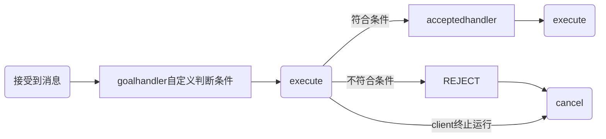

## 前言

ros2 跟 ros1 相差并不是非常大，但是毕竟是一个新的机器人操作系统，相比 ros1 来说强大的很多，总结就是

- 节点干掉了 Master
- 通信换为了 DDS
- 核心概念没变化
- 编程难度上升

### github仓库

这是我自己的学习之后写的代码 [github](https://github.com/Luo25177/ros2Work)

### 注意

需要注意在 `package.xml` 和 `CMakeLists.txt` 中声明所需要的依赖

---

## 安装

### 设置编码

```shell
sudo apt update && sudo apt install locales
sudo locale-gen en_US en_US.UTF-8
sudo update-locale LC_ALL=en_US.UTF-8 LANG=en_US.UTF-8
export LANG=en_US.UTF-8
```

### 添加源

```shell
sudo apt update && sudo apt install curl gnupg lsb-release
sudo curl -sSL https://raw.githubusercontent.com/ros/rosdistro/master/ros.key -o /usr/share/keyrings/ros-archive-keyring.gpg
echo "deb [arch=$(dpkg --print-architecture) signed-by=/usr/share/keyrings/ros-archive-keyring.gpg] http://packages.ros.org/ros2/ubuntu $(source /etc/os-release && echo $UBUNTU_CODENAME) main" | sudo tee /etc/apt/sources.list.d/ros2.list > /dev/null
```

上述第二条指令可能会报错“无法连接到raw.githubusercontent.com"，解决办法如下

1. 登录网站[https://www.ipaddress.com/](https://www.ipaddress.com/)
2. 将 `raw.githubusercontent.com` 在查询栏中搜索，可以看到域名对应的 ip 地址信息
3. 将结果中的 ip 地址和域名拷贝到 `/etc/hosts` 文件中，（记得sudo）
4. 保存退出之后就可以重新尝试第二条指令了

### 安装ros2

```shell
sudo apt update
sudo apt upgrade
sudo apt install ros-humble-desktop
```

### 设置环境变量

```shell
source /opt/ros/humble/setup.bash
echo " source /opt/ros/humble/setup.bash" >> ~/.bashrc
```

### 测试

打开两个终端，分别运行如下指令

```shell
ros2 run turtlesim turtlesim_node
ros2 run turtlesim turtle_teleop_key
```

## ros2的一些指令

### 运行节点程序

```shell
ros2 run
```

### 查看节点信息

**查看节点列表**

```shell
ros2 node list
```

**查看具体节点信息**

```shell
ros2 node info /turtlesim # 这里的turtlesim就是海龟节点
```

### 查看话题信息

**查看话题列表**

```shell
ros2 topic list
```

**利用echo指令查看话题中的消息**

```shell
ros2 topic echo /turtle1/pose
```

### 发布话题消息

在上述小海龟中可以发布话题消息控制小海龟运动

```shell
ros2 topic pub --rate 1 /turtle1/cmd_vel geometry_msgs/msg/Twist "{linear: {x: 2.0, y: 0.0, z: 0.0}, angular: {x: 0.0, y: 0.0, z: 1.8}}"
```

### 发送服务请求

还是在上述的小海龟中，其实小海龟里创建了服务器可以在用户端的请求之下可以产生一个新的海龟

```shell
ros2 service call /spawn turtlesim/srv/Spawn "{x: 2, y: 2, theta: 0.2, name: ''}"
```

### 发送动作目标

想要让海龟完成一个具体动作，比如转到指定角度，仿真器中提供的这个action可以帮上忙，通过命令行发送动作目标

```shell
$ ros2 action send_goal /turtle1/rotate_absolute turtlesim/action/RotateAbsolute "theta: 3"
```

### 录制控制指令

系统运行中参数太多，通过 `rosbag` 可以将数据录制与播放

```shell
ros2 bag record /turtle1/cmd_vel # 保存的具体的指令
ros2 bag play rosbag2_2022_04_11-17_35_40/rosbag2_2022_04_11-17_35_40_0.db3 # 已经保存的录制的文件
```

### 创建工作空间

```shell
mkdir -p ./dev_ws/src
cd ./dev_ws/src
```

### 编译工作空间

```shell
sudo apt install python3-colcon-ros
cd ..
colcon build
```

### 设置运行环境变量

```shell
source install/local_setup.sh # 仅在当前终端生效
echo "source ${dev/install/local_setup.sh" >> ~/.bashrc # 所有终端均生效
```

### 创建功能包

```shell
ros2 pkg create --build-type <build-type> <package_name>
```

其中

- create 表示创建功能包
- build-type 表示新创建的功能包是 C++ 还是 python 的，如果使用 C++，那这里就是 `ament_cmake` ，对于 python 就是 `ament_python`
- package_name 新建功能包的名字

## 创建自定义消息和服务

很恶心的一点就是,自定义的消息或者是服务的名称编译结束之后会变得不一样，引用的时候就会出现一些奇怪的bug，例如:

AddTwoInt.srv -> add_two_int.hpp & AddTwoInt

编译结束之后需要调用的头文件名称会不太一样,变成上面那种格式,但是在函数中调用的时候依旧是原来的定义的文件名的格式

利用这条指令来查看自己是否创建完成消息或者服务

```shell
ros2 interface list
```

文件名称中必须有大写字母，也就是最好使用**驼峰式命名**格式

文件中的数据类型必须声明位数，例如：`int64 int32 float32` 等

使用方需要注意包含特定的包

1. CMakeLists.txt 中 `find_package`
2. CMakeLists.txt 中 `ament_target_dependencies`
3. package.xml 中 `<depend>interfaces</depend>`

---

## 话题通信

使用 `Publisher` 来发布话题消息

使用 `Subscription` 接受话题消息

需要注意的是

1. `publisher` 和 `subscription` 需要有相同的消息类型
2. `publisher` 和 `subscription` 需要有相同的消息名称
3. 话题通信是一种异步通信

### 命令行指令

- `ros2 topic list` 查看话题列表
- `ros2 topic info <topic_name>` 查看话题信息
- `ros2 topic hz <topic_name>` 查看话题发布频率
- `ros2 topic bw <topic_name>` 查看话题传输带宽
- `ros2 topic echo <topic_name>` 查看话题数据
- `ros2 topic pub <topic_name> <msg_type> <msg_data>` 发布话题消息

---

## 服务通信

使用 `service` 作为服务器

使用 `client` 作为客户端

客户端可以向服务器发送请求和数据，需要自己创建自定义的消息类型和服务

对于同一个服务器可以有多个客户端

### 命令行指令

- `ros2 service list` 查看服务列表
- `ros2 service type <service_name>` 查看服务数据类型
- `ros2 service call <service_name> <service_type> <service_data>` 发送服务请求

---

## 动作

一定一定要添加依賴 `rclcpp_action`

其中 `actionserver` 比较复杂，需要应对多种信号来做处理

`actionclient` 也比较复杂，需要定义一个 `option` 绑定多种函数，也不是很建议使用 `timer`，感觉会有点冲突？



动作的三个通信模块，有两个是服务，一个是话题，当客户端发送运动目标时，使用的是服务的请求调用，服务器端也会反馈一个应答，表示收到命令。动作的反馈过程，其实就是一个话题的周期发布，服务器端是发布者，客户端是订阅者

没错，动作是一种应用层的通信机制，其底层就是基于话题和服务来实现的

### 自定义action接口

通过在 `action` 文件夹下定义 `xxx.action` 文件，内部包含的内容类似于服务通信，例如

```CODE
bool enable # 定义动作的目标，表示动作开始的指令
---
bool finish # 定义动作的结果，表示是否成功执行
---
int32 state # 定义动作的反馈，表示当前执行到的位置
```

在 `CMakeLists.txt` 的 `rosidl_generate_interfaces` 添加 `xxx.action` 的路径，然后编译生成对应的头文件

### 命令行指令

- `ros2 action list` 查看服务列表
- `ros2 action info <action_name>` 查看数据服务类型
- `ros2 action send_goal <action_name> <action_type> <action_data>` 发送服务请求

## 参数

参数实际上就是一个全局字典，相当于是所有 ros 线程公用的全局变量，所有节点都可以访问。如果其中一个节点对参数进行了修改，那其它的节点也会立即知道

### 命令行指令

- `ros2 param list` 查看列表参数
- `ros2 param describe nodename paramname` 获取某个参数的描述信息
- `ros2 param get nodename paramname` 查询某个参数的值
- `ros2 param set nodename paramname value` 修改某个参数的值

## launch文件

launch文件的核心目的就是启动节点，在命令行中输入各种参数，在 `launch` 文件中，可以进行配置。由于 ros2 中的 `launch` 文件是由 `python` 来描述的，所以可以使用 `python` 原有的编程功能

## 通信模型

### 点对点模型

许多客户端连接到一个服务器，每次通信时，通信双方必须建立一条连接。当通信节点增多时，连接数也会增多。而且每个客户端都需要知道服务器的具体地址和所提供的服务，一旦服务器地址发生变化，所有客户端都会受到影响

### Broker模型

针对点对点模型进行了优化，由Broker集中处理所有人的请求，并进一步找到真正能响应该服务的角色。这样客户端就不用关心服务器的具体地址了。不过问题也很明显，Broker作为核心，它的处理速度会影响所有节点的效率，当系统规模增长到一定程度，Broker就会成为整个系统的性能瓶颈。更麻烦是，如果Broker发生异常，可能导致整个系统都无法正常运转。之前的ROS1系统，使用的就是类似这样的架构

### 广播模型

所有节点都可以在通道上广播消息，并且节点都可以收到消息。这个模型解决了服务器地址的问题，而且通信双方也不用单独建立连接，但是广播通道上的消息太多了，所有节点都必须关心每条消息，其实很多是和自己没有关系的

### DDS模型

以数据为中心，这种模型与广播模型有些类似，所有节点都可以在DataBus上发布和订阅消息。但它的先进之处在于，通信中包含了很多并行的通路，每个节点可以只关心自己感兴趣的消息，忽略不感兴趣的消息。

## 总结

ros2 相比于 ros1 来说，通讯上的实时性更好一点，并且 ros2 系统在应用和性能上只会比 ros1 更加强大
