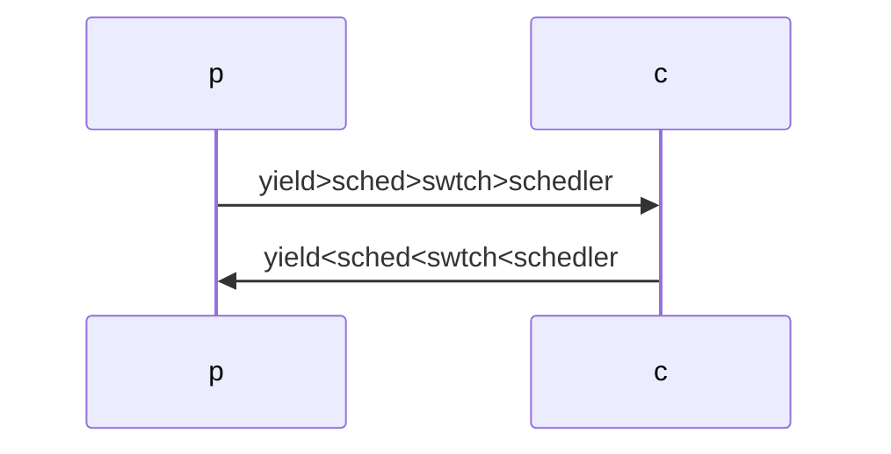

# 前言

由于 `xv6-kernel` 的代码是在 `qemu+riscv` 中进行仿真的，所以首先我们需要安装 `qemu` 和 `riscv` 仿真工具链

## riscv工具链

### 下载源码

源码地址为

[risc-v](https://gitcode.com/riscv-collab/riscv-gnu-toolchain/overview)

也可以直接使用 git 指令下载

```shell
git clone https://gitcode.com/riscv-collab/riscv-gnu-toolchain/overview
```

这里直接下载默认分支

### 下载模块

打开下载的源码目录下，找到名为 `.gitmodules` 的文件，这里面就是每个子模块的路径和分支。如果没有梯子，就可以根据其对应的名字在 Gitee 上查找对应的模块，然后直接将其下载到 `riscv-gnu-toolchain` 这个文件夹下，但是对应的模块要下载到对应的文件夹里。不仅如此，还需要下载该模块对应的分支，分支一定不能错。可以使用如下指令

```shell
git clone -b branch_name url module_name
```

其中 `branch_name` 是分支名称， `url` 是下载链接，也就是 Gitee 上对应的模块的仓库地址， `module_name` 就是需要将这个模块放入的文件夹的名称，需要与 `.gitmodules` 文件中指定的模块的 `path` 一致

### 编译安装

安装之前需要先安装依赖

```shell
sudo apt-get install autoconf automake autotools-dev curl python3 python3-pip libmpc-dev libmpfr-dev libgmp-dev gawk build-essential bison flex texinfo gperf libtool patchutils bc zlib1g-dev libexpat-dev ninja-build git cmake libglib2.0-dev
```

然后在 `/opt` 下创建 riscv 目录，并且修改其权限为所有权限

```shell
sudo mkdir /opt/riscv
sudo chmod 777 /opt/riscv
```

还需要安装 libncurses5-dev 库，这个库使得能够在使用 gdb 调试时使用 `layout` 指令，先安装再编译 riscv 才生效

编译

```shell
cd riscv-gnu-toolchain
mkdir build
cd build
../configure --prefix=/opt/riscv --enable-multilib
make linux -j 12
```

执行完成没有报错的话，就可以查看 `/opt/riscv` 目录下，可以看到里面有 riscv 的工具

### 环境配置

需要编辑 `~/.bashrc` 文件，在文件末尾添加如下两行

```shell
export RISCV="/opt/riscv"
export PATH=$PATH:$RISCV/bin
```

然后使配置文件生效

```shell
source ~/.bashrc
```

### 测试

创建一个文件 `hello.c`

```C
#include<stdio.h>
int main(){
  printf("%s","hello RISCV!");
  return 1;    
}
```

然后使用 riscv 的 gcc 编译器编译

```shell
riscv64-unkonwn-linux-gnu-gcc hello.c -o hello
./hello
```

如果编译没有报错就成功了，但是 Ubuntu 不是 riscv 架构的，所以不能运行这个可执行文件

## qemu安装

### 安装依赖

```bash
sudo apt update
sudo apt install build-essential
sudo apt install zlib1g-dev
sudo apt install pkg-config
sudo apt install libglib2.0-dev  
sudo apt install binutils-dev
sudo apt install libboost-all-dev
sudo apt install autoconf
sudo apt install libtool
sudo apt install libssl-dev
sudo apt install libpixman-1-dev
sudo apt install virtualenv
sudo apt install flex
sudo apt install bison
sudo apt install libgcrypt20-dev
```

### python版本

python版本必须是 ≥ 3.6 的，使用下列指令查看 python 版本

```bash
python3 --version
```

### 安装 ninja

```bash
sudo apt update
sudo apt install ninja-build
```

### 下载源码

由于官网下载较慢，所以可使用命令下载

```bash
wget https://download.qemu.org/qemu-6.2.0.tar.xz
```

在终端输入指令解压

```bash
xz -d qemu-6.2.0.tar.xz
tar -xvf qemu-6.2.0.tar
```

### 编译安装

首先进入解压后的文件夹，新建安装目录，然后 `configure` 指令

```bash
cd qemu-6.2.0
sudo mkdir /opt/qemu
./configure --prefix=/opt/qemu
```

编译源码

```bash
make -j8
```

安装

```bash
sudo make install
```

## 下载 xv6源代码

xv6源代码仓库地址为 [github-xv6](https://github.com/mit-pdos/xv6-riscv.git)

使用指令下载该源代码

```bash
git clone https://github.com/mit-pdos/xv6-riscv.git
```

# xv6

## 介绍

代码非常简洁，只有 6000 行代码，大部分是 C 语言和汇编语言，而且代码中没有依赖任何库函数，这也是内核程序员需要注意的

在 xv6 中所实现的用户操作有

- sh
- cat
- echo
- grep
- kill：用于杀死一个终端程序
- ln：创建一个文件的硬链接
- ls：内容目录
- mkdir：创建目录
- rm：删除文件
- wc：计算文件的单词数量

### SMP

它是适用于多核的处理器的，并且所有进程共享内存，一共是 128MB

### 硬件设备

- UART：同步串口通信设备，多个内核公用
- DISK：磁盘，多个内核公用
- TIMER：定时器，一个内核有一个定时器
- PLIC：平台级中断处理器，这是一个单独的芯片或者电路处理来自于不同的设备的中断，会计算那个核心中断并且允许处理中断。模拟器将会模拟平台级中断处理
- CLINT：核心本地中断控制器，这也是模拟的一部分，每个核心都有一个核心本地中断控制器，所以操作系统也需要处理这些东西

### 内存管理

内存管理比较简单

- 物理内存分为页，页面大小是固定的 4KB
- 从空闲列表中为内核分配内存，空闲链表至少有一个未使用的页面。这是一个简单的链表，它从空闲列表中分配页面。当一个页面不再使用时，会将该页面返回到空闲链表的最先面
- 在操作系统中没有对象。在 xv6 中有几种不同的结构，当然它们是指着，但是使用面向对象的编程语言，可以分配可变大小的内存
- 没有 `malloc` ，虚拟地址空间由页表处理
- 页表：分为三个等级。每个进程有一个页表，此外内核本身还有一个页表，用于映射所有内存空间。内核页表被所有进程共享。页表硬件可以将数据页标记为可读，可写和可执行。R / W / X / U / V

### 任务调度

- 基本上是一个循环调度
- 每个过程有一个时间片，并且是固定的时间片——1000000 cycles。每个被调度的程序都在任务队列上等待着被调用。
- 所有进程共享一个就绪队列。内核会搜索一个准备好运行的进程，从队列中取出，并且为它分配时间片，运行结束之后会把它放回到就绪队列中，继续寻找另一个可运行的进程，并且内核会不断遍历该就绪队列。在这个队列中，线程会被标记为可运行和不可运行两种状态

### 启动顺序

- 使用 `qemu` 来启动内核几乎跳过了所有的引导项
- RISC-V 会模拟物理内存，把内核代码放在一个固定的位置。
- xv6 不支持引导加载项，主引导记录或者 BIOS 之类的东西

### 锁

xv6 使用了几种锁来进行锁定和并发控制

- Spin Locks 自旋锁，在内存中只有一个字来表示锁。如果锁是未持有的或者自由的，这个字为 0，否则为 1。有两个用户可调用的方法。
  - acquire 获取，就是等待自旋锁状态被释放，一旦获取锁就会将其置为 1
  - release 释放，就是简单的将自旋锁状态设置为 0

    还有两个线程所调用的方法

  - sleep 执行之后，线程将会结束它的时间片，并且将以不可运行的状态放回到就绪队列中，直到被唤醒
  - release 如果一个睡眠中的进程被唤醒，那它将会从睡眠状态改为可运行状态，然后它就会得到时间片
- 选择性禁用中断，每个核心都有一个状态控制字，这个控制字可以被设置也可以被清除。它表示要么启用并且允许中断，要么禁用。通过禁用中断可防止一个线程被中断。但是这只能保证在当前内核中的线程不会被其它线程中断，不能保证其他内核的中断

### 一些固定的限制

- xv6 中有一些固定的限制，这些都是用磅符号定义声明的，例如进程数量只是一个固定的数字，最大可打开的文件数量也是固定的。
- 在内核中更加倾向于使用数组而不是链表，在一些情况下，使用线性搜索来遍历这些链表。例如杀死某个进程就是通过遍历进程表并且对比进程号进行线性搜索来杀死该进程

### 用户地址空间


这就是用户地址空间，分配内存时以页为单位进行内存分配。

- 当使用 `exec` 操作时，内核将进入文件系统并且找到可执行文件，它将分配几个整页面，会把数据读入到 `data and code` 区域，然后这些页面将会被标记为可读，可写，并且可由内核执行。
- 并且还为栈分配了一个页面，而且这个栈只有一个页面，这导致很多需要将堆栈超出 4KB 的程序不能在 xv6 中运行。如果一个程序的堆栈需要增长到 4KB 以上时，会被系统终止
- 在 linux 或者 unix 系统中，栈通常放在高内存中，并且向下增长，直到堆栈相互触碰
- 除此以外，xv6 还有一个安全页，不可读，不可写，在用户模式下无法访问，当用户想要获取这部分空间时，整个进程将会被终止
- 堆在栈之后开始，并且以页面为单位增长，会调用内存来分配一些空闲的时间给堆使用，这些页面将会标记为可读可写
  - 用户可以在堆内存中任意的 `malloc` 内存，分配内存
- 在虚拟内存空间最上面还有两个页面
  - `trampaline page` 被标记为**用户模式不可访问**，包含代码，所以它是**可执行的**。当陷阱或者异常发生时，将在 trampaline page 中执行代码
  - `trap frame` 是可读可写的，寄存器将会被保存在这个位置
  - 当中断或者异常发生时，寄存器以及用户进程的整个状态都会被保存，并且将其按照 `trampaline page` 中的代码保存在陷阱帧中。每个虚拟地址空间都有自己的陷阱框架页面， `trampalline page` 被所有进程共享，所以它们都被映射到相同的地址空间，但是有着不同的物理记忆页面。
- 虚拟内存的大小正还是 256GB ，所以空闲内存会有很多，并且堆可能不会占用太多。而且内存中所存储的内容不可能超过实际的物理内存大小
- 在 C 语言程序运行时的入口 `main` 函数可以传入 `argc` 表示参数数量， `args` 表示传入参数， `arge` 来传入系统环境变量，但是 xv6 不支持环境变量。内核中的代码设置虚拟地址空间，并且将为栈分配一个页面，会将参数推入栈中，并且将栈的指针指向栈底，然后将栈的指针存入寄存器中。所以在用户程序运行第一条指令时，它会在栈上找到参数
- 页表有三种方案，xv6 使用 SV39，所以虚拟地址的内存大小为 $2^{39}$ ，正好是 512GB 的大小，所以使用这种方案意味着可以访问 512GB 大小的内存。而 xv6 只使用 $2^{38}$ 的内存，就是 256GB，所以最大内存地址为 0x4000000000
  - SV32：是一个两级页表方案
  - SV39：应用于 xv6，是一个三级页表方案
  - SV48：是一个四级页表方案

## 内核代码

### risc-v汇编指令码

- `ld` 例如 `ld t0, 0(t1)` `t0 = memory[t1 + 0]` 将 `t1` 的值加上 0,将这个值作为地址，取出这个地址所对应的内存中的值，将这个值赋值给 `t0`
- `lw` 例如 `lw t2, 20(t3)` `t2 = memory[20 + t3]` `lw` 与 `ld` 的区别就在于 `ld` 是从内存取出64位数值，而lw是取出32位数值。
- `lh` 例如 `lh t4, 30(t5)` `t4 = memory[30 + t5]` 从内存中取出16位数值
- `lb` 例如 `lb t4, 30(t5)` `t4 = memory[30 + t5]` 从内存中取出8位数值
- `sd` 例如 `sd t0, 0(t1)` `memory[0+t1] = t0` 将 `t1` 的值加上0,将这个值作为地址，将 `t0` 的值存储到上述地址所对应的内存中去
- `sw` 例如 `sw t0, 0(t1)` `memory[0+t1] = t0` 与 `sd` 的区别在于 `sw` 只会将 `t0` 的低32位数值存储到相应的内存。 `sd`会将 `t0` 的64位都存入
- `sh` 例如 `sh t0, 0(t1)` `memory[0+t1] = t0` 只将 `t0` 的低16位所对应的数值存入，也就是一个half word大小
- `sb` 例如 `sb t0, 0(t1)` `memory[0+t1] = t0` 只存入8位，一个byte大小
- `lwu` 例如 `lwu t2, 20(t3)` `t2 = memory[20 + t3]` `lw` 与 `lwu` 的区别在于，前者取出32位数值作符号扩展到64位，而后者做无符号扩展到64位
- `lhu` 例如 `lhu t4, 30(t5)` `t4 = memory[30 + t5]`
- `lbu` 例如 `lbu t4, 30(t5)` `t4 = memory[30 + t5]`

### 内核代码文件

- `bio.c` 文件系统的磁盘块缓存
- `console.c` 连接到用户的键盘和屏幕
- `entry.S` 首次启动指令
- `exec.c` exec()系统调用
- `file.c` 文件描述符支持
- `fs.c` 文件系统
- `kalloc.c` 物理页面分配器
- `kernelvec.S` 处理来自内核的陷入指令以及计时器中断
- `log.c` 文件系统日志记录以及崩溃修复
- `main.c` 在启动过程中控制其他模块初始化
- `pipe.c` 管道
- `plic.c` RISC-V中断控制器
- `printf.c` 格式化输出到控制台
- `proc.c` 进程和调度
- `sleeplock.c` Locks that yield the CPU
- `spinlock.c` Locks that don’t yield the CPU.
- `start.c` 早期机器模式启动代码
- `string.c` 字符串和字节数组库
- `swtch.c` 线程切换
- `syscall.c` Dispatch system calls to handling function.
- `sysfile.c` 文件相关的系统调用
- `sysproc.c` 进程相关的系统调用
- `trampoline.S` 用于在用户和内核之间切换的汇编代码
- `trap.c` 对陷入指令和中断进行处理并返回的C代码
- `uart.c` 串口控制台设备驱动程序
- `virtio_disk.c` 磁盘设备驱动程序
- `vm.c` 管理页表和地址空间

## 系统开始

xv6 系统在多核的计算机上运行时，开始时每个核心都同时开始，并且它们享有共同的内存，所以他们会执行相同的代码，这个代码位于 `entry.S` 文件中

### entry.S

代码很少，在这个文件中运行的是将一些环境设置好，以便可以执行 C 程序代码。初始化栈指针寄存器（SP寄存器）以及 线程指针（TP寄存器，会存储当前是第几个内核，整个过程中，寄存器将在核心上保持不变）。由于每个核心都是共享内存的，所以它们将访问同一组全局变量，但是每个内核都会需要自己的栈，并且不能重合，所以每个核心都有一个单独的空间。然后将控制权转交给 `start.c` 中一个名为 `start` 的 C 函数。

### start.c

将控制权转交给 `main.c` ，也就是 main 函数。进入 `start.c` 函数之后，程序会进入机器模式，然后会做一些 bookkeeping 的事情，之后进入监督模式，也就是把系统交给用户管理。每个核心都会执行 `start` 函数和 `main` 函数

### main

在函数中会判断内核号，0 号内核会进行一些初始化的操作，等待 0 号内核初始化完成之后，其它的内核会进行一些页面，内核陷阱列表和系统级中断等初始化。0 号内核的最后语句是初始化用户程序。当所有内核执行完成之后，每个内核都会调用一个调度器，就是寻找一个要执行的进程。

在 `main` 中有一段神奇的代码 `__sync_synchronize` ，这个函数将会告诉编译器，一定要完成这条代码之前的东西再执行这条代码之后的东西

## spinlock

用一个单词表示自旋锁，如果内容是 0，那就表示锁是释放掉的，内容是 1，表示锁被占用

```c
// Mutual exclusion lock.
struct spinlock {
  uint locked;       // Is the lock held?

  // For debugging:
  char *name;        // Name of lock.
  struct cpu *cpu;   // The cpu holding the lock.
};
```

还有两个参数

- `name` 可以给该自旋锁设置名字，它所指向的是一个字符串
- `cpu` 指定某一个 CPU，每个核都有一个与之相关联的结构体 `cpu` ，这个字段包含一个指向 `cpu` 结构的指针，用于表示当前持有锁的内核

### acquire

用于请求锁，代码格式类似于下列代码，也就是会并不断循环来请求锁

```c
if (locked == 0)
 locked = 1;
else
 loop;
```

这个自旋锁是有风险的，一旦两个线程同时请求锁，并且锁是释放的，这两个线程会同时将锁置 1，它们都会认为自己获得了锁，所以就会出现问题。在 risc-v 中提供了**原子内存操作**，它会不间断的检索该单词的前一个值，所以它不允许其它任何线程或者任何其它内核的指令来访问这段内存。

自旋锁具体实现就是，向内存中写入 1，并且读取内存的前一个值，如果前一个值为 0，那就大功告成，否则会一直循环请求，直到前一个值为 0

```c
  //   a5 = 1
  //   s1 = &lk->locked
  //   amoswap.w.aq a5, a5, (s1)
  while(__sync_lock_test_and_set(&lk->locked, 1) != 0)
    ;
```

这段代码将会被编译为上面的汇编指令，就是一段原子交换指令，这个函数的作用就是，传入一个想要修改的地址，并且传入新值，返回旧值。

整个请求的代码为

```c
void
acquire(struct spinlock *lk)
{
 // 禁止中断来防止死锁的发生
  push_off(); // disable interrupts to avoid deadlock.
  if(holding(lk)) // 判断是否持有锁，如果持有锁，那就出问题了，报错指令
    panic("acquire");

  // On RISC-V, sync_lock_test_and_set turns into an atomic swap:
  //   a5 = 1
  //   s1 = &lk->locked
  //   amoswap.w.aq a5, a5, (s1)
  while(__sync_lock_test_and_set(&lk->locked, 1) != 0) // 原子内存交换，获取锁
    ;

  // Tell the C compiler and the processor to not move loads or stores
  // past this point, to ensure that the critical section's memory
  // references happen strictly after the lock is acquired.
  // On RISC-V, this emits a fence instruction.
  // 告诉C编译器和处理器不要移动超过这个点的加载或存储，以确保临界区的内存引用严格发生在获得锁之后。
  // 在RISC-V上，这会发出一个fence指令。
  __sync_synchronize(); // 同步操作

  // Record info about lock acquisition for holding() and debugging.
  lk->cpu = mycpu(); // 将锁的持有CPU改为当前CPU
}
```

### release

用于释放锁，释放锁只需要向锁的内存中写入 0 就可以，它不是一个原子操作，只是一个内存的读取与存储，

```c
void
release(struct spinlock *lk)
{
  if(!holding(lk)) // 首先确定真的拿到了这把锁
    panic("release");

  lk->cpu = 0; 

  // Tell the C compiler and the CPU to not move loads or stores
  // past this point, to ensure that all the stores in the critical
  // section are visible to other CPUs before the lock is released,
  // and that loads in the critical section occur strictly before
  // the lock is released.
  // On RISC-V, this emits a fence instruction.
  __sync_synchronize();

  // Release the lock, equivalent to lk->locked = 0.
  // This code doesn't use a C assignment, since the C standard
  // implies that an assignment might be implemented with
  // multiple store instructions.
  // 释放锁，相当于lk->locked = 0
 // 这段代码没有使用C语言赋值，因为C语言标准暗示赋值可以用多个存储指令来实现。
  // On RISC-V, sync_lock_release turns into an atomic swap:
  //   s1 = &lk->locked
  //   amoswap.w zero, zero, (s1)
  __sync_lock_release(&lk->locked);

  pop_off(); // enable interrupts 
}
```

### initlock

在第一次调用锁之前初始化锁

```c
void
initlock(struct spinlock *lk, char *name)
{
  lk->name = name;
  lk->locked = 0;
  lk->cpu = 0; // 初始化锁的 CPU 相当于是 NULL
}
```

### holding

用于输出哪个内核正在持有锁，用于检查 CPU 是否获得了锁，如果当前锁是 1，并且锁被当前 CPU 持有，则返回 1

```c
int
holding(struct spinlock *lk)
{
  int r;
  r = (lk->locked && lk->cpu == mycpu());
  return r;
}
```

### push_off

在请求锁的函数的第一条语句就是禁用中断

```c
void
push_off(void)
{
  int old = intr_get(); // 获取失能中断前的中断使能状态

  intr_off(); // 关闭中断
  if(mycpu()->noff == 0) // 如果时第一次调用就设置中断使能状态，见下面的解释
    mycpu()->intena = old;
  mycpu()->noff += 1; // 中断层数计数器
}
```

### pop_off

在释放锁的函数的最后一条语句就是使能中断

```c
void
pop_off(void)
{
  struct cpu *c = mycpu(); // 对当前内核进行操作
  if(intr_get()) // 中断已经启用了，就报错，因为在释放所有锁之前，中断不能使能
    panic("pop_off - interruptible");
  if(c->noff < 1) // 已经释放所有锁，但是依旧调用释放，就报错
    panic("pop_off");
  c->noff -= 1;
  if(c->noff == 0 && c->intena)
    intr_on(); // 如果第一次请求锁之前中断是使能状态，就使能中断
}
```

### **注意**

自旋锁不应该被长期持有，如果一个线程想要获得锁，并且不断自旋，会浪费很多时间。当然 xv6 中还有其它锁定技术 `sleep()` 和 `wakeup()` 这些可以在需要拿着锁很长一段时间下使用

所以不会让一个线程获得锁时间太长，内核会集中处理拿到锁的线程的核心程序，尽可能快地释放锁

### **作用**

锁是用来保护共享数据的，在 xv6 中会有如下精巧的操作

```c
acquire();
...// 访问共享数据，一次只能一个线程进行
release();
```

### **死锁**


当一个线程获得了锁的时候，恰巧按下键盘，触发键盘中断，键盘中断调用中断处理程序，向某一个共享内存写入数据，需要获得锁。但是持有锁的线程被中断，这导致系统卡死。也就是拿着锁的线程不运行无法释放锁，中断请求锁但是拿不到，这就是死锁

所以解决死锁的方法就是在请求锁时禁用中断，在释放锁之后，打开中断，当然持有锁的时间一定需要很短

### **如果需要调用多个锁**

例如需要调用 3 个锁，每个锁获取时都会禁用中断，但是在第一个释放锁就会启用中断，这个并不是我们想要的。希望可以使用多层嵌套调用 `acquire` 和 `release` 函数，所以可以使用一个计数器。例如每个内核都有一个 `CPU` 结构体，而每个结构体内部都有一个计数器，所以请求和释放函数可以如下实现

```c
acquire() {
 cnt++;
 disableInterrupt();
}
release() {
 cnt--;
 if(cnt == 0)
  enableInterrupt();
}
```

在中断使能函数 `enableInterrupt` 中，当 `cnt==0` 时，需要判断在第一次请求锁之前中断是否是使能状态，如果已经使能，那就会启用中断，所以在 `CPU` 结构体中，有一个专门用来存储第一次请求锁之前中断的使能状态。

## 空闲内存管理

在 xv6 中，所有的内存管理都是 4KB 为单位的，也就是以 page 为单位，它们被放在一个空闲列表中，内存管理有两个关键的函数

- `kalloc()` 只是从空闲列表中删除了一些东西
- `kfree()` 将一个空闲页重新添加回空闲列表中

### 结构体

```c
struct run {
  struct run *next;
};

struct {
  struct spinlock lock;
  struct run *freelist;
} kmem;
```

其中

- `run` 是一个指向下一个空闲空间的指针
- `kmem` 里面实现了自旋锁和空闲链表，用自旋锁对空闲链表进行分组，称为简单锁，用于将锁与空闲列表关联，每当操作空闲列表，需要获取锁或者设置锁，当访问完空闲列表之后，需要把锁释放掉

### end

```c
extern char end[]; // first address after kernel.
                   // defined by kernel.ld.
```

这是链接器在链接时生成的，里面存放的是内核之后的第一个地址，也就是第一个可用内存，这将会在初始化时被使用

### **kinit**

```c
void
kinit()
{
  initlock(&kmem.lock, "kmem");
  freerange(end, (void*)PHYSTOP); // PHYSTOP-end=128MB
}

void
freerange(void *pa_start, void *pa_end)
{
  char *p;
  // 将起始内存四舍五入到最近的页面边界，页面对齐
  p = (char*)PGROUNDUP((uint64)pa_start);
  for(; p + PGSIZE <= (char*)pa_end; p += PGSIZE)
    kfree(p); // 将所有可用内存初始化，释放掉所有内存
}
```

这个函数中所做的就是初始化锁，并且释放掉范围之内的内存，这个范围就是第一个内存空间和顶端物理空间的内存，这是一个常数，正好是 128MB ，但是由于需要内存页面对齐，所以真实内存可能不到 128MB

### kalloc

```c
// Allocate one 4096-byte page of physical memory.
// Returns a pointer that the kernel can use.
// Returns 0 if the memory cannot be allocated.
void *
kalloc(void)
{
  struct run *r; 

  acquire(&kmem.lock); // 请求自旋锁
  r = kmem.freelist; // 请求第一个物理页
  if(r) // 请求成功
    kmem.freelist = r->next; // 修改空闲列表以指向下一个项目
  release(&kmem.lock);

  if(r) // 请求成功之后
    memset((char*)r, 5, PGSIZE); // fill with junk
  return (void*)r;
}
```


在 `kalloc` 中所进行的操作如上图所示

### kfree

传递一个页面的指针

```c
void
kfree(void *pa)
{
  struct run *r;
 // 错误检查
  if(((uint64)pa % PGSIZE) != 0 || (char*)pa < end || (uint64)pa >= PHYSTOP)
    panic("kfree");

  // Fill with junk to catch dangling refs.
  memset(pa, 1, PGSIZE);

  r = (struct run*)pa;

  acquire(&kmem.lock);
  r->next = kmem.freelist;
  kmem.freelist = r;
  release(&kmem.lock);
}
```

在函数中首先回进行错误检查，确保 `pa` 的物理地址在页边界上对齐，确保页面内存位于申请的首尾内存之间。之后会将页面写满 1，这样做目的就是防止内核其它代码出现任何bug，所以不想将页面返回空闲链表之后被使用，所以就将其中的每个字节都设置为某个值。然后请求锁，并将释放的内存链接到空闲内存链表中，与 `kalloc()` 正好相反

## 系统调用

用户模式如何进入系统调用

系统调用的所有函数原型（声明）位于 `user.h` 中，其中的系统调用代码的实现位于 `usys.pl` 脚本生成 `usys.S` 文件中

```perl
#!/usr/bin/perl -w

# 打印声明，也就是将这些东西写入 usys.S 文件中
print "# generated by usys.pl - do not edit\n";

print "#include \"kernel/syscall.h\"\n";

sub entry {
    my $name = shift;
    print ".global $name\n"; # 全局声明
    print "${name}:\n";
    print " li a7, SYS_${name}\n"; # 加载系统调用
    print " ecall\n"; # 调用
    print " ret\n"; # 返回
}

# 这个就是将对应的系统调用进行实现，实际上每个系统调用的最终都是调用了 SYS 的系统调用
entry("fork");
...
entry("uptime");
```

最后生成的对应的汇编代码为

```perl
# generated by usys.pl - do not edit
#include "kernel/syscall.h"
.global fork
fork:
 li a7, SYS_fork
 ecall
 ret
...
```

会生成很多系统调用的代码，每个系统调用码都对应着一个数字，位于 `syscall.h` 文件中。 `ecall` 在用户模式下被调用，进入到内核模式中，然后内核将执行对应的代码，然后返回用户模式 `return`

当调用该函数时，函数传入的参数会依次被放入 `a0, a1...` 寄存器中，而返回值将出现在 `a0` 中，内核会做到这一点，系统调用中的参数位于 `a0, a1, ...` 中，而且返回值会位于 `a0` 中。这些系统调用没有直接在寄存器中赋予参数，是因为调用之前就假定已经将参数写入到对应的寄存器中了，而调用结果将会在 `a0` 中被返回

### initcode.S

是内核在用户模式下执行的第一个代码

```nasm
# Initial process that execs /init.
# This code runs in user space.

#include "syscall.h"

# exec(init, argv)
.globl start
start:
        la a0, init
        la a1, argv
        li a7, SYS_exec
        ecall

# for(;;) exit();
exit:
        li a7, SYS_exit
        ecall
        jal exit

# char init[] = "/init\0";
init:
  .string "/init\0"

# char *argv[] = { init, 0 };
.p2align 2
argv:
  .long init
  .long 0
```

代码量很少，在 `start` 中执行的代码就是 `exec` 系统调用，开始初始化的系统调用，加载两个参数，第一个参数就是 `/init\0` ，第二个参数包含 `init` 的地址，一个 0 和一个对齐语句，加载完成之后，进行系统调用。在 `exit` 中执行的代码就是系统退出代码，调用 `exit` 系统调用退出，这个调用需要一个参数，就是退出码或者返回码。

## 寄存器


在 risc-v 架构中，有 32 个通用寄存器和一个程序计数器，每个都是 64 位寄存器

- `zero` 是以硬件线路作为寄存器的，在进程之间上下文切换中不需要保存
- `ra` 返回地址寄存器，当在 risc-v 中进行函数调用时，函数返回地址位于 `ra` 寄存器，而不是推入栈中，返回地址只是简单的从 `ra` 中复制值，所以许多函数不需要访问主存
- `sp` 栈指针，栈向下生长
- `tp` 是 xv6 中所谓的线程指针，包括内核代码，实际上是不可改变的，在启动过程中 `mhartid` 寄存器的数据将会被 move 到这里
- `gp` 是全局指针，被编译器使用，将被设置而不被更改，基本上只是用来使得访问全局和共享变量更快更有效
- `a0,...,a7` 用于将参数传递给函数， `a0` 用于存放函数返回值
- `t0,...,t6` 这些寄存器可以在函数中自由使用，做函数任何想做的事情
- `s0,...,s11` 有12个所谓的被调用方保存寄存器。调用方将假设它所调用的任何函数都不会修改这些寄存器。该函数必须在使用它们之前保存它们，通常将它们推入栈中。返回之前必须恢复这些寄存器
- `pc` 是代码执行地址的寄存器，指向下一条该运行的代码

### risc-v 模式

任何情况下 risc-v 都处于以下三种模式之一，**每个内核都有自己的寄存器**，**每个内核在任何时候都以一种模式运行**

- machine mode：机器模式是最高和最强大的模式，拥有最大的权限。在系统启动或者重启之后 xv6 内核会进入机器模式。这个模式使用不多。有些代码在启动时以机器模式运行，做一些初始化的工作
  - startup——initialization
  - time interrupt require：定时器中断要求处理程序在机器模式下运行。而在机器模式下运行的这段代码立即将中断转换为 supervisor mode 的代码中断，这个程序会很快返回
- supervisor mode：是所有动作发生的地方
  - 所有内核代码都在此运行
  - 有些中断是有权限的，无法在 user mode 下运行，只能在 supervisor mode 和 machine mode 下运行
- user mode
  - 所有用户代码都在此运行
  - 高权限的指令会产生一个陷阱，并且内核将会中止此进程

### Control And Status Registers CSRs

事实上，系统能容纳 4096 个控制和状态寄存器。在 xv6 中，只有 19 个是重要的。

下面是三条具有高权限的指令，是对**控制和状态寄存器的读写操作**

- `csrr a0, sstatus` 将 s 状态寄存器读取到 a0 寄存器中
- `csrw sstatus, a0` 将 a0 寄存器写入到 s 状态寄存器中
- `csrrw a0 mscratch a0`  将 a0 寄存器与 mscratch 寄存器内容交换，这个交换是原子操作。这条指令的实际操作就是，将 mscratch 复制到 a0 寄存器中，同时将 a0 寄存器复制到 mscracth 中，这两个操作是同时进行的

下面是那 19 个**比较重要的寄存器**，其中 `m` 开头的只能在机器模式下使用和访问，而 `s` 开头的可以在机器模式和主管模式下访问

- `mhartid` 包含内核号。这个寄存器是硬件连线的，不能修改，可查询代码运行在哪个内核中，并且将内容移居到 `tp` 寄存器， `tp` 寄存将永不改变。 函数 `cpuid()` 将会返回 `tp` 寄存器
- `mstatus` `sstatus` 状态寄存器
- `mtvec` `stvec` 陷阱向量也就是陷阱发生时被调用的处理程序的地址
- `mepc` `sepc` 当陷阱发生时，以前的程序计数器将会保存在该寄存器
- `scause` 当陷阱发生时，陷阱发生的原因会被保存于此，如果有额外信息， `stval` 寄存器也会更新
- `stval` 保存出错的指令或者地址
- `mscratch` `sscratch` 工作寄存器，可以被 `trap handler` 所使用
- `satp` 包含指向页表的指针，是地址转换指针。注册地址转换指针，指向页表，而页表存储在主存中。任何时候都会有一个页表被使用，就是 satp 所指向的页表
- `mie` `sie` 可以在机器模式或者用户模式下有选择地使能中断
- `sip` 可以找到任何一点，有哪些中断被挂起了
- `medeleg` 异常可以从机器模式委托到主管模式
- `mideleg` 中断可以从机器模式委托到主管模式
- `pmp0cfg` `pmp0addr` PMP控制寄存器和PMP地址寄存器，但是未在 `xv6` 中使用。**物理内存保护**，限制运行在用户模式或者主管模式的打码对物理内存的访问，具体可查看 [RISC-V 物理内存保护（PMP）机制探究 - 泰晓科技 (tinylab.org)](https://tinylab.org/riscv-pmp-1/#%E5%89%8D%E8%A8%80)
  - 可以提供安全处理和故障隔离功能，对现代处理器来说是非常重要的。
  - PMP 机制适用于所有特权模式为 S 或 U 的指令和数据访问，通过在 M 态下修改每个 hart 对应的控制寄存器，可以指定每个物理内存区域的读、写和执行等访问权限。
  - PMP 机制也可用于 S 态中的页表访问。
  - 违反 PMP 机制的访存将被处理器捕获并触发异常

### trap

陷阱，分为两种

- `exceptions` 异常是同步的，是由某种指令引起的，分为两种
  - 系统调用指令，在 risc-v 系统中，系统调用指令为 `ecall`
  - 程序错误。一些非法的指令，对齐错误，内存访问错误会导致异常
- `interrupts` 中断是异步的，来自于当前代码以外的某个其它的地方
  - timer：处理程序必须在机器模式下运行，任何情况下都可能发生，但是恰好处理程序会在机器模式下运行。这个中断处理会通知内核，并且导致主管级别的软件中断
  - device: uart，disk and so on：硬件设备的中断
  - 软件中断：软件中断将由在机器模式下运行的代码引起。软件中断将由运行在监管模式下的代码来处理。也就是内核有软件中断处理程序，做一些需要为定时器中断所做的事

## 页表架构

### 虚拟地址转换

`satp` 包含指向页表的指针，是地址转换指针。注册地址转换指针，指向页表，而页表存储在主存中。任何时候都会有一个页表被使用，就是 `satp` 所指向的页表

虚拟地址转换在初始化之后总是打开的，一开始 `satp` 是 0，也就没有地址转换发生，但是在初始化阶段之后，该指针会指向第一个页表。也就是说，在机器模式下，虚拟地址转换还未打开，在用户模式和主管模式下就打开了

RISC-V 指令操作的是虚拟地址，RISC-V的页表硬件支持了虚拟地址到物理地址的转换

xv6运行在**Sv39 RISC-V**上， 这意味着**只使用64位虚拟地址的低39位**，而高25位不使用，高25位作为保留位

分页硬件通过利用39位中的高27位索引到页表中找到一个PTE来转换一个虚拟地址，并计算出一个**56位的物理地址**，该物理地址的**前44位**来自PTE中的PNN，而它的后12位则是从原来的虚拟地址中的**低12位**复制过来，如下图


实际上 xv6 的地址转换时分三步运行的，页表是以三级页表的形式存储在物理内存中

第二级页表也就是根页表是一个 **4KB 的页表**，包含**512个页表项**。这些页表项包含树的下一级页表的物理地址首址。第一级页表也包含**512个页表项**，这些页表项包含第零级页表的物理首址。第一级页表的物理首址由页表寄存器 `satp` 提供，而 `satp` 寄存器由内核写入根页表的物理地址。最终的叶页表就是实际的物理页

虚拟地址的低39位的高27位用来定位页框号。这27位被分为3份，每份9位，分别定位对应的页表的页表项。具体过程如下图所示


每个CPU都有自己的satp寄存器。因此，一个CPU将使用自己的satp寄存器所指向的页表来翻译后续指令产生的所有地址。这保证了不同CPU可以运行不同的进程，因为这使每个CPU的进程可以拥有不同的私有地址空间。

> **缺页异常：若转换一个地址所需的三个页表项中的任何一个不存在，分页硬件就会引发一个缺页异常（page-fault exception），内核会处理这个异常**
>

页表项是一个 64 位的数字，各个位的分配如下图所示


其中

- V ：表示页表是否存在，没置位则不允许引用该页表对应的页
- R ：是否允许指令读取
- W ：是否允许指令写入
- X ：是否可以将页表内容解释为指令并执行
- U ：决定是否允许用户态下得到指令访问页面，没置位则只能在内核态下使用

### 内核页表

内核页表只有一个，所有内核共同使用。是一对一的映射，所有的页表内存都映射着物理内存，不需要进行地址运算。还有一些内存映射，是一个 IO 设备

### 用户进程页表

每一个用户进程都有一个页表，页表的实现有多个选项

- sv32 二级页表，例如RV32
- sv39 三级页表，xv6
- sv48 四级页表，例如RV64

### 内存访问

每一次内存的读取，存储都会遍历页表，遍历页表将涉及几次内存访问，这个效率是非常低的。

所以在实际的系统中是有地址转换的缓存的（Translation Lookaside Buffers，TLBs），用于减少这些低效率的操作。它会缓存最近的页表。当需要切换页表时，必须清空所有的 LTBs

实际上在 risc-v 架构提供了方法 `sfence.vma` ，而在内核中会有函数 `sfence_vma` 用于调用这个方法

### 虚拟地址

虚拟地址一共有 39 位


- `0-11` 位表示在页面上的偏移量
- `12-20` 位表示页表项在第三级页表中的偏移地址
- `21-29` 位表示第一级页表的页表项在第二级页表中的偏移量
- `30-38` 位表示第零级页表的页表项在第一级页表中的偏移位置
- `39-63` 位被忽略

具体过程表示i可以看看上面

### 页表项


其中

- V ：表示页表是否存在，没置位则不允许引用该页表对应的页
- R ：是否允许指令读取
- W ：是否允许指令写入
- X ：是否可以将页表内容解释为指令并执行
- U ：决定是否允许用户态下得到指令访问页面，没置位则只能在内核态下使用
- 其它的 G, A, D 和 RSW 并没有在 xv6 中使用

其中 `10-53` 位是该页表对应的物理页的地址，一共 44 位，将其与虚拟地址的低 12 位组合得到最终的真实地址，一共占 56 位，所以最多可以支持 56 位的主物理内存

## Trap Processing

### 分类

- `exception`
  - `syscall` : `ecall`
  - `Error` : Illegal instruction, Aligment Error,…
- `interrupt`
  - device interrupt：会在用户模式和主管模式下出现，而且处理程序是在主管模式下运行

### stvec

是一个状态和控制寄存器，包含指向中断处理程序代码的指针。每个中断处理程序的第一条指令的地址，将处理发生的任何陷阱

### 中断处理

- `kernelvec`：处理在主管模式下运行时发生的 `trap`
- `uservec`：处理在用户模式下运行时所发生的 `trap`

### sstatus

一共是64个位，每一个位表示一个状态标志位

- `sie` 第 3 位，是否启用中断。如果是中断导致的 `trap` ，这个值必须是 1，否则不会处理
  - 在 xv6 的内核中可以改变启用中断的状态来防止核心部分代码受到打扰。
  - 不同核之间不会相互干扰，但有可能会对同一块内存同时进行读写操作，这个是由锁来保护
- `spie` 第 7 位，当前中断使能状态，主要是用于保存多层嵌套的锁中最初的中断使能状态
- `spp` 第 11 位，当前权限等级。主要是为了区分当前异常或者中断发生时，是在什么模式下的，中断处理不可能从机器模式到主管模式
  - 0：用户态
  - 1：内核态
- `seie` 第 1 位，设备中断使能，初始化置为 1
- `stie` 第 5 位，时钟定时器中断使能，初始化置 1
- `ssie` 第 9 位，软件中断使能，也就是委托中断，初始化置 1
- `sip` 用于中断挂起的标志位，保存了发生但是为处理的中断或者异常
  - 1：一个中断被挂起
  - 0：没有中断

### mstatus

是 64 位，每一个位表示一个状态标志位

- `mie` 第 3 位，是否启用中断
- `spie` 第 7 位，表示最初中断使能状态
- `mpp` 第 11 和 第 12 位，用于保存先前的模式
  - 00：用户模式
  - 01：主管模式
  - 11：机器模式
- `mtie` 第 8 位，用于使能定时器中断，在初始化阶段会被设为 1，这发生在 `start` 函数中，并且在机器模式下运行

### trap处理

- 首先判断中断是否启用，如果未启用会将中断处理程序挂起，等到重新启用中断
- 但是如果是 `expection`，不管是否禁用中断都会立即处理

### 主管模式处理 trap

1. 硬件将会做
    - 将 `pc` 保存在 `sepc`
    - 将中断处理程序的第一条指令放入 `pc` 中，也就是 `stvec->pc`
    - 在 `scause` 寄存器中保存陷阱处理程序的原因
        - 1：软件中断，与时钟中断有关
        - 8：系统调用
        - 9：外部设备
        - 其它都是程序异常以及代码中的错误
    - 可能会在 `stval` 中保存额外的信息
    - 硬件会立即保存之前的模式，会保存在 `sstatus.SPP`
    - 将 `sstatus.sie` 写入 `sstatus.spie` 中，也就是保存多层嵌套的锁中最初的中断使能状态
    - 禁用中断 `sstatus.sie=0`
    - 模式改为主管模式
2. 硬件处理做完之后将会开始执行第一条中断处理程序的代码
3. 中断处理程序结束之后会返回到中断代码，然后**从主管模式返回**，这被称为 `sret`
    - `sstatus.spie` 写入到 `sstatus.sie` 中，还原启用中断的位
    - `sstatus.SPP` 写入到 `mode` 中，还原之前的模式
    - `sepc` 写入到 `pc` 中，还原到运行中断之前的代码

大部分内核都是在主管模式下完成的，只有少部分是在机器模式下完成的

### 机器模式处理 trap

1. 大致与主管模式一致，但是有一个不同的寄存器 `mstatus`
    - 机器模式处理的唯一中断就是时间定时器中断。有一个委派机制来委派所有其他陷阱，所有其他中断和异常将会在主管模式下处理
    - 中断总是在机器模式启用，每一个定时器中断都会处理，其它 trap 都会被委派到主管模式，而是否处理中断都由是否启用中断来决定
    - 当一个定时器中断发生，处理的代码将会做：
        - 强制创建一个软件中断到主管模式，并且中断主管模式代码
        - 机器模式的运行依旧继续，并且使能中断
        - 返回到中断的代码，哪个模式中断代码就返回哪个模式。如果在主管模式启用了中断，会在主管模式立即发生中断，否则会将中断保持挂起，直到启用中断
2. 机器模式只处理时间中断，其他都是硬件级别上的委托，立即进入主管模式
3. 在 `mtvec` 保存了机器模式中断处理程序的地址，代码叫做 `timervec`
4. 硬件处理
    - `pc` 写入 `mepc`
    - `mtvec` 写入到 `pc`
    - 当前的模式写入到 `mstatus.mpp` 中
    - `mstatus.mie` 写入到 `mstatus.mpie` 中
    - 禁用中断 `mstatus.mie=0`
    - 切换到机器模式
5. 执行计时器 `vec` 代码—— `timevec`
    - 这将导致主管级别的中断，这个中断是软件中断，这个代码很短
6. 在机器模式下执行 `mret` 的指令，将会返回到机器模式中去
    - 恢复中断启用的标志位 `mstatus.spie` 写入到 `mstatus.sie` 中，还原启用中断的位
    - `mstatus.SPP` 写入到 `mode` 中，还原之前的模式
    - `mepc` 写入到 `pc` 中，还原到运行中断之前的代码
7. 产生的软件中断会发生什么取决于是否在主管模式里启用中断
    - 如果未启用，将软件中断挂起，直到启用中断之后再进行处理
    - 如果启用， `trap` 会立即在主管模式下发生

### 定时器中断处理

是在机器模式下运行的，需要将 `ssie` 寄存器置为 1，迫使软件中断发生在主管模式的内核级别

### Trap Delegation

所有的中断都需要进入机器模式来处理，但是也有可以绕过机器模式处理程序的委托，可以直接在主管模式处理中断。由两个寄存器用于委派异常或者中断

- `medeleg` 用于委派异常
- `mideleg` 用于委派中断

这两个寄存器用于委派异常和中断，当有异常或者中断产生时，它将立即由内核代码在监管模式下处理。但是由于定时器中断不能委托，所以与其它中断不同，因为它做了软件中断

这两个寄存器在启动时初始化，发生在机器模式下的启动函数中。一旦初始化将不会改变

由于委派了这些中断或者异常而发生的陷阱，所以机器模式下什么都不会做，这将会立即成为主管级别的中断或者异常

### medeleg

寄存器中所包含的委派 trap 类型

- 存储，加载和指令获取页面错误
- 三种模式下的系统调用
- 访问错误
- 未命中的错误
- 加载权限错误
- 加载未命中
- 断点
- 非法指令
- INST 权限错误
- INST 未命中

有一个专门的指令来初始化 `medeleg` 寄存器，就是

```nasm
csrw medeleg 0xffff
```

虽然不是一个合法的指令，但是提供了一个想法可以用于将所有标志位置 1

### mideleg

寄存器中委派的 `trap` 类型

- 在机器模式和主管模式下的设备中断
- 在机器模式和主管模式下的定时器中断
- 在机器模式和主管模式下的软件中断

初始化也很简单

```nasm
csrw mideleg 0xffff
```

## 上下文切换

一个用户的线程，可通过 `trap` 进入内核态，中断处理结束之后调用 `sret` 返回到原来的程序中。

如果是发生的中断，那用户线程将不知道发生了此陷阱，会在线程返回之后继续运行代码。发生中断时，将会保存用户线程所有的寄存器，然后在系统返回时，这些寄存器将会被恢复或者重新加载，所以线程相当于是从它中断的时候继续开始。所以在用户态相当于是一系列的时间片。

如果发生的是定时器中断，那在这种情况下，内核进入处理时会在这个区域内关闭，然后调用其它的线程来处理。在之后，内核决定给用户线程另一个时间片，然后将返回到用户进程，最终还是返回到用户线程。其实这一段就是讲的线程调度。

对于多线程时间片分配处理，利用 `sret` 开始时间片，使用定时器中断来结束时间片

### 单核处理Trap流程

1. 用户代码接受到 trap 之后，一般来说 trap 可以分为定时器中断，设备中断（外部信号导致，非同步，与用户代码无关），系统调用和错误（与用户代码有关）
    1. 中断失能
    2. 进入主管模式 `spp=s mode`
    3. 保存用户 `pc` 指针
    4. 读取 `stvec` 更新 `pc` ，其中的指令应该是跳转到 `uservec`
    5. 更新中断原因
2. 接受 trap 之后会进入内核态，然后根据中断类型信息从 `uservec` 用户中断处理程序中找到中断处理程序的地址，然后进入中断处理，进入 `uservec`
    1. 保存用户寄存器和 `pc` 寄存器到 trap frame 中
    2. 加载内核的 `sp` 和 `tp` 寄存器
    3. 将内核页表的地址加载到 `satp` 中（加载内核地址空间）
    4. 然后跳转到 `usertrap()` 函数
3. 用户处理中断程序 `usertrap()` 实际上这不是个真正的函数，可以说是一个代码块，永远不会返回到 `uservec` 。这里会将内核的 trap vector 加载到 `stvec` 寄存器中
    1. `exception`：退出 `exit()` ，打印错误报告
    2. `device`：设备中断处理，判断 `killed` 标志位，如果为 `true` ，就会 `exit()` 处理完回到原线程
    3. `syscall`：系统调用，判断 `killed` 标志位，如果为 `true` ，就会 `exit()` 处理完回到原线程。在处理系统调用时，会使能中断，也就是在处理系统调用时可能会去做其它的事情
    4. `timer`：定时器中断，判断 `killed` 标志位，如果为 `true` ，就会 `exit()` ，是时间片线程调度，下一步会执行 `yield` ，这将调用调度器和其它进程
4. `usertrapret()`  C 语言代码
    1. 禁用中断，防止在 `syscall` 中启用
    2. 将 `uservec` 保存到 `stvec` 中，以备下一次的 trap
    3. 保存内核的 `sp` 和 `tp` 寄存器
    4. 将被保存的用户的 `pc` 写入到 `sepc`
5. `userret` 汇编语言代码，这个代码位于 trampoline page
    1. 恢复寄存器 `satp` ，也就是将用户页表地址加载进去，加载用户虚拟空间地址，将内核地址空间切换到用户地址空间
    2. 恢复用户寄存器
    3. 更新控制和状态寄存器
        - 设置用户模式， `spp=u mode`
        - 恢复中断
    4. `sret`
6. 返回到用户线程 `sret`

### 多核多线程的调度

有时候一个线程会受到多个内核的调度

所以当一个内核运行这个线程时，发生时间中断之后会将该线程的各种数据保存在一个共享的内存中，并且再次调度这个现成的内核有权限读取这段内存

每个线程都有用户部分和内核部分，从用户态转到内核态是需要上下文切换的，需要保存所有的通用寄存器

实际上调度线程的程序也是一个单独的线程，当线程进入内核态之后，会上下文切换到线程调度程序中，然后由该程序决定切换到哪个进程中

### 线程调度

在 xv6 中线程调度使用的函数是汇编函数 `swtch()`

```nasm
.globl swtch
swtch:
        sd ra, 0(a0)
        sd sp, 8(a0)
        sd s0, 16(a0)
        sd s1, 24(a0)
        sd s2, 32(a0)
        sd s3, 40(a0)
        sd s4, 48(a0)
        sd s5, 56(a0)
        sd s6, 64(a0)
        sd s7, 72(a0)
        sd s8, 80(a0)
        sd s9, 88(a0)
        sd s10, 96(a0)
        sd s11, 104(a0)

        ld ra, 0(a1)
        ld sp, 8(a1)
        ld s0, 16(a1)
        ld s1, 24(a1)
        ld s2, 32(a1)
        ld s3, 40(a1)
        ld s4, 48(a1)
        ld s5, 56(a1)
        ld s6, 64(a1)
        ld s7, 72(a1)
        ld s8, 80(a1)
        ld s9, 88(a1)
        ld s10, 96(a1)
        ld s11, 104(a1)
        
        ret
```

从上面代码可以看出，该函数内部的操作就是将一些常用寄存器给保存，然后初始化，也就是上下文切换

在 xv6 中，进入到内核态之后，如果需要线程调度，用到的代码就是 `sched()` ，这个代码与 `scheduler` 向关联

```nasm
void
sched(void)
{
  int intena;
  struct proc *p = myproc();

  if(!holding(&p->lock))
    panic("sched p->lock");
  if(mycpu()->noff != 1)
    panic("sched locks");
  if(p->state == RUNNING)
    panic("sched running");
  if(intr_get())
    panic("sched interruptible");

  intena = mycpu()->intena;
  swtch(&p->context, &mycpu()->context);
  mycpu()->intena = intena;
}
void
scheduler(void)
{
  struct proc *p;
  struct cpu *c = mycpu();

  c->proc = 0;
  for (;;) {
    // Avoid deadlock by ensuring that devices can interrupt.
    intr_on();

    for (p = proc; p < &proc[NPROC]; p++) {
      acquire(&p->lock);
      if (p->state == RUNNABLE) {
        // Switch to chosen process.  It is the process's job
        // to release its lock and then reacquire it
        // before jumping back to us.
        p->state = RUNNING;
        c->proc = p;
        swtch(&c->context, &p->context);

        // Process is done running for now.
        // It should have changed its p->state before coming back.
        c->proc = 0;
      }
      release(&p->lock);
    }
  }
}
```

从代码中可以看到，当初始化时，CPU 的进程会先清空，然后进入调度，为了避免死锁会使能设备中断。

然后 CPU 会从任务列表中找一个进程来调用，调用该进程时会给该进程上锁，防止其它 CPU  调度。如果进程状态是准备好运行了，那就会进入调度，将进程状态切换为运行中，然后将其挂载到该 CPU 上，进行上下文切换，切换到该进程中。

当该进程运行的时间片结束时，会调用 `sched` 函数。进入该函数，首先会检查该进程的锁，检查 CPU 的 `noff` 标志，检查进程是否还在运行，检查中断是否使能，在线程调度时是不能使能。然后保存当前进程的 `intena` 标志，切换上下文。

函数 `swtch` 的作用就是保存当前进程的寄存器并且加载下一个进程的寄存器，是写在汇编代码里的

## 内存管理

### 用户的地址空间


从下往上依次为

- 代码和数据段
- 安全页
- 栈
- 堆
- 空闲空间
- 陷阱框架页
- trampoline 页面

由于取决于用户程序，栈页面的位置会有不同，但是最上面的两个页面总是在同一个位置，这两个页面是可读可写的，但是在用户模式下不可访问，如果用户尝试访问会得到一个错误。

每一个用户进程都会有一段这样的空间，每一个都有一个 trap frame 和 trampoline 页面，但是内核进程只有一个虚拟地址空间，所有的内核都会共享这一个虚拟空间

在内核进程的虚拟地址空间中，最上层是 trampoline 页面，但是没有 trap frame 页面

### trampoline page

- 包含代码，只包含了 `uservec` 和 `userret` 函数，都是汇编代码
- 所有用户进程的 trampoline page 都在同一个位置，也就是虚拟地址空间和内核虚拟地址空间的最顶端
- 标记为可读可写，但是用户模式下不可访问
- 在实际中，所有的 trampoline page 都被映射到同一块物理地址空间，这个是共享的。这个是没问题的，因为这里的代码所有进程都是一样的并且不可改变

### trap frame page

- 每一个用户进程都有自己的页面，每一个页面都是不一样的，每个虚拟地址空间都包含一个 trap frame，但是内核虚拟地址空间中是没有的
- 在页面中包含数据，它将包含将保存用户寄存器的数据
- 标记为可读可写，但是用户模式下无法访问
- 实际中，每一个 trapframe page 都被映射到不同的物理地址空间，不是共享的

### 物理地址与内核虚拟地址


其中右边是真实物理空间，左边是内核虚拟地址空间。真实物理空间的内存分配如下

- `boot ROM` 启动项的只读内存
- 核心本地中断控制器
- 平台级中断控制器
- 串行通信设备
- 虚拟磁盘
- 物理地址的 RAM

内核的虚拟地址空间分配如下

- 左侧的虚拟地址空间几乎都是真实映射的，也就是内核可以提供一个地址，不需要真正区分物理地址空间还是虚拟地址空间，相同的地址可以直接用于物理地址。
- 当需要访问虚拟磁盘，串口还是平台级中断控制器都是直接访问的
- 核心本地中断控制器只能在机器模式下运行，在机器模式下，所有的寻址都是使用物理地址的，而且没有虚拟寻址页，页表 not active，只使用物理地址，所以不需要映射到虚拟地址空间
- 虚拟地址的顶端有一个 trampoline 页面，然后就是安全页和栈页面的组合，者将会有 64 个，就是为每一个用户进程都分配一个。安全页没有映射真实的物理空间，因为它已经被标记为不可读不可写不可执行，任何试图访问它的进程都会出错，它用来捕获内核中任何堆栈的溢出
  - 这里的栈的页面只是虚拟内存的映射，初始化时会在虚拟内存地址中分配栈的空间，然后映射到这里
- 在 `KERNELBASE` 之后会有 Kernel text 区域，这个区域用于存储可读可执行的代码和只读的数据
- Kernel data 段保存内核的可读写数据，也就是内核中使用的变量
- 最后会有一段空闲的内存，这一段内存将会用于页面分配。这些区域一开始被分为几页，并且保存在空闲列表中
  - `kalloc` 分配空间，会从空闲列表中分配一页空闲内存
  - `kfree` 释放空间，当 `kalloc` 分配的空间使用完之后，会归还到该空闲内存区域，也会回到空闲列表中
  - 用户进程的 trap frame page 将会在这段内存中分配空间

### memlayout

在这个文件中，定义了一些设备的地址

- `UART0` 定义串口设备的地址，与上文中一致
- `UART0_IRQ` 定义串口中断
- `VIRTIO0` 定义虚拟磁盘设备地址
- `VIRTIO0_IRQ` 定义虚拟磁盘设备中断
- `CLINT` 定义核心本地中断地址
- `CLINT_MTIMECMP` 就是一个函数，用于查找核心硬件寄存器的地址
  - 这个寄存器由内核加载，它会告诉你下一次打断的时间，所以内核会把打断的时间写到这个寄存器中，当时间到了该打断的时候，将会自动生成中断
- `CLINT_MTIME` 指向一个地址，该地址存储了从启动开始的 cycles 数
- `PLIC` 平台级中断的地址
- `PLIC_PRIORITY` 平台级中断优先级
- `PLIC_PENDING` 平台级中断是否挂起
- `PLIC_MENABLE` 平台级中断在机器模式下是否使能
- `PLIC_SENABLE` 平台级中断在主管模式下是否使能
- `PLIC_MPRIORITY` 平台级中断在机器模式下的优先级
- `PLIC_SPRIORITY` 平台级中断在主管模式下的优先级
- `PLIC_MCLAIM` 平台级中断在机器模式下的声明
- `PLIC_SCLAIM` 平台级中断在主管模式下的声明
- `KERNBASE` 内核加载位置
- `PHYSTOP` 物理主存的顶部
- `TRAMPOLINE` 定义了 trampoline 页面的地址，就是虚拟地址最顶端的一页
- `KSTACK` 定义了栈的地址，每一个进程都有一个栈地址，传入进程号，根据进程号获得栈的地址
- `TRAPFRAME` 定义 trap frame 页面的地址，也就是顶端的第二个页面的地址

## 目标文件链接

### 连接器作用

从目标文件中提取所有数据，并将其合并到可执行文件中


上面显示了来自于内核的各个部分的可执行文件中的内容，链接器将找到内存中放置所有这些材料的位置，然后会构建可执行文件，它包含了以后要加载到内存中的所有数据，当加载好内核并且开始运行内核时，模拟器（qemu）将读取可执行文件，并且把这些东西放到链接器所选择的地址中。

目标文件中会包含很多数据段，但是编译器和汇编器并不知道这些东西将会放在内存中的什么位置，这些数据段都是给定的名字。其中

- `.text` 包含可执行的代码
- `.data` 包含程序的变量，是需要读写的值，有可能会有初值
- `.rodata` 只读数据，这个数据会进行初始化，但是不会在运行中更新
- `.bss` 包含未初始化的数据，而它被加载到内存中时会被 0 填充或者用 0 初始化，没有任何初始化数据，所以在目标文件和可执行文件中可能很小
- `trampsec` trampoline 段，这必须放在特殊的地方

链接器会从内存中找到这些数据，并且从 `0x80000000` 的边界开始，将这些代码和数据按照图中的方式将这些派那段放在一起，它们将会按顺序被放到这些位置。链接器的命令将列出此输入代码的目标文件。第一个 `.text` 中存储的是 `entry.S` 文件，而第一条指令的标签为 `_entry` ，会首先开始执行 `.text` 段，也就是代码段会先执行。这些代码存放的数据与命令行中链接的顺序有关， `trampsec` 这个文件放在代码段之后

链接器会找到所有东西的地址用于填充之前未填充的部分，例如有些变量在编译时并不知道在哪里，只有链接之后才知道变量的地址。链接器将代码中不确定的变量的地址改为确定的地址位置。而且编译器将确定几个重要的值，例如 `etext` 就是代码段的结尾和内核数据的开始，然后 `end` 是数据段的结尾， `_entry` 是代码段的开始， `_trampoline` 就是 trampoline 页面的位置。链接器一旦确定所有变量的位置，会将代码中所有关于此变量的引用都替换成该位置

链接器会构建一个页表来描述这块内存，例如 `.text` 段可读可执行，数据段可读可写。链接器会将所有数据和代码对齐

### kernel.ld

```nasm
OUTPUT_ARCH( "riscv" )
ENTRY( _entry )

SECTIONS
{
  /*
   * ensure that entry.S / _entry is at 0x80000000,
   * where qemu's -kernel jumps.
   */
  // 当前位置，表示从这个位置开始存放下列数据
  . = 0x80000000;

  // 抓取所有的 .text 片段放到文本段中，这是按照命令行中的顺序来的，所以命令行上第一个对象文件将是 entry.S 文件
  .text : {
    *(.text .text.*)
    . = ALIGN(0x1000); // 强行走到下一页，也就是对齐，中间会有一些未使用的空闲内存
    _trampoline = .;
    *(trampsec)
    . = ALIGN(0x1000);
    ASSERT(. - _trampoline == 0x1000, "error: trampoline larger than one page"); // 确保 trampoline 只有一页
    PROVIDE(etext = .); // 生成一个简单的文本 etext
  }

  .rodata : {
    . = ALIGN(16); // 四字节对齐
    *(.srodata .srodata.*) /* do not need to distinguish this from .rodata */
    . = ALIGN(16);
    *(.rodata .rodata.*)
  }

  .data : {
    . = ALIGN(16);
    *(.sdata .sdata.*) /* do not need to distinguish this from .data */
    . = ALIGN(16);
    *(.data .data.*)
  }

  .bss : {
    . = ALIGN(16);
    *(.sbss .sbss.*) /* do not need to distinguish this from .bss */
    . = ALIGN(16);
    *(.bss .bss.*)
  }

  PROVIDE(end = .); // 定义结束，没有对齐操作，可能不在页面边界上
}

```

## 内核启动过程

### 一些定义

```c
__attribute__ ((aligned (16))) char stack0[4096 * NCPU];

uint64 timer_scratch[NCPU][5];
```

其中

- `stack0` 的大小为 `4096 * NCPU` 给每一个 CPU 都分配一个栈，为每个栈都分配一页的内存。由于是 `char` 类型的数组，所以可能不会对齐，所以前面声明强制对齐
- `timer_scratch` 每个 CPU 中有 5 个，是一个 64 字的数组，具体的构造如下

    

### entry.S

```nasm
        # qemu -kernel loads the kernel at 0x80000000
        # and causes each hart (i.e. CPU) to jump there.
        # kernel.ld causes the following code to
        # be placed at 0x80000000.
.section .text
.global _entry
_entry:
        # set up a stack for C.
        # stack0 is declared in start.c,
        # with a 4096-byte stack per CPU.
        # sp = stack0 + (hartid * 4096)
        la sp, stack0
        li a0, 1024*4
        csrr a1, mhartid
        addi a1, a1, 1
        mul a0, a0, a1
        add sp, sp, a0
        # jump to start() in start.c
        call start
spin:
        j spin
```

其中

- `.section .text` 是表示下面的代码将会被存放到 `.text` 段
- `.global _entry` 声明该标签是全局的标签
- `_entry` 这段代码的作用就是初始化栈指针寄存器，然后调用 `start` 函数，该函数不打算返回，但是如果返回了，将会执行下面的代码
- `spin` 是本地的标签，这就是为了防止 `start` 函数返回，如果返回就死循环，锁定这个内核

### start

```c
void
start()
{
  // set M Previous Privilege mode to Supervisor, for mret.
  unsigned long x = r_mstatus();
  x &= ~MSTATUS_MPP_MASK;
  x |= MSTATUS_MPP_S;
  w_mstatus(x);

  // set M Exception Program Counter to main, for mret.
  // requires gcc -mcmodel=medany
  w_mepc((uint64)main);

  // disable paging for now.
  w_satp(0);

  // delegate all interrupts and exceptions to supervisor mode.
  w_medeleg(0xffff);
  w_mideleg(0xffff);
  w_sie(r_sie() | SIE_SEIE | SIE_STIE | SIE_SSIE);

  // configure Physical Memory Protection to give supervisor mode
  // access to all of physical memory.
  w_pmpaddr0(0x3fffffffffffffull);
  w_pmpcfg0(0xf);

  // ask for clock interrupts.
  timerinit();

  // keep each CPU's hartid in its tp register, for cpuid().
  int id = r_mhartid();
  w_tp(id);

  // switch to supervisor mode and jump to main().
  asm volatile("mret");
}
```

**注意**

- 这段代码是在机器模式运行的
- 以 `r_` 开头的函数表示对该寄存器的读取
- 以 `w_` 开头的表示对寄存器的写入

**流程**

- 首先设置 `mpp` 寄存器，设置先前的模式为主管模式
- 设置 `mepc` 寄存器，也就是说明 `mret` 之后返回到哪里的代码，实际上在这之前并没有执行任何一条指令，通过设置各个寄存器来制造一个假象，使得 CPU 回到 main 函数中
- 机器模式没有页表，所以将 `satp` 寄存器设置为 0
- 将 `medeleg` 和 `mideleg` 寄存器全部置为 1，也就是会将所有中断和异常委托给主管模式，所以当异常或者是错误发生，不会在机器模式下处理
- 设置 `sie` ，读取原先值，并且设置使能软件中断，定时器中断和设备中断
- 物理内存保护，实际上希望将这些内存中写入常数来判断这些物理内存是否都可访问
- `timerinit` 定时器初始化
- 读取当前内核 id，并且写入 `tp` 寄存器，用于之后确定代码运行在哪个内核上
- `mret` 这里将会回到 `main` 函数处执行

### timerinit

```c
void
timerinit()
{
  // each CPU has a separate source of timer interrupts.
  int id = r_mhartid();

  // ask the CLINT for a timer interrupt.
  int interval = 1000000; // cycles; about 1/10th second in qemu.
  *(uint64*)CLINT_MTIMECMP(id) = *(uint64*)CLINT_MTIME + interval;

  // prepare information in scratch[] for timervec.
  // scratch[0..2] : space for timervec to save registers.
  // scratch[3] : address of CLINT MTIMECMP register.
  // scratch[4] : desired interval (in cycles) between timer interrupts.
  uint64 *scratch = &timer_scratch[id][0];
  scratch[3] = CLINT_MTIMECMP(id);
  scratch[4] = interval;
  w_mscratch((uint64)scratch);

  // set the machine-mode trap handler.
  w_mtvec((uint64)timervec);

  // enable machine-mode interrupts.
  w_mstatus(r_mstatus() | MSTATUS_MIE);

  // enable machine-mode timer interrupts.
  w_mie(r_mie() | MIE_MTIE);
}
```

**流程**

- 获得当前内核 id 号。核心本地中断寄存器上有几个寄存器，其中有 `timecmp` 寄存器。 `CLINT_MTIMECMP` 会返回特定 id 的 `timecmp` 寄存器的地址，在这里会记下当前的时间加上 1000000 次循环作为定时器的下次中断
- 然后将当前内核的 `timecmp` 寄存器的地址存储在 `time_scratch` 的第 4 个元素上，把中断间隔时间存储在 `time_scratch` 的第 5 个元素上，然后将 `time_scratch` 的地址存放到 `mscratch` 寄存器中。这个 `mscratch` 寄存器只在机器模式下才可访问。系统只在一开始时在机器模式，而在发生时间中断时也会位于机器模式
- 更新陷阱向量，也就是当陷阱出现时应该执行的处理函数的地址。在机器模式下就是定时器中断处理程序，也就是当定时器中断发生时会跳转到该函数中
- 启用机器模式中断
- 将定时器中断启用

### timevec

定时器中断处理函数，将会在定时器中断发生时调用。这个函数在计时器初始化中调用

```c
.globl timervec
.align 4
timervec:
        # start.c has set up the memory that mscratch points to:
        # scratch[0,8,16] : register save area.
        # scratch[24] : address of CLINT's MTIMECMP register.
        # scratch[32] : desired interval between interrupts.
        
        csrrw a0, mscratch, a0
        sd a1, 0(a0)
        sd a2, 8(a0)
        sd a3, 16(a0)

        # schedule the next timer interrupt
        # by adding interval to mtimecmp.
        ld a1, 24(a0) # CLINT_MTIMECMP(hart)
        ld a2, 32(a0) # interval
        ld a3, 0(a1)
        add a3, a3, a2
        sd a3, 0(a1) # 把 a3 存入 a1 中

        # arrange for a supervisor software interrupt
        # after this handler returns.
        li a1, 2
        csrw sip, a1

        ld a3, 16(a0)
        ld a2, 8(a0)
        ld a1, 0(a0)
        csrrw a0, mscratch, a0

        mret
```

- 首先前面所说的 `time_scratch` 中保存了 5 个 8 字节的数据，其中前三个时用来存储在次数需要用到的三个数据
- 交换 `mscratch` 和 `a0` 中的数据，然后再代码的末端会再交换回来。保存当前 `a1, a2, a3` 寄存器的值在 `mscratch` 中，并且在函数结束之前会把这些寄存器恢复
- 之后是相当于把当前的 `timecmp` 加上了 1000000 次循环时间，也就是下一次定时器中断
- 然后会在这个处理中断结束之后，生成一个主管模式下的软件中断，当然这个中断的处理取决于主管模式下是否允许中断。通过将 2（b10) 写入寄存器 `sip` 中。但是当前是机器模式，所以并不会立即处理这个软件中断，也就是会先挂起，当之后的 `mret` 回到主管模式时就会处理该中断。如果中断使能就会立即处理，否则就会挂起中断

## 陷阱处理

陷阱出现的原因

- 异步中断：设备中断，定时器中断
- 同步中断：系统调用，错误

### 内核中代码运行流程

1. 用户代码接受到 trap 之后，一般来说 trap 可以分为定时器中断，设备中断（外部信号导致，非同步，与用户代码无关），系统调用和错误（与用户代码有关）
    1. 中断失能
    2. 进入主管模式 `spp=s mode`
    3. 保存用户 `pc` 指针
    4. 读取 `stvec` 更新 `pc` ，其中的指令应该是跳转到 `uservec`
    5. 更新中断原因
2. 接受 trap 之后会进入内核态，然后根据中断类型信息从 `uservec` 用户中断处理程序中找到中断处理程序的地址，然后进入中断处理，进入 `uservec`
    1. 保存用户寄存器和 `pc` 寄存器到 trap frame 中
    2. 加载内核的 `sp` 和 `tp` 寄存器。每个进程都会为内核栈留出一个页面，这个就是加载到 `sp` 中的
    3. 将内核页表的地址加载到 `satp` 中（加载内核地址空间）
    4. 然后跳转到 `usertrap()` 函数
3. 用户处理中断程序 `usertrap()` 实际上这不是个真正的函数，可以说是一个代码块，永远不会返回到 `uservec` 。这里会将内核的 trap vector 加载到 `stvec` 寄存器中
    1. `exception`：退出 `exit()` ，打印错误报告
    2. `device`：设备中断处理，判断 `killed` 标志位，如果为 `true` ，就会 `exit()` 处理完回到原线程
    3. `syscall`：系统调用，判断 `killed` 标志位，如果为 `true` ，就会 `exit()` 处理完回到原线程。在处理系统调用时，会使能中断，也就是在处理系统调用时可能会去做其它的事情
    4. `timer`：定时器中断，判断 `killed` 标志位，如果为 `true` ，就会 `exit()` ，是时间片线程调度，下一步会执行 `yield` ，这将调用调度器和其它进程，调度其他线程也会进行上下文切换，这里的上下文切换开关与其它的不同
4. `usertrapret()`  C 语言代码
    1. 禁用中断，防止在 `syscall` 中启用
    2. 将 `uservec` 保存到 `stvec` 中，以备下一次的 trap
    3. 保存内核的 `sp` 和 `tp` 寄存器
    4. 将被保存的用户的 `pc` 写入到 `sepc`
5. `userret` 汇编语言代码，这个代码位于 trampoline page
    1. 恢复寄存器 `satp` ，也就是将用户页表地址加载进去，加载用户虚拟空间地址，将内核地址空间切换到用户地址空间
    2. 恢复用户寄存器
    3. 更新控制和状态寄存器
        - 设置用户模式， `spp=u mode`
        - 恢复中断
    4. `sret`
6. 返回到用户线程 `sret`

### trapframe

当在用户模式下，会有一个控制和状态寄存器 `sscratch` ，它将会指向这个 trap frame，其中 trap frame 的结构如下。它是一个页面，并且将以页面对齐

```c
struct trapframe {
  /*   0 */ uint64 kernel_satp;   // kernel page table
  /*   8 */ uint64 kernel_sp;     // top of process's kernel stack
  /*  16 */ uint64 kernel_trap;   // usertrap()
  /*  24 */ uint64 epc;           // saved user program counter
  /*  32 */ uint64 kernel_hartid; // saved kernel tp
  /*  40 */ uint64 ra;
  /*  48 */ uint64 sp;
  /*  56 */ uint64 gp;
  /*  64 */ uint64 tp;
  /*  72 */ uint64 t0;
  /*  80 */ uint64 t1;
  /*  88 */ uint64 t2;
  /*  96 */ uint64 s0;
  /* 104 */ uint64 s1;
  /* 112 */ uint64 a0;
  /* 120 */ uint64 a1;
  /* 128 */ uint64 a2;
  /* 136 */ uint64 a3;
  /* 144 */ uint64 a4;
  /* 152 */ uint64 a5;
  /* 160 */ uint64 a6;
  /* 168 */ uint64 a7;
  /* 176 */ uint64 s2;
  /* 184 */ uint64 s3;
  /* 192 */ uint64 s4;
  /* 200 */ uint64 s5;
  /* 208 */ uint64 s6;
  /* 216 */ uint64 s7;
  /* 224 */ uint64 s8;
  /* 232 */ uint64 s9;
  /* 240 */ uint64 s10;
  /* 248 */ uint64 s11;
  /* 256 */ uint64 t3;
  /* 264 */ uint64 t4;
  /* 272 */ uint64 t5;
  /* 280 */ uint64 t6;
};
```

在处理 trap 的流程中，保存用户的寄存器到 trap frame 中，就是这个 trap frame ，每个进程都有一个 trap frame。由于一共有 32 个寄存器，但是其中一个寄存器是硬件连接到 0，所以只保存 31 个寄存器，也就是上面的 `ra~t6` 寄存器，剩下的

- `kernel_satp` 内核的页表
- `kernel_sp` 进程的内核栈顶
- `kernel_trap` 保存 `usertrap()` 的地址
- `kernel_hartid` 保存 `tp` 寄存器中内容，就是当前内核 id
- `epc` 保存用户的 `pc` 寄存器

### CPU

```c
struct cpu {
  struct proc *proc;          // The process running on this cpu, or null.
  struct context context;     // swtch() here to enter scheduler().
  int noff;                   // Depth of push_off() nesting.
  int intena;                 // Were interrupts enabled before push_off()?
};
extern struct cpu cpus[NCPU];
```

有个 CPU 的数组，也就是每一个 CPU 都有一个对应的结构体。

在 CPU 结构体中

- `proc` 就是进程指针，如果用户模式进程在该内核上运行，会有一个指向描述该进程的 proc 结构的指针。如果该 CPU 上没有运行进程或者正在程序调度进程，该字段将为 0 或者空
- `noff` 记录失能中断层数的数据，也就是 `push_off` 层数
- `intena` 记录最初是否启用中断。如果想要失能中断，就将 `noff++` 并且用 `intena` 记录下最初中断的使能状态，用于回到最初的状态。在最初的 `push_off` 之前是否启用中断
- `context` 一个名为上下文的寄存器保存区域。这个寄存器保存区存在是为了在线程调度时保存寄存器，只需要保存 `ra` 和 `sp` 寄存器和 `s0-s11` 寄存器

### proc

```c
struct proc {
  struct spinlock lock;
 // 使用这些量必须拿到进程的锁
  // p->lock must be held when using these:
  enum procstate state;        // Process state
  void *chan;                  // If non-zero, sleeping on chan
  int killed;                  // If non-zero, have been killed
  int xstate;                  // Exit status to be returned to parent's wait
  int pid;                     // Process ID

  // wait_lock must be held when using this:
  struct proc *parent;         // Parent process

  // these are private to the process, so p->lock need not be held.
  uint64 kstack;               // Virtual address of kernel stack
  uint64 sz;                   // Size of process memory (bytes)
  pagetable_t pagetable;       // User page table
  struct trapframe *trapframe; // data page for trampoline.S
  struct context context;      // swtch() here to run process
  struct file *ofile[NOFILE];  // Open files
  struct inode *cwd;           // Current directory
  char name[16];               // Process name (debugging)
};
```

- `lock` 自旋锁
- `state` 进程状态，可以为
  - `UNUSED` 未使用
  - `USED` 已使用
  - `SLEEPING` 挂起
  - `RUNNABLE` 可运行，等待一个时间片
  - `RUNNING` 正在运行
  - `ZOMBIE` 僵尸进程，也就是已经被杀死的进程，整个结构被回收和闲置之前。直到退出 `xstate` 就变成了未使用的
- `chan` 在睡眠状态时，等待什么信号，只有进程在 `SLEEPING` 时才有意义，用于存储 `SLEEPING` 信息，也可能在等待什么东西
- `killed` 杀死进程的标志
- `xstate` 进程的退出状态，用于传递给其它等待它的进程
- `pid` 进程的 id 号
- `parent` 指向进程的父，也就是会指向另一个进程的结构体，处理该字段必须持有 `wait_lock`
- `kstack` 内核栈的虚拟地址
- `sz` 虚拟地址空间大小
- `pagetable` 指向描述虚拟地址空间的页表的指针
- `trapfram` 指向 trap frame page，每个进程在物理内存中都有一个唯一的页，位于每个进程虚拟地址空间的最顶端的第二页面，但是这里指向的是物理内存空间地址
- `context` 这里是另一个上下文保存区域，所以在调度器调度进程和线程的时候可以使用这两个区域保存
- `ofile[NOFILE]` 打开的文件的数组，指针指向对应的文件描述符，其中 `NOFILE` 是可以同时打开的文件数
- `cwd` 当前地址
- `name[16]` 进程名字

### killed函数

用来检查进程的 `killed` 标志位，读取并且返回该标志位

```c
int killed(struct proc *p) {
  int k;
 // 需要获取对应的锁
  acquire(&p->lock);
  k = p->killed;
  release(&p->lock);
  return k;
}
```

### context

```c
// Saved registers for kernel context switches.
struct context {
  uint64 ra;
  uint64 sp;

  // callee-saved
  uint64 s0;
  uint64 s1;
  uint64 s2;
  uint64 s3;
  uint64 s4;
  uint64 s5;
  uint64 s6;
  uint64 s7;
  uint64 s8;
  uint64 s9;
  uint64 s10;
  uint64 s11;
};
```

是一个上下文内容的结构体，其中

- `ra` 返回地址寄存器，将会保存 `pc` 的内容
- `sp` 栈指针
- `s0-s11` 用于保存通用寄存器

## trampoline

这个文件中有两段代码，被声明为 `trampsec` 段，所以会被链接器放置在 `trampsec` 区域中。

这里定义了标签 `trampoline` 这是此页面所在物理内存中的地址，并且这段代码将会以 4 字节对齐。但是实际上 `.section trampsec` 是页面的边界，已经对齐了，所以下面的对齐语句 `align 4` 是没有作用的。所以 `trampoline` 与 `uservec` 的地址是一样的，相当于是为同一个地址分配两个标签。这样的话， `uservec` 相对于页面边界 `trampoline` 计算偏移量为 0，而下面的 `userret` 计算的偏移量是大于 0 的

```nasm
.section trampsec
.globl trampoline
trampoline:  # 这是这个页面的开始
.align 4
.globl uservec
uservec: # 这个是第一个例程的开始
 ...
```

### uservec

这是汇编代码，这段代码和 `userret` 将会被链接器放置在 `trampsec` 区域中

```nasm
.globl uservec
uservec: 
 # 状态和控制寄存器 sscratch 实际上就是指向了 trap frame page，保存 a0 寄存器
  csrw sscratch, a0
  # 这里的 TRAPFRAME 就是 trap frame page 页面的地址
  li a0, TRAPFRAME
  
  # 在 trap frame 中保存所有寄存器
  sd ra, 40(a0)
 ...
  sd t6, 280(a0)
 # 将用户的最开始的 a0 保存到 trap frame 中
  csrr t0, sscratch
  sd t0, 112(a0)
 # 保存寄存器之后，使用内核的栈指针，初始化内核的栈指针。每一个进程中都专门留了一个页面作为内核栈页面
  ld sp, 8(a0)
  # 从 trap frame 中获取当前的内核 id
  ld tp, 32(a0)
 # 加载 usertrap 的地址到 t0 寄存器中，为了之后的 jr t0 作准备
  ld t0, 16(a0)
  # 从 trap frame 中加载内核页表的地址加载到 t1 中
  ld t1, 0(a0)
  # 等待其它先前的内存操作完成，等到它们使用用户页表，也就是退出内核态
  # 这是个围栏指令，需要之前的事情都做完才能执行之后的代码
  sfence.vma zero, zero
 # 将内核页表的地址放入到 satp 寄存器中
  csrw satp, t1
  # 这是个围栏指令，需要之前的事情都做完才能执行之后的代码
  sfence.vma zero, zero
  # 跳转到 usertrap
  jr t0
```

在这段代码里，首先是获取用户的寄存器的地址，保存到 `a0` 寄存器中，然后就能够通过 `a0` 寄存器实现对各个寄存器的保存了。

一般来说，会用 `ra` 寄存器保存返回值，但是 `usertrap` 没有返回值

### userret

```nasm
.globl userret
userret:
        # userret(pagetable)
        # called by usertrapret() in trap.c to
        # switch from kernel to user. 从内核态转到用户态
        # a0: user page table, for satp.
        # 围栏函数
        sfence.vma zero, zero
        # 转到用户的页表，将 a0 写入到 satp 中
        csrw satp, a0
        # 围栏函数
        sfence.vma zero, zero
    # 将 TRAPFRAME 加载到 a0 中
        li a0, TRAPFRAME 
        # 恢复所有寄存器除了 a0，因为 a0 正在使用，作为 trap frame 的地址
        ld ra, 40(a0)
        ...
        ld t6, 280(a0)
    # 最后恢复 a0
        ld a0, 112(a0)
        # 返回用户模式和用户模式的 pc
        # sepc 和 sstatus 都在 usertrapret 中被设置
        sret
```

## trap frame

### usertrap

用户 trap 处理函数

```c
void
usertrap(void)
{
  int which_dev = 0;  
 // 判断当前运行是以内核态运行还是用户模式运行，最好是在用户模式下运行
  if((r_sstatus() & SSTATUS_SPP) != 0)
    panic("usertrap: not from user mode");
 // 如果处于内核态，那就给 kerneltrap() 发送一个 trap，所以这里向 stvec 中写入内核中断处理函数的地址
  // 这里实际上就是保存寄存器来进入 kernelvec
  w_stvec((uint64)kernelvec);
 // 获得当前进程的结构体
  struct proc *p = myproc();
  // 保存 pc
  p->trapframe->epc = r_sepc();
  // 系统调用
  if(r_scause() == 8){
    if(killed(p)) // 如果进程的 killed 置位，那就退出
      exit(-1);
    // 调用系统调用时，会将寄存器保存，对于 pc 寄存器，会保存到 epc 中
  // sepc 指针指向系统调用语句，但是希望跳过这条语句，系统调用占 4 个字节，所以 +=4
    p->trapframe->epc += 4;
    // 使能中断，所以允许其它的设备中断。也就是在系统调用时，允许其它设备的中断
    intr_on();
  // 系统调用
    syscall();
  } else if((which_dev = devintr()) != 0){ // 0(other) 1:uart/disk 2:timer
    // ok
  } else { // 如果是其它的什么错误之类的，那就将 killed 置1
   // 这里的 %p 实际上是打印一个 16进制的64位数字
    printf("usertrap(): unexpected scause %p pid=%d\n", r_scause(), p->pid);
    printf("            sepc=%p stval=%p\n", r_sepc(), r_stval());
    setkilled(p);
  }
  if(killed(p))
    exit(-1);
  // 如果是时间中断，那就需要进行线程调度，然后从这里放弃 cpu，也就是 cpu 调度其他的线程
  // 调用这个函数，然后从这个函数返回，但是不会立即返回，因为会去调度其它的线程
  // 然而不一定会返回到这个内核，因为可能换了一个内核
  if(which_dev == 2)
    yield();
  usertrapret();
}
```

### usertrapret

这个函数 `usertrapret` 不仅使用在 `usertrap` 之后，而且对于 fork 进程也可以返回，所以这一段被单独拿出来作为一个函数

```c
void
usertrapret(void)
{
 // 获得当前进程的结构体
  struct proc *p = myproc();
 // 防止系统调用打开中断，所以这里关掉中断，而且因为要对系统的控制和状态寄存器做处理，所以需要关掉中断
  intr_off();
 // 由于在 usertrap 中，将 kernelvec 写入到 stvec 中，所以这里写回来
 // 这个地址就是 uservec 相对于 trampoline 的偏移再加上 trampoline 的首地址
  uint64 trampoline_uservec = TRAMPOLINE + (uservec - trampoline);
  w_stvec(trampoline_uservec);
 // 设置当进入到内核模式时 uservec 将会需要的
  p->trapframe->kernel_satp = r_satp();         // 内核页表
  p->trapframe->kernel_sp = p->kstack + PGSIZE; // 设置进程内核的栈地址，初始化站寄存器，指向栈页面后面的地址，所以这里相当于是一个空的栈
  p->trapframe->kernel_trap = (uint64)usertrap; // 将 trap 字段指向用户trap 字段
  p->trapframe->kernel_hartid = r_tp();         // 当前运行的内核号，由于之前的一个 yield 指令导致可能没有运行在同一内核中
  // 为下面的 sret 做准备 
  unsigned long x = r_sstatus();
  x &= ~SSTATUS_SPP; // 恢复到先前的用户模式
  x |= SSTATUS_SPIE; // 在用户模式下使能中断
  w_sstatus(x);
 // 还原用户模式下的程序计数器
  w_sepc(p->trapframe->epc);
 // 选择用户进程的页表
 // 右移12位，然后与 SATP_SV39
  uint64 satp = MAKE_SATP(p->pagetable);
 // 将内核地址空间中的函数映射到进程虚拟地址空间中
  uint64 trampoline_userret = TRAMPOLINE + (userret - trampoline);
  ((void (*)(uint64))trampoline_userret)(satp);
}
```

## 内核调度

### cpuid

```c
int cpuid() {
  int id = r_tp();
  return id;
}
```

该函数简单的返回 `tp` 寄存器中的值，这个寄存器始终保存目前内核的 id 号，由于可能会被打断而导致返回时 `return` 的 id 过时，所以调用此函数之前需要禁用中断

### mycpu

```c
struct cpu *
mycpu(void) {
  int id = cpuid();
  struct cpu *c = &cpus[id];
  return c;
}
```

根据当前 CPU 的 id 找到当前 CPU 对应的结构体，返回这个结构体，这个函数调用必须是在中断禁用的条件下的

### myproc

```c
struct proc *
myproc(void) {
  push_off(); // 禁用中断，并且增加 CPU 的计数器
  struct cpu *c = mycpu();
  struct proc *p = c->proc;
  pop_off(); // 如果 CPU 的计数为 0，中断使能恢复到之前的状态
  return p;
}
```

获得当前的 CPU 中正在运行的进程，然会该进程的结构体，在这个过程中将会禁用中断，然后获取当前 CPU 的进程，最后重启中断返回进程结构体。在 CPU 结构体中，有一个指向当前进程的指针，一般来说 CPU 不是运行进程调度程序就是运行在某一个进程上，只有运行在某一个进程上时，这个指针才是有效的，指向对应的进程的结构体

### yield

```c
void yield(void) {
  struct proc *p = myproc();
  acquire(&p->lock);
  p->state = RUNNABLE;
  sched();
  release(&p->lock);
} 
```

该函数中首先请求进程的锁，然后才能将进程状态设置为可执行（更改进程状态需要权限），然后进入调度函数 `sched` ，从调度函数中返回之后，释放锁

在 `sched` 函数中有 `swtch` 函数，这个函数会直接返回到内核进程调度程序中，也就是不会返回到原来的 `sched` 函数中，所以这将会导致可能需要一段时间才能从 `sched` 函数返回到当前这个 `yield` 函数中，才能继续释放锁进行之后的操作

这个函数会在 `usertrap` 和 `kerneltrap` 中被调用，到那时不会有任何锁，在 `acquire` 中会禁用中断，记录之前中断状态，然后计数，这时候 `noff=1` 。会将进程的运行状态设置为 `RUNNABLE`

### sched

```c
void sched(void) {
  int intena;
  struct proc *p = myproc();

  if (!holding(&p->lock))
    panic("sched p->lock");
  if (mycpu()->noff != 1)
    panic("sched locks");
  if (p->state == RUNNING)
    panic("sched running");
  if (intr_get())
    panic("sched interruptible");

  intena = mycpu()->intena;
  swtch(&p->context, &mycpu()->context);
  mycpu()->intena = intena;
}
```

该函数需要正常运行的条件

- 拿到进程的锁
- CPU 的 `noff` 计数为 1，也就是锁在这个进程中嵌套的层数为 1，也就是该 CPU 只在这个进程中被锁，
- 需要当前的进程不是运行中，而是被设置为 `RUNNABLE` 因为需要被放入进程队列中
- 在此过程中不能使能中断，否则出现死锁

然后保存当前 CPU 的最初的中断使能状态，进行上下文切换。等到这个进程再次被调度，就会恢复 CPU 中记录最初中断使能状态的标志。

### swtch

```c
.globl swtch
swtch:
        sd ra, 0(a0)
        sd sp, 8(a0)
        sd s0, 16(a0)
        sd s1, 24(a0)
        sd s2, 32(a0)
        sd s3, 40(a0)
        sd s4, 48(a0)
        sd s5, 56(a0)
        sd s6, 64(a0)
        sd s7, 72(a0)
        sd s8, 80(a0)
        sd s9, 88(a0)
        sd s10, 96(a0)
        sd s11, 104(a0)

        ld ra, 0(a1)
        ld sp, 8(a1)
        ld s0, 16(a1)
        ld s1, 24(a1)
        ld s2, 32(a1)
        ld s3, 40(a1)
        ld s4, 48(a1)
        ld s5, 56(a1)
        ld s6, 64(a1)
        ld s7, 72(a1)
        ld s8, 80(a1)
        ld s9, 88(a1)
        ld s10, 96(a1)
        ld s11, 104(a1)
        
        ret
```

在这个函数中，就是调度器函数，只负责进行上下文切换，保存当前进程的寄存器，然后加载内核的寄存器， `ret` 之后会进入进程调度程序，选择一个进程开始运行

当从 p 进程 `swtch` 到线程调度进程中去时，会保存 P 进程的各种寄存器，保存到 p 进程的 `context` 中，并且加载 CPU 的上下文到寄存器中。如果是从线程调度寄存器 `swtch` 到 P 进程时，保存进程调度函数的寄存器到 CPU 的 `context` 中，并且加载 p 进程 的上下文到寄存器中

其中有一个 RISC-V 的特性，就是对于一个函数调用，该函数会做现场保护，如果被调用的函数不调用别的函数的话，就可以把当前的 `pc` 值保存在 `ra` 寄存器中，而不用推入栈中，所以当函数返回就会从 `ra` 寄存器中读到 `pc` 指针，进而恢复到原来的代码中。而在 `swtch` 中，是使用了这个特性，把之前的 `ra` 寄存器保存，然后将将要运行的代码保存在 `ra` 寄存器中，之后代码返回就会返回到新的代码地址中去

在 RISC-V 中，假设任何函数都可以更新，使用和修改，覆盖 a 寄存器和 t 寄存器，所以当调用 `swtch` 函数时，没有办法对 a 和 t 返回后的寄存器的值做任何假设，所以没有必要保存这些寄存器的数据，只需要保存 `ra` ， `sp` 和 s 寄存器就可以了。在 xv6 中不使用 `gp` 寄存器，所以不予考虑。而 `tp` 寄存器保存的是当前内核的 id，所以是不会改变的，不予考虑

### scheduler

```c
void scheduler(void) {
  struct proc *p;
  struct cpu *c = mycpu();
  c->proc = 0;
  for (;;) {
  // 使能中断防止死锁
    intr_on();
    for (p = proc; p < &proc[NPROC]; p++) {
      acquire(&p->lock);
      // 这些状态必须在锁之后才拿到
      if (p->state == RUNNABLE) {
    // 选中的进程改为运行中的状态
        p->state = RUNNING;
        c->proc = p; // 将 cpu 当前进程设置为 p
        swtch(&c->context, &p->context);
        c->proc = 0;
      }
      release(&p->lock);
    }
  }
}
```

在这个函数中有一个死循环，也就是 CPU 会不断循环执行这个调度程序，而这个死循环之前有初始化，将当前 CPU 的进程结构体初始化为 NULL，之后就进入死循环的调度任务

在调度任务中，需要使能中断防止死锁。然后遍历进程队列，找到一个可运行的进程，然后将其改为运行状态，切换上下文到该进程中运行，当 `swtch` 函数返回，就不再执行那个进程了，所以就会将 CPU 的进程改为 NULL

这个调度任务中有一个请求进程的锁，这里的话与上面的 `yield` 函数相对，也就是这里请求的锁会在调度回 `yield` 函数中释放，而在 `yield` 请求的锁会在这里被释放，所以就很奇妙的完成了只有进程在调度中时才会被锁上，其他时候都会被释放掉，也就不至于其它的内核在调度进程请求锁这里浪费太多时间

如果总是找不到一个可执行的进程，那么就会进入到外层的死循环中

### 调度流程



### 中断状态

在 `scheduler` 函数中，如果进程调度循环结束一轮之后，会进入大的循环，在这里会把中断打开，以防止一直没有可运行的进程而导致内核锁死在这里。每次在进程队列中循环一遍之后，就会把中断打开，一段时间之后，会的得到中断并且会去处理 trap，这可能会唤醒一些进程，从而使得该内核可以运行

每当程序进入 `usertrap` 中之后都会禁用中断，而重新返回到该线程之后会将中断启用状态恢复到处理 trap 之前的状态。这也就是说，在这个进程调度的过程中，中断是被禁用的

## 进程挂起和唤醒

### channel

- 保存在 `proc` 结构体中的 `chan`
- 是一个 `void *` 变量。这里面可以存储函数 `sleep` 的原因和唤醒该进程的条件
- 在唤醒函数 `wakeup` 中作为匹配唤醒的条件

### 一个典型的语法

```c
while(condition is false) {
 sleep(untile condition is updated);
}
```

对于一个正在 sleep 的进程，其它进程可能并不知道该进程在等待怎样的 wake up 条件。所以其它的进程有可能唤醒所有与该条件有关的进程，所以会发生下列情况之一

- 唤醒了太多的进程
- 唤醒几个正在等待在共享数据中做更改的进程

它们其中之一有可能会抓住该条件，然后检查这个条件，如果这个条件满足要求，就会唤醒，如果发现这个条件是假的然后继续 sleep，所以必须在唤醒时重新检查条件

这会有一个**问题**：如果这个条件变成了 true，但是进程并没有执行完 sleep，那它就会错过这个信号，从而陷入永久的 sleep

### sys_sleep

```c
uint64
sys_sleep(void)
{
  int n;
  uint ticks0;
  argint(0, &n); // 将进程中的 a 寄存器的值赋予 n
  acquire(&tickslock);
  ticks0 = ticks;
  while(ticks - ticks0 < n){
    if(killed(myproc())){
      release(&tickslock);
      return -1;
    }
    sleep(&ticks, &tickslock);
  }
  release(&tickslock);
  return 0;
}
```

- `ticks` 是一个全局变量，受到 `ticklock` 的保护，必须获得 `ticklock` 之后才能访问 `ticks`
- 不能错过任何一个 `wakeup` ，每当 `wakeup` 时都会重新检查一下是否满足 `wakeup` 的条件，然后进行下一步，打开锁，以此保证请求和释放锁都是配对的
- 当 sleeping 过程中不能 hold 锁，所以就是自旋锁必须迅速释放。所以可以看到在 `sys_sleep` 函数中，调用 `sleep` 函数之前，实际上是持有 `tickslock` 的，所以 `sleep` 函数将 `tickslock` 传入，在函数内会把该锁给释放掉，而当 `wakeup` 之后就会重新请求锁，以此来保证 `sleep` 过程中不能持有锁，只有在检查条件时才会持有锁。需要保证请求和释放锁都是配对的

这是一个 `sleep` 的系统调用，就是会 `sleep` 固定 `tick` 数的一个函数。当睡眠时间不够，会在循环中持续 `sleep` ，直到用户退出杀死这个进程或者是 `sleep` 时间足够了，就会释放 `ticklock` 锁，然后退出

### sleep

```c
void sleep(void *chan, struct spinlock *lk) {
  struct proc *p = myproc();
 // 一旦我们持有p->lock，我们可以保证我们不会错过任何唤醒(唤醒将会锁定p->lock)，所以可以释放lk。
  acquire(&p->lock);//DOC: sleeplock1
  release(lk);
  p->chan = chan;
  p->state = SLEEPING;
  sched();
  p->chan = 0;
  release(&p->lock);
  acquire(lk);
}
```

这个 `sleep` 与 `yield` 函数相似，两者都会停止该进程的运行，两者都会获取进程的锁以此来把该进程标记为一个非运行的状态。在该函数中，会获取进程的锁，然后设置进程唤醒的条件，将进程状态设置为 `sleeping` ，然后进入 `sched` 进程调度函数，进行程序调度，那该函数就会保持 `sleep` 直到被唤醒，然后将唤醒条件清除，释放进程锁，然后返回

可以看到，函数的参数中传入一个自旋锁 `lk` ，在函数中将其释放掉，以此来保证该锁不会被长期占用，然后 `wakeup` 之后再请求锁，返回到之前的函数中

通常在循环中使用 `sleep` 寻找某个条件，这个条件由某个共享的变量保证

需要注意的是，在这个函数中的请求锁的函数必须是原子的，进入睡眠之前也不会被中断打扰。由于进程的锁一次只能由一个进程获取，所以会有两种情况

- `wakeup` 比 `sleep` 先获得锁，那 `wakeup` 已经走过之后， `sleep` 函数才会设置 `SLEEPING` 状态，所以 `wakeup` 看来该进程并没有进入 `SLEEPING` 的状态
- `sleep` 比 `wakeup` 先获得锁，会设置好进程的 `chan` 变量并且将进程的状态设置为 `SLEEPING` 之后进入到 `sched` 函数才会释放该进程的锁。然后 `wakeup` 函数运行才能重新唤醒该进程

### wakeup

```c
void wakeup(void *chan) {
  struct proc *p;
  for (p = proc; p < &proc[NPROC]; p++) {
    if (p != myproc()) {
      acquire(&p->lock);
      if (p->state == SLEEPING && p->chan == chan) {
        p->state = RUNNABLE;
      }
      release(&p->lock);
    }
  }
}
```

在函数中，参数就是唤醒进程的信号，用于确定哪些进程可以被唤醒。在函数中遍历所有的进程，把所有符合唤醒条件的进程都唤醒，改变其状态为 `RUNNABLE` ，改变其状态需要获得该进程的锁。该函数需要在没有任何进程的锁被 hold 的时候调用。在代码中会判断只有在 `SLEEPING` 状态下的进程符合条件才会被改变状态为 `RUNABLE` ，所以一开始的 `p!=myproc` 实际上是一个无效的判断，也许就是个历史产物，但是实质上不会有什么影响，除了多费点时间

实际上， `wakeup` 的调用一般都是在该进程获得锁之后才进行

## UART


16650A 是一个早期的串口的通讯的芯片，它的协议至今还在使用，而 `xv6` 就是使用的该协议来做的。

内核将通过串口将数据输入到显示屏上，而键盘的数据也会通过串口输入到内核中，内核将从某个特定的字节读取。芯片 16650A 中可能没有 FIFO 队列，但是内部的 FIFO 队列可以被忽略

在内核中有 `uart_tx_buf` 来向显示屏发送串口数据，使用 `cons_buf` 来存储从键盘得到的数据，而且这两个数据都有自己的锁保护。所以在串口输出时，会调用 `uartputc` 来向 `uart_tx_buf` 中添加一个字节，并且使用 `consoleread` 来读取 `cons_buf` 缓冲区的字符。还有其它的方式，例如键盘中输入数据之后，可以使用 `echo` 来将其展示到显示屏上，这将会被内核自动响应并且立即显示，并且 `echo` 将会绕过输入缓冲区直接显示在设备上，如果缓冲区满了，将会拿到串口输出数据的锁来延迟 `echo` 。 `printf` 函数将会调用 `uartputc_sync` 函数同步的发送到显示设备上，这个是十分重要的，所以会绕过缓冲区

### uart_tx_buf

这是串口输出缓冲区，尺寸有限，有 32 个字节，缓冲区中有两个索引， `r` 用于读取， `w` 用于写入

每写入一个都会把字符存到当前 `w` 的位置上，然后将 `w` 自增 1，读取时会将 `r` 所指的读取，然后 `r` 自增 1，但是它们两个索引只会在 32 个字节中循环追赶

```c
buf[w++ % sz] = ch;
ch = buf[r++ % sz];

// 在实际代码中
#define UART_TX_BUF_SIZE 32
char uart_tx_buf[UART_TX_BUF_SIZE];
uint64 uart_tx_w; // write next to uart_tx_buf[uart_tx_w % UART_TX_BUF_SIZE]
uint64 uart_tx_r; // read next from uart_tx_buf[uart_tx_r % UART_TX_BUF_SIZE]
```

**empty**

如果是空的，那就是 `r` 追上 `w` 相互重合

**full**

如果是满的，就是 `w` 超过 `r` 正好是缓冲区的大小

**lock**

由于这个缓冲区可能会被多个进程访问，所以需要加上锁，这个锁是 `uart_tx_lock`

### cons_buf

```c
struct {
 // 保护缓冲区和索引
  struct spinlock lock;
  // 128字节的buf
#define INPUT_BUF_SIZE 128
  char buf[INPUT_BUF_SIZE];
  uint r;  // Read index
  uint w;  // Write index
  uint e;  // Edit index
} cons;
```

在这个 buffer 中，有三个索引值

- `r` 用于读取数据
- `w` 用于写数据
- `e` 是一个编辑的指针，在输入命令时，有时候会输入错误，这时候按下退格键将之前的命令字符删除，也就是说，在用户确认自己的输入之前，这些字符都是有可能被删除的。 所以在使用键盘键入字符时， `console` 会先使用编辑指针 `e` 来记录用户输入的字符，如果用户此时按下 `Ctrl-D` （EOF组合键）或者是换行 `\n` 时，这时候写指针就会确认之前编辑指针的输入，并且更新位置到编辑指针的位置

### UART Hardware Regs


上述说到从串口读取数据是从某个位置读取的数据，那个位置就是内存映射位置，内存地址映射到物理地址空间中的某个地址，这个地址由常数 `uart0` 表示，这个地址恰好为 `0x10...00` 。在这个地址上有几个字节，这些字节被认为是 IO 寄存器

- `THR` ：发送保存寄存器，发送的数据存入这里
- `IER` ：中断使能寄存器，如果想使能中断，需要在该寄存器中写入一些特殊的东西
- `FCR` ：板上 `FIFO` 控制寄存器，如果想要使用芯片上的 `FIFOs` ，需要向该寄存器写入点东西
- `LCR` ：线路控制寄存器，用于设置波特率


还有用于接收的地址

- `RHR` ：接收保存寄存器，从这里读取接收数据
- `ISR` ：中断状态寄存器，显示中断的状态
- `LSR` ：线路状态寄存器，有两位特别重要
  - 在 `RHR` 中是否有输入，可以检查这个寄存器来读取数据
  - 告诉发送保存寄存器，准备接收下一个输出字节。所以当写入 `THR` 太快就会导致数据丢失

### uartputc_sync

用于将字符尽快发送到硬件输出，被 `printf` 用来将错误消息尽可能快的打印在显示上，可以绕过输出队列。也可以使用 `echo` 方法将消息打印在显示设备上

```c
void
uartputc_sync(int c)
{
 // 禁用中断
  push_off();
  // panicked 这个全局的变量会在硬件错误或者内核错误之后设置为 true，会进入死循环，冻结所有想要做的输出
  if(panicked){
    for(;;)
      ;
  }
  // 读取寄存器 LSR 并且判断这个位是否置位。如果这个位是置位的话，就是准备好接收一个字节了
  while((ReadReg(LSR) & LSR_TX_IDLE) == 0)
    ;
  // 当准备好接收一个字节之后，写入一个字节
  WriteReg(THR, c);
 // 开启中断
  pop_off();
}
```

### uartputc

这将由控制台调用，将在输出队列中添加一个字符，要想做到这一点，需要获得这个队列的锁，还要测试缓冲器的情况，是否有一些额外的空间在其中，然后将字符串放入到队列中，之后就调用 `uartstart`

```c
void
uartputc(int c)
{
 // 获得串口输出队列的锁
  acquire(&uart_tx_lock);
 // 如果出现硬件或者内核错误，就死循环
  if(panicked){
    for(;;)
      ;
  }
  // 当串口输出队列满了，就进入 sleep
  while(uart_tx_w == uart_tx_r + UART_TX_BUF_SIZE){
    sleep(&uart_tx_r, &uart_tx_lock);
  }
  // 向串口队列写入数据
  uart_tx_buf[uart_tx_w % UART_TX_BUF_SIZE] = c;
  uart_tx_w += 1;
  // 如果硬件设备准备好接收数据的话，开始发送串口数据
  uartstart();
  // 释放锁
  release(&uart_tx_lock);
}
```

### uartstart

将信息从串口缓冲队列发送到 16650A 芯片中，将下一个数据发送到硬件中，如果硬件接收端准备好接收这个字段的话就会发送，否则就先不发送退出函数

```c
void
uartstart()
{
  while(1){
   // 检查缓冲区是否是空的
    if(uart_tx_w == uart_tx_r){
      return; // 缓冲区空了
    }
    // 检查硬件是否准备好接收一个字节
    if((ReadReg(LSR) & LSR_TX_IDLE) == 0){
      return; // 未准备好
    }
    // 从缓冲区中读取字节
    int c = uart_tx_buf[uart_tx_r % UART_TX_BUF_SIZE];
    uart_tx_r += 1; // 释放了缓冲区中的一个位置
    // 唤醒所有向串口写入但是在 sleep 的函数，也就是现在的缓冲区一定不是满的了
    wakeup(&uart_tx_r);
    // 写入硬件寄存器
    WriteReg(THR, c);
  }
}
```

### uartgetc

如果硬件设备准备好了，并且 `RHR` 中有输入，从硬件中读取一个字节，这个函数不会等待，如果没有数据或者硬件没准备好，直接返回 -1

```c
int
uartgetc(void)
{
 // 检查 LSR 寄存器，是否有数据输入
  if(ReadReg(LSR) & 0x01){
    // input data is ready.
    return ReadReg(RHR);
  } else {
    return -1;
  }
}
```

### uartintr

串口中断处理函数。只要有输入字符可以从硬件中读取，或者每当硬件准备好接收下一个输出字符时，硬件会产生中断，然后该中断会调用串口中断处理函数

它会读取串口硬件上的所有数据，然后每读到一个数据都会调用一次 `consoleintr` 函数

它也会调用串口开始发送的函数用于串口数据发送到硬件设备

```c
void
uartintr(void)
{
 // 获取串口信息一直到串口中没有信息
  while(1){
    int c = uartgetc();
    if(c == -1)
      break;
    // 读到一个字节就丢到控制台中断中
    // 控制台中断控制器，由于当前处于中断控制器中，所以控制台中断不会休眠
    consoleintr(c);
  }
  // 发送下一个字节
  acquire(&uart_tx_lock);
  // 开始向输出缓冲区发送字符
  uartstart();
  release(&uart_tx_lock);
}
```

### uartinit

串口初始化

```c
void
uartinit(void)
{
 // 写入寄存器，失能寄存器，保证初始化期间不会受到打扰
  WriteReg(IER, 0x00);
 // 设置波特率控制位，使能控制位之后，写入的数据就是波特率，进入设置波特率模式
  WriteReg(LCR, LCR_BAUD_LATCH);
 // 写入波特率 LSB
  WriteReg(0, 0x03);
 // MSB 设置波特率
  WriteReg(1, 0x00);
  // 退出设置波特率模式
  // 设置 LCR 是 8 字节
  WriteReg(LCR, LCR_EIGHT_BITS);
  // 初始化并且使能 FIFOs，有可能已经有一些数据正在缓存中，所以清除 FIFOs 并且使能 FIFOs
  WriteReg(FCR, FCR_FIFO_ENABLE | FCR_FIFO_CLEAR);
 // 使能发送和接收中断
  WriteReg(IER, IER_TX_ENABLE | IER_RX_ENABLE);
 // 初始化串口缓冲器保护的锁
  initlock(&uart_tx_lock, "uart");
}
```

### consputc

由上图可知， `printf` 调用 `uartputc_sync` 直接将数据输出到显示设备上，但是实际上，它不直接调用 `uartputc_sync` ，而是通过调用 `consputc` 来调用 `uartputc_sync`

```c
void
consputc(int c)
{
  if(c == BACKSPACE){
  // 如果输入退格键，就会向左移动一个字符，然后用空格填充原来输入的字符
  // 然后再向左移动一个字符，这样下一个字符就会填充在退格的部分
    uartputc_sync('\b'); uartputc_sync(' '); uartputc_sync('\b');
  } else {
    uartputc_sync(c);
  }
}
```

### consolewrite

用于调用 `uartputc` 函数来将数据写入缓冲区中，如果函数 `uartputc` 进入 sleep 状态，那这个函数也会罢工

```c
int
consolewrite(int user_src, uint64 src, int n)
{
  int i;
  for(i = 0; i < n; i++){
    char c;
    if(either_copyin(&c, user_src, src+i, 1) == -1)
      break;
    uartputc(c);
  }
  return i;
}
```

该函数有三个形参，其中

- `user_src` 一个布尔值，传递表示 `src` 表示的缓冲区地址空间是虚拟地址空间还是真实的物理地址空间
- `src` 源数据的地址
- `n` 传递字节数

在该函数中，如果读取数据失败（地址非法）就会退出，否则就一直读到 `n` 个字节为止，最后该函数返回写入的字节数

### consoleread

等待在 `cons_buf` 中有数据可以被检索，它将从缓冲区中复制字符串，并将其移动到用户空间的某个地方，直到得到 `\n` 或者时 `EOF` 字符

```c
int
consoleread(int user_dst, uint64 dst, int n)
{
  uint target;
  int c;
  char cbuf;
  target = n;
  // 获得源缓冲区的锁
  acquire(&cons.lock);
  while(n > 0){
  // 如果缓冲区中没有数据，就进入 sleep
    while(cons.r == cons.w){
      if(killed(myproc())){
        release(&cons.lock);
        return -1;
      }
      sleep(&cons.r, &cons.lock);
    }
    // 读取数据
    c = cons.buf[cons.r++ % INPUT_BUF_SIZE];
    // C(x) = ctrl+x
    if(c == C('D')){  // end-of-file:ctrl+D 
      if(n < target){
    // 就是说如果已经读到了文件末尾，那就将 r 指针倒退一格保证下一次循环依旧是 ctrl+D
    // 从而实现文件读不出数据了，或者说读出来空的数据
        cons.r--;
      }
      break;
    }
  // 写入数据
    cbuf = c;
    if(either_copyout(user_dst, dst, &cbuf, 1) == -1)
      break; // 写入失败
    dst++;
    --n;
    if(c == '\n'){
      // a whole line has arrived, return to the user-level read().
      // 已经读取到一整行，将新行移动到用户缓冲区，退出循环
      break;
    }
  }
  release(&cons.lock);
  // 返回成功读取多少字节 
  return target - n;
}
```

该函数有三个参数，其中

- `user_dst` 表示目的缓冲区地址 `dst` 的地址空间是虚拟地址空间还是真实的物理地址空间
- `dst` 目标缓冲区地址
- `n` 读取字节数

### consoleintr

终端的中断处理函数，在 `uartintr` 中被调用

- 用于将一个字符添加到 `cons_buf` 中
- 将字符回显到输出中
- 如果得到一个 `\n` 或者是 `EOF` 文件结尾字符，都会将 `w=e` 然后唤醒任何等待输入的函数，例如 `consoleread` 函数来处理信息

```c
void
consoleintr(int c)
{
  acquire(&cons.lock);

  switch(c){
  case C('P'):  // Print process list.
    procdump();
    break;
  case C('U'):  // Kill line.
    while(cons.e != cons.w &&
          cons.buf[(cons.e-1) % INPUT_BUF_SIZE] != '\n'){
      cons.e--;
      consputc(BACKSPACE);
    }
    break;
  case C('H'): // Backspace
  case '\x7f': // Delete key
    if(cons.e != cons.w){
      cons.e--;
      consputc(BACKSPACE);
    }
    break;
  default:
    if(c != 0 && cons.e-cons.r < INPUT_BUF_SIZE){
      c = (c == '\r') ? '\n' : c;

      // echo back to the user.
      consputc(c);

      // store for consumption by consoleread().
      cons.buf[cons.e++ % INPUT_BUF_SIZE] = c;

      if(c == '\n' || c == C('D') || cons.e-cons.r == INPUT_BUF_SIZE){
        // wake up consoleread() if a whole line (or end-of-file)
        // has arrived.
        cons.w = cons.e;
        wakeup(&cons.r);
      }
    }
    break;
  }
  release(&cons.lock);
}
```

该函数中传入一个字节，会将它传入输入缓冲区，会对字符进行判断，各种情况如下

- `ctrl+P` 打印进程列表，会调用 `procdump` 函数，这对于调试内核很有用
- `ctrl+H` ， `\x7f` 就是退格和 `delete` ，这将做的事情就是备份原先输入的数据，然后调用 `uartputc(BACKSPACE)`
- `ctrl+U` 就是删除当前的一整行，或者是将编辑索引删除到与写入索引一个位置，并且调用一个 `uartputc(BACKSPACE)`
- `default` 当字符是空的或者缓冲区中已经满了，就会忽略输入字符串
  - 如果字符串是返回字符 `\r` 就将其转为新行 `\n` 字符，否则不变
  - 然后将字符直接显示在显示器上并且输入到缓冲区中
  - 如果写入了换行或者文件末尾或者是缓冲区满了，会将 `w` 移动到 `e` 以便将所有字符读到，还会唤醒正处于 `SLEEPING` 的读取缓冲区的进程

### consoleinit

初始化函数，在其中会初始化锁，将串口初始化，并且链接函数指针

```c
void
consoleinit(void)
{
  initlock(&cons.lock, "cons");
  uartinit();
  devsw[CONSOLE].read = consoleread;
  devsw[CONSOLE].write = consolewrite;
}
```

- 初始化缓冲区的锁
- 串口初始化
- 链接函数指针

## 虚拟内存

### pagetable


页表表现为树状，并且在 xv6 中为三级树

### 一些定义


- `PGSIZE` 页面最大尺寸
- `PGSHIFT` 这个就是虚拟地址中，页表的地址的偏移
- `PX(level, va)` 返回第 `level` 级页表中虚拟地址 `va` 的地址
- `PXMASK` 返回页表地址的掩码，是 9 位，对应上图
- `MAXVA` 虚拟地址的最大地址
- `PA2PTE` 物理地址转为页表项虚拟地址
- `PTE2PA` 页表项虚拟地址转为物理地址
- `PTE_FLAGS` 页表项标志位的掩码
- `PGROUNDUP(sz)` 该地址的上一页页表的地址（内存从下向上排）
- `PGROUNDDOWN(a)` 该地址的下一页页表的地址（内存从下向上排）
- `MAKE_SATP(pagetable)`

### walk

该函数会在页表树上查找，将返回指向数据页的页表项的地址，如果不能分配页面并且也不选择创建页面，会返回一个空指针，成功返回该页表的地址，返回的是虚拟地址

64 位的虚拟地址被拆分如下

- `39-63` 必须为 0
- `30-38` 9 位的二级页表索引
- `21-29` 9 位的一级页表索引
- `12-20` 9 位的零级页表索引
- `0-11` 12 位在页面的偏移量

该函数需要传入的参数

- `pagetable` 指向页表根节点和虚拟地址的指针
- `va` 虚拟地址
- `alloc` 是一个布尔量，当这个页表不存在的话，可以将 `alloc=1` 来创建页表，这个就是是否需要创建页表项

```c
pte_t *
walk(pagetable_t pagetable, uint64 va, int alloc)
{
  // 虚拟地址不能大于最大的虚拟地址
  if(va >= MAXVA)
    panic("walk");
  // 三级别页表
  for(int level = 2; level > 0; level--) {
    pte_t *pte = &pagetable[PX(level, va)];
    if(*pte & PTE_V) {
     // 切换到下一级页表
      pagetable = (pagetable_t)PTE2PA(*pte);
    } else {
     // 不存在该页表调用 kalloc 分配页面
      if(!alloc || (pagetable = (pde_t*)kalloc()) == 0)
        return 0;
      // 初始化内存
      memset(pagetable, 0, PGSIZE);
      // 物理内存转为虚拟页表地址
      *pte = PA2PTE(pagetable) | PTE_V;
    }
  }
  // 返回页表指针
  return &pagetable[PX(0, va)];
}
```

### mappages

用于将页表项添加到页表中，也就是添加一个虚拟映射，创建一个虚拟地址开始于 `va` 的页表，虚拟地址空间映射的物理空间开始于 `pa` 。 `va` 和 `size` 没必要页面对齐，会使用最小的能包含所有大小的页面数。成功返回 `0`，如果 `walk` 不能分配一个需要的页表页面就返回 `-1`

参数如下

- `pagetable` 页表
- `va` 虚拟地址空间，告诉页面将在虚拟地址空间中添加到哪里
- `size` 添加页面的大小
- `pa` 传递一个物理地址，指向很多页面，所以需要使用 `size` 来表示页面数
- `perm` 该页面被赋予的权限 `R/W/X/U`

如果函数运行出错将会返回 `-1` ，否则返回 `0`

```c
int
mappages(pagetable_t pagetable, uint64 va, uint64 size, uint64 pa, int perm)
{
  uint64 a, last;
  pte_t *pte;
 // 大小为0
  if(size == 0)
    panic("mappages: size");
  // 找到可以容纳所有内存的最小的页面内存
  a = PGROUNDDOWN(va);
  last = PGROUNDDOWN(va + size - 1);
  for(;;){
   // 申请页面
    if((pte = walk(pagetable, a, 1)) == 0)
      return -1;
    // 刚申请好的页面必须是无效的
    if(*pte & PTE_V)
      panic("mappages: remap");
    // 标记为有效的，并且赋予权限
    *pte = PA2PTE(pa) | perm | PTE_V;
    // 把所有页面都包含进去的页表数
    if(a == last)
      break;
    a += PGSIZE;
    pa += PGSIZE;
  }
  return 0;
}
```

### kvmmap

这个就是添加一个内核页表的映射，**只在初始化时调用**，不刷新 `TLB` 或启用页面

由于内核只有一个共享页表，所以当创建页表时，使用这个函数映射内核虚拟内存，实际上这个创建操作与 `mappages` 是类似的，除此以外，如果创建出错会直接报错，因为内核页表创建出错会导致无法正常运行

函数的形参：

- `kpgtbl` 内核的页表
- `va` 映射的虚拟地址
- `pa` 映射的实际物理地址
- `sz` 内核页面大小
- `perm` 页面的权限

```c
void
kvmmap(pagetable_t kpgtbl, uint64 va, uint64 pa, uint64 sz, int perm)
{
 // 直接调用 mappages 来映射地址空间
  if(mappages(kpgtbl, va, sz, pa, perm) != 0)
    panic("kvmmap");
}
```

### kvmmake

这个函数将会调用 `kvmmap` 来创建和初始化内核的页表，为内核创建一个直接映射页面表

- 通过直接映射将所有物理内存添加到页表中
- 将所有设备直接映射到页表中
- 为 trampoline page 创建了一个映射，trampoline page 是位于某个物理地址中的，另外·还会有一个映射到虚拟地址的最高的页面的映射
- 调用 `proc_mapstacks` 函数，在这个函数中
  - 调用 `kalloc` 来为每一个进程的栈分配一个页面，这些页面将被映射到某些物理页面上
  - 当进程以内核模式运行时，需要用到栈，所以在内核模式的页表中创建了 64 个对每个进程的内核栈的映射，这中间用到了 `KSTACK` 宏定义函数，可以计算对应进程的栈的内存地址

```c
pagetable_t
kvmmake(void)
{
  pagetable_t kpgtbl;
 // 申请分配页面，并且初始化
  kpgtbl = (pagetable_t) kalloc();
  memset(kpgtbl, 0, PGSIZE);
 // 串口寄存器，串口映射
  kvmmap(kpgtbl, UART0, UART0, PGSIZE, PTE_R | PTE_W);
  // virtio mmio磁盘接口映射
  kvmmap(kpgtbl, VIRTIO0, VIRTIO0, PGSIZE, PTE_R | PTE_W);
  // PLIC
  kvmmap(kpgtbl, PLIC, PLIC, 0x400000, PTE_R | PTE_W);
  // 映射内核代码，并且赋予可执行和可读权限
  kvmmap(kpgtbl, KERNBASE, KERNBASE, (uint64)etext-KERNBASE, PTE_R | PTE_X);
  // 映射内核数据页和将要使用的物理的 RAM
  kvmmap(kpgtbl, (uint64)etext, (uint64)etext, PHYSTOP-(uint64)etext, PTE_R | PTE_W);
 // 在最高的内核虚拟地址空间地址映射 trampoline 
  kvmmap(kpgtbl, TRAMPOLINE, (uint64)trampoline, PGSIZE, PTE_R | PTE_X);
 // 为每一个进程都映射一个内核栈的虚拟地址空间
  // allocate and map a kernel stack for each process.
  proc_mapstacks(kpgtbl);
  // 返回申请好的内核页表
  return kpgtbl;
}
```

### kvminit

通过调用 `kvmmake` 来创建内核页表，并且将其地址保存在某个全局变量中 `kernel_pagetable` ，这个初始化函数将由 0 号内核调用来初始化内核页表

```c
void
kvminit(void)
{
  kernel_pagetable = kvmmake();
}
```

### kvminithart

在初始化阶段，每个内核都会调用这个函数，每个内核的寄存器 `satp` 将保存内核的页表地址，这对于每个内核将会比较有效的打开这个页表

```c
void
kvminithart()
{
 // 等待先前的操作完成
  sfence_vma();
 // 将kvminit得到的内核页表根目录地址放入SATP寄存器，其实就是内核共享页表
 // 清楚LTB中过时的条目
  sfence_vma();
}
```

### walkaddr

用于将虚拟地址并且将其转化为物理地址，如果没有映射的话返回 `NULL` ，只能在用户模式下使用

- `pagetable` 页表
- `va` 虚拟地址

    这个函数将使用页表映射，将虚拟地址转为物理地址。这个页表必须被标记为有效，并且必须有用户权限，如果中间出现错误，就会返回 0，由于任何虚拟地址的物理地址都不会对应为 0（从0x80..000开始），所以返回 0 是安全的

```c
uint64
walkaddr(pagetable_t pagetable, uint64 va)
{
  pte_t *pte;
  uint64 pa;
  if(va >= MAXVA)
    return 0;
  // 找到页表项对应的虚拟地址
  pte = walk(pagetable, va, 0);
  if(pte == 0)
    return 0;
  if((*pte & PTE_V) == 0)
    return 0;
  if((*pte & PTE_U) == 0)
    return 0;
  // 页表项的虚拟地址转为物理地址
  pa = PTE2PA(*pte);
  return pa;
}
```

### uvmcreate

这将创建一个空的页表，它只是分配一个物理页面，并将其清除为 0，并且返回该页面的根索引，这个用于用户地址空间

```c
pagetable_t
uvmcreate()
{
  pagetable_t pagetable;
  pagetable = (pagetable_t) kalloc();
  if(pagetable == 0)
    return 0;
  memset(pagetable, 0, PGSIZE);
  return pagetable;
}
```

### uvminit

在 xv6 代码中没找到这个函数，用于创建第一个用户虚拟地址空间，这个有点特别。这个函数将创建一个页面，并且将其映射到虚拟地址 0，并标记为可读可写可执行用户权限，并且会用一些代码填充，将会用 `initcode` 来填充这个页面，这个 `initcode` 是一个 52 个字节组成的数组。这个数组来自于 `initcode.S` 是系统执行的第一个用户模式的进程

### initcode.S

在 `initcode.S` 代码中所做的是调用确切的系统调用，并且调用的进程名称为 `/init` ，还有 0 参数，这个 `init` 函数不应该返回，这个 `init` 函数应该存在，并且如果由于某种原因返回了，这将调用 `exit` 系统调用，然后循环退出。函数只能在用户模式下调用

这个汇编代码汇编好之后，从可执行文件中提取字节存放在 `initcode` 数组中

```nasm
.globl start
start:
        la a0, init
        la a1, argv
        li a7, SYS_exec
        ecall

# for(;;) exit();
exit:
        li a7, SYS_exit
        ecall
        jal exit

# char init[] = "/init\0";
init:
  .string "/init\0"

# char *argv[] = { init, 0 };
.p2align 2
argv:
  .long init
  .long 0
```

### uvmalloc

该函数将向现有虚拟地址空间添加页面，可以说是将虚拟地址空间给重新分配大小了。这个函数中调用 `kalloc` 来分配物理内存，并且使用 `mappages` 将内存映射到页表中。而且该函数申请的新的页表的新的大小不需要页表对齐，页表会在这段内存中尽可能地多分配页面。函数运行结束就返回 `newsz` 。如果运行中出现任何问题，就会调用 `kfree` 和 `uvmdealloc` 将页表大小重新恢复到原大小，并且将所有申请的页面退回到空闲内存中，并且返回 0 表示失败了。

在这个函数中，会给扩大的内存直接赋予可读权限和用户模式可访问权限，可写和可执行权限由外部指定

例如对于堆内存的扩展就可以使用 `uvmalloc` 函数来实现

其中参数为

- `pagetable` 页表地址
- `oldsz` 虚拟空间原来的大小
- `newsz` 新的大小
- `xperm` 给新的页面添加的权限

```c
uint64
uvmalloc(pagetable_t pagetable, uint64 oldsz, uint64 newsz, int xperm)
{
  char *mem;
  uint64 a;
  if(newsz < oldsz)
    return oldsz;
  // 从 oldsz 所在的页面的下一个页面开始
  oldsz = PGROUNDUP(oldsz);
  for(a = oldsz; a < newsz; a += PGSIZE){
   // 分配内存
    mem = kalloc();
    if(mem == 0){
     // 出现申请失败，释放所有申请的内存
      uvmdealloc(pagetable, a, oldsz);
      return 0;
    }
    memset(mem, 0, PGSIZE);
   // 创建虚拟地址映射
    if(mappages(pagetable, a, PGSIZE, (uint64)mem, PTE_R|PTE_U|xperm) != 0){
      // 释放掉该页面
      kfree(mem);
      // 释放所有页面的虚拟地址映射
      uvmdealloc(pagetable, a, oldsz);
      return 0;
    }
  }
  return newsz;
}
```

### uvmunmap

删除从 `va` 开始的映射的 `npage` 个页表。 `va` 必须与页面对齐并且映射必须存在，可以选择释放物理内存。这个函数将遍历每个页面并且将其页表项设为 0。其中包括有效位，所以就是将这个页表设置为无效的页表

这个函数传入的参数为

- `pagetable` 指向页表的指针
- `va` 虚拟地址
- `npages` 从虚拟地址空间删除的页面数
- `do_free` 是否释放数据页，如果为 `true` 还将调用 `kfree` 来释放数据页，会释放进空闲池

```c
void
uvmunmap(pagetable_t pagetable, uint64 va, uint64 npages, int do_free)
{
  uint64 a;
  pte_t *pte;
 // 未对齐
  if((va % PGSIZE) != 0)
    panic("uvmunmap: not aligned");

  for(a = va; a < va + npages*PGSIZE; a += PGSIZE){
   // 清除所有设置的权限
    if((pte = walk(pagetable, a, 0)) == 0)
      panic("uvmunmap: walk");
    // 无效的页面
    if((*pte & PTE_V) == 0)
      panic("uvmunmap: not mapped");
    // 页面没有任何权限
    if(PTE_FLAGS(*pte) == PTE_V)
      panic("uvmunmap: not a leaf");
    // 释放物理内存
    if(do_free){
      uint64 pa = PTE2PA(*pte);
      kfree((void*)pa);
    }
    *pte = 0;
  }
}
```

### uvmdealloc

释放用户页面以将大小从 `oldsz` 调整为 `newsz` 。 `oldsz` 和 `newsz` 不需要页面对齐， `newsz` 如果大于 `oldsz` 那就不会取消分配的页面，直接返回。 `oldsz` 可以大于实际大小，返回新的大小

调用 `uvmunmap` 函数来从虚拟地址空间释放页面，用来缩小地址空间，并且会释放数据页，所以需要将 `do_free=1` ，而且新的大小和旧的大小不需要页面对齐。需要保证新的大小不大于旧的大小，否则将会返回旧的大小，并且不做处理。

其中传入的参数为

- `pagetable` 页表地址
- `oldsz` 旧的大小
- `newsz` 新的大小

```c
uint64
uvmdealloc(pagetable_t pagetable, uint64 oldsz, uint64 newsz)
{
  if(newsz >= oldsz)
    return oldsz;
 // newsz 所在页面上一页小于 oldsz 所在页面的上一页地址
  if(PGROUNDUP(newsz) < PGROUNDUP(oldsz)){
    int npages = (PGROUNDUP(oldsz) - PGROUNDUP(newsz)) / PGSIZE;
    // 取消虚拟映射，并且释放内存
    uvmunmap(pagetable, PGROUNDUP(newsz), npages, 1);
  }
  return newsz;
}
```

### freewalk

用于删除页表，释放页表中的所有索引页，但是不释放数据页，所以需要率先删除所有的叶映射来防止内存泄漏，这是一个递归调用。最后删除根索引页。如果使用递归函数需要注意不要递归的太深，主要是因为内核没有很大的栈，实际上树只有三层，所以不用担心

其中参数为

- `pagetable` 指向页表的指针，作用是调用该节点的子结点来删除子树

```c
void
freewalk(pagetable_t pagetable)
{
  // 每个页表中有 512 个页表项
  for(int i = 0; i < 512; i++){
    pte_t pte = pagetable[i];
    if((pte & PTE_V) && (pte & (PTE_R|PTE_W|PTE_X)) == 0){
      // 这是指向下一级页表的地址
      uint64 child = PTE2PA(pte);
    // 递归释放
      freewalk((pagetable_t)child);
      pagetable[i] = 0;
      // 如果已经是最后一层那所查询的页表项是没有权限或者无效的
    } else if(pte & PTE_V){
      panic("freewalk: leaf");
    }
  }
  // 删除释放页表
  kfree((void*)pagetable);
}
```

### uvmfree

将会释放掉位于指定地址以下的虚拟地址空间的所有页面。先释放用户内存页，再释放页表索引

在用户的虚拟地址空间的顶部会有 trampoline 页面和 trap 页面，由于 trampoline 页面是由所有的虚拟地址空间共享的页面，所以不去释放，trap 页面也是预先分配的，所以也没有释放

其中传入的参数为

- `pagetable` 指向页表的指针
- `sz` 要释放的虚拟地址空间的地址（实际上也是释放的大小）

```c
void
uvmfree(pagetable_t pagetable, uint64 sz)
{
  if(sz > 0)
   // sz 以下的所有内存页都释放掉
    uvmunmap(pagetable, 0, PGROUNDUP(sz)/PGSIZE, 1);
  freewalk(pagetable);
}
```

### uvmcopy

给定父进程的页表，将其内存复制到子进程的页表格中。复制页表和物理内存。成功时返回0，失败时返回-1。失败时释放所有分配的页面。

当使用 `fork` 指令复制进程时，需要复制整个进程的虚拟地址空间，需要为子进程创建第二个虚拟地址空间，会调用该函数

它会从旧的地址开始复制指定大小的页面到新的地址空间。新的地址空间的 trampoline 页面是映射于同一个位置的，新的虚拟地址空间会有新的 trap frame 页面，而且它将会为所有的虚拟地址空间的 data 页面创建映射到新的物理地址，而且这些新的页面会有相同的权限。如果失败会调用 `kfree` 和 `uvmunmap` 删除掉页表的条目并且释放掉所有申请的页面

参数为

- `old` 旧的页表地址，父进程页表地址
- `new` 新的页表的地址，子进程页表地址
- `sz` 复制的大小，父进程页表的大小

```c
int
uvmcopy(pagetable_t old, pagetable_t new, uint64 sz)
{
  pte_t *pte;
  uint64 pa, i;
  uint flags;
  char *mem;

  for(i = 0; i < sz; i += PGSIZE){
    if((pte = walk(old, i, 0)) == 0)
      panic("uvmcopy: pte should exist");
    if((*pte & PTE_V) == 0)
      panic("uvmcopy: page not present");
    pa = PTE2PA(*pte);
    flags = PTE_FLAGS(*pte);
    if((mem = kalloc()) == 0)
      goto err;
    memmove(mem, (char*)pa, PGSIZE);
    if(mappages(new, i, PGSIZE, (uint64)mem, flags) != 0){
      kfree(mem);
      goto err;
    }
  }
  return 0;

 err:
 // 释放所有子进程所申请的也表空间
  uvmunmap(new, 0, i / PGSIZE, 1);
  return -1;
}
```

### uvmclear

这个函数仅用于在用户模式下将保护页标记为不可访问，防止栈溢出，这就是它唯一用到的地方，通过清除页表条目中的 `U` 位来标记该页面

传入的参数

- `pagetable` 页表地址
- `va` 虚拟地址

```c
void
uvmclear(pagetable_t pagetable, uint64 va)
{
  pte_t *pte;
  
  pte = walk(pagetable, va, 0);
  if(pte == 0)
    panic("uvmclear");
  *pte &= ~PTE_U;
}
```

### copyin and copyout

对于一个进程来说，需要时不时地将进程的数据移动到虚拟地址空间以内或者之外的地方

但是有时候一个字节块在虚拟地址空间中是连续的块，但是有可能横跨几个页面，而不同的页面存储的位置不一定连续，所以可以将其移动进缓冲区从而将物理地址中这些不连续的字节块连续起来。

**copyin**

从用户复制到内核，将 `len` 字节从给定页表中的虚拟地址 `srcva` 复制到 `dst` 。成功时返回 0，错误时返回 -1

这个函数将会从用户虚拟空间复制字节到目标内核区域，所以它会复制碎片的地址的数据，传入

传入的参数

- `pagetable` 传入的页表
- `dst` 目标地址，这就像缓冲区一样，想要存储字节的地方，位于内核中
- `srcva` 源数据地址，位于用户地址空间
- `len` 传递数据大小

```c
int
copyin(pagetable_t pagetable, char *dst, uint64 srcva, uint64 len)
{
  uint64 n, va0, pa0;

  while(len > 0){
    va0 = PGROUNDDOWN(srcva);
    pa0 = walkaddr(pagetable, va0);
    if(pa0 == 0)
      return -1;
    n = PGSIZE - (srcva - va0);
    if(n > len)
      n = len;
    memmove(dst, (void *)(pa0 + (srcva - va0)), n);

    len -= n;
    dst += n;
    srcva = va0 + PGSIZE;
  }
  return 0;
}
```

**copyout**

从内核复制到用户，将len字节从src复制到给定页表中的虚拟地址dstva。成功时返回0，错误时返回-1

用于将数据从这个缓冲区移回虚拟地址空间。或者说是将内核空间的数据复制到用户虚拟地址空间中

传入参数为

- `pagetable` 页表
- `dstva` 目标地址，应该是虚拟地址空间地址，是用户地址空间
- `src` 指向源数据的指针，内核地址空间
- `len` 传入数据长度

```c
int
copyout(pagetable_t pagetable, uint64 dstva, char *src, uint64 len)
{
  uint64 n, va0, pa0;

  while(len > 0){
    va0 = PGROUNDDOWN(dstva);
    pa0 = walkaddr(pagetable, va0);
    if(pa0 == 0)
      return -1;
    n = PGSIZE - (dstva - va0);
    if(n > len)
      n = len;
    memmove((void *)(pa0 + (dstva - va0)), src, n);

    len -= n;
    src += n;
    dstva = va0 + PGSIZE;
  }
  return 0;
}

```

这两个函数在出错时返回 -1，否则返回 0

**copyinstr**

将以 `null` 结尾的字符串从用户复制到内核，将字节从给定页表中的虚拟地址 `srcva` 复制到 `dst` ，直到 `\0` 或最大值。成功时返回 0，错误时返回 -1

函数与 `copyin` 相似，但是这个传递的是一个字符串，而不是特定的长度

传入的参数为

- `pagetable` 页表项
- `dst` 目标地址/缓冲区地址
- `srcva` 源虚拟地址
- `max` 将会传递的最大大小，如果遇到字符串末尾的空终止字时就会停止，传递的字符数量不会超过这个大小，可能是缓冲区的大小。如果一直到最大长度都没有遇到终止字，就会返回 -1 以表示出现了某种错误

```c
int
copyinstr(pagetable_t pagetable, char *dst, uint64 srcva, uint64 max)
{
  uint64 n, va0, pa0;
  int got_null = 0;

  while(got_null == 0 && max > 0){
    va0 = PGROUNDDOWN(srcva);
    pa0 = walkaddr(pagetable, va0);
    if(pa0 == 0)
      return -1;
    n = PGSIZE - (srcva - va0);
    if(n > max)
      n = max;

    char *p = (char *) (pa0 + (srcva - va0));
    while(n > 0){
      if(*p == '\0'){
        *dst = '\0';
        got_null = 1;
        break;
      } else {
        *dst = *p;
      }
      --n;
      --max;
      p++;
      dst++;
    }

    srcva = va0 + PGSIZE;
  }
  if(got_null){
    return 0;
  } else {
    return -1;
  }
}
```

## 进程创建

### 一些定义

- `cpus[NCPU]` 实力化所有 CPU 结构体
- `proc[NPROC]` 实例化所有进程的结构体
- `initproc` 指向初始进程指针
- `nextpid` 进程计数器，初始化为 1
- `pid_lock` 进程锁，自旋锁
- `KSTACK(p)` 映射 trampoline page 下的内核堆栈，每个都被无效的保护页包围

### allocpid

当需要一个新的进程 id 的话，可以调用这个函数，他将会返回新进程 id，并将进程计数器加一，对进程计数器进行修改需要请求锁

```c
int allocpid() {
  int pid;
  acquire(&pid_lock);
  pid = nextpid;
  nextpid = nextpid + 1;
  release(&pid_lock);
  return pid;
}
```

### procinit


用于初始化进程数组，只在 0 号内核中被调用一次

```c
void procinit(void) {
  struct proc *p;
 // 初始化进程锁
  initlock(&pid_lock, "nextpid");
  // 初始化另一个锁
  initlock(&wait_lock, "wait_lock");
  for (p = proc; p < &proc[NPROC]; p++) {
   // 初始化每一个进程的自旋锁
    initlock(&p->lock, "proc");
    // 将状态初始化为未使用
    p->state = UNUSED;
    // kstack 指向内核虚拟地址空间中栈的地址，实际上就是真实的地址空间
    p->kstack = KSTACK((int) (p - proc));
  }
}
```

### procdump

基本上是为了调试，遍历 `proc` 数组并且打印每一个被使用的进程的信息，进程号，状态和名字

```c
void procdump(void) {
  static char *states[] = {
    [UNUSED] "unused",
    [USED] "used",
    [SLEEPING] "sleep ",
    [RUNNABLE] "runble",
    [RUNNING] "run   ",
    [ZOMBIE] "zombie"};
  struct proc *p;
  char *state;
  printf("\n");
  for (p = proc; p < &proc[NPROC]; p++) {
    if (p->state == UNUSED)
      continue;
    if (p->state >= 0 && p->state < NELEM(states) && states[p->state])
      state = states[p->state];
    else
      state = "???";
    printf("%d %s %s", p->pid, state, p->name);
    printf("\n");
  }
}
```

### proc_pagetable

为给定的进程创建一个用户页表，没有用户内存，但是有 trampoline page 的映射，返回创建的页表

```c
pagetable_t
proc_pagetable(struct proc *p) {
  pagetable_t pagetable;

  // An empty page table.
  pagetable = uvmcreate();
  if (pagetable == 0)
    return 0;
  // 为 trampoline 创建映射，将内核的 trampoline 的（物理）地址映射到 TRAMPOLINE 虚拟地址空间中
  // 并且将其标记为可执行，可读
  if (mappages(pagetable, TRAMPOLINE, PGSIZE,
               (uint64) trampoline, PTE_R | PTE_X) < 0) {
     // 出问题，释放创建的页表
    uvmfree(pagetable, 0);
    return 0;
  }
  // 将陷阱框架映射到内存中第二高的页面，由于之前（在allocproc中）为进程创建过一个 trap frame page
  // 所以这里直接映射该页面到虚拟地址空间中
  if (mappages(pagetable, TRAPFRAME, PGSIZE,
               (uint64) (p->trapframe), PTE_R | PTE_W) < 0) {
    uvmunmap(pagetable, TRAMPOLINE, 1, 0);
    // 出问题，释放创建的页表
    uvmfree(pagetable, 0);
    return 0;
  }

  return pagetable;
}
```

### allocproc

当需要利用 `proc` 数组创建一个新的进程时，调用 `allocproc` 函数，会找到一个未使用的进程结构体，然后初始化它并且返回一个指向它的指针。如果找到了，初始化它并且带着锁返回，如果有任何意外，就返回 `NULL` ，函数工作流程

- 寻找一个未使用的进程结构体
- 创建一个 trap frame 页，trampoline 被所有页面共享
- 创建一个新页表
- 添加 trap frame 和 trampoline 的映射
- 设置上下文 `context` （这里是寄存器保存区），也就是初始化上下文，为过程的第一个切片做准备

这个函数不会将代码或者数据添加到地址空间中，如果出现问题就撤销所作的一切操作，返回 `NULL` ，调用这个函数时应该在之后将这个进程设置为 `RUNNABLE` 的状态以在未来某一时刻运行。 `allocproc` 函数只在两个地方使用，一个就是进程初始化，另一个就是 `fork` 函数

```c
static struct proc *
allocproc(void) {
  struct proc *p;

  for (p = proc; p < &proc[NPROC]; p++) {
    acquire(&p->lock);
    if (p->state == UNUSED) {
      goto found;
    } else {
      release(&p->lock);
    }
  }
  return 0;

found:
  p->pid = allocpid();
  p->state = USED;
 // 创建一个 trap frame page
  if ((p->trapframe = (struct trapframe *) kalloc()) == 0) {
   // 创建失败，清空所有进程所申请的内存，
    freeproc(p);
    release(&p->lock);
    return 0;
  }
  // 创建一个空的用户页表，将所有位于 trap frame 之下的页面都映射
  p->pagetable = proc_pagetable(p);
  if (p->pagetable == 0) {
   // 创建失败，撤销做的所有事
    freeproc(p);
    release(&p->lock);
    return 0;
  }

  // 设置初始化的上下文
  memset(&p->context, 0, sizeof(p->context));
 // 初始化返回地址寄存器，程序开始执行的地址
  p->context.ra = (uint64) forkret;
  // 初始化栈指针寄存器，由于栈向下增长，所以初始化指针指向栈的最顶部
  p->context.sp = p->kstack + PGSIZE;
  return p;
}
```

### forkret

上述代码中返回时并未释放锁，所以需要释放锁，但是从调度器出来之后依旧是拿着锁的

从 `fork` 产生的进程，可以从 trap 中 return，但是对于新创建的进程，需要伪装一个 trap，然后返回。这里有个静态变量 `first` ，当这个函数是 `fork` 产生的，它一定会是 0

文件系统初始化必须在常规进程的上下文中运行（例如，因为它调用 `sleep` ），因此不能从  `main()` 运行。

```c
void forkret(void) {
  static int first = 1;
  release(&myproc()->lock);
  if (first) {
    first = 0;
    // 文件系统初始化
    fsinit(ROOTDEV);
  }
  usertrapret();
}
```

### proc_freepagetable

释放进程的页表，首先释放掉 trampoline page 和 trap frame page，之后释放掉页表，并且释放掉所有的空间

```c
void proc_freepagetable(pagetable_t pagetable, uint64 sz) {
 // 释放 trampoline page 不要求释放内存，这个是所有进程与内核共享的，不需释放
  uvmunmap(pagetable, TRAMPOLINE, 1, 0);
  // 取消 trap frame 不要求释放内存，因为这个是在 freeproc 中调用这个函数之前就被释放了
  uvmunmap(pagetable, TRAPFRAME, 1, 0);
  uvmfree(pagetable, sz);
}
```

### freeproc

当出现问题，会调用该函数，或者进程结束也会调用该函数。传入参数为需要释放的进程的指针，会释放该进程的 trap frame page 的物理地址和进程的页表的数据页的地址和页表索引页，将进程的剩余字段清零（虽然都是不太必要的），并且进程转台标记为未使用

```c
static void
freeproc(struct proc *p) {
  if (p->trapframe)
    kfree((void *) p->trapframe);
  p->trapframe = 0;
  if (p->pagetable)
    proc_freepagetable(p->pagetable, p->sz);
  p->pagetable = 0;
  p->sz = 0;
  p->pid = 0;
  p->parent = 0;
  p->name[0] = 0;
  p->chan = 0;
  p->killed = 0;
  p->xstate = 0;
  p->state = UNUSED;
}
```

### userinit

用于设置第一个用户进程，其中的 `initcode` 是一段机器代码，基本功能就是执行系统调用，传入一个 `/init` 的参数

```c
void userinit(void) {
  struct proc *p;
 // 调用 alloc 找到 proc 结构并且设置它
  p = allocproc();
  // 这是一个初始化进程，所以需要保存它的指针
  initproc = p;
  // 分配一个用户页面，并且复制初始的代码和数据到其中
  // initcode 是一个字节序列，有 52 个字节，要将这些数据复制到虚拟地址空间的第 0 页
  uvmfirst(p->pagetable, initcode, sizeof(initcode));
  // 进程对应的虚拟内存空间的大小
  p->sz = PGSIZE;
  // 准备从内核到用户的第一次返回
  // 将程序计数器设置为 0，表示第一次程序的返回是从第一条指令开始执行的
  // 需要注意的是，之后得每一个进程都是直接 fork 的初始进程，所以不会再执行这段代码了
  p->trapframe->epc = 0;
  // 栈指针指向第一页顶部，需要注意的是，第一个程序的页面，包含着代码和栈，所以希望第一个进程不会占用太多栈内存
  p->trapframe->sp = PGSIZE;
  // 设置进程的名称，这个安全字符复制函数会将字符串从一个地方复制到另一个地方
  // 而且这个过程是安全的，不会超出目标区域的大小，所以第三个参数为传入的最大的字节数
  safestrcpy(p->name, "initcode", sizeof(p->name));
  // 进程的工作目录，初始化进程的工作目录就是 '/'
  p->cwd = namei("/");
 // 设置进程状态为可执行
  p->state = RUNNABLE;
 // 再 allocproc 中设置了锁，这里释放掉
  release(&p->lock);
}
```

## system call

系统调用处理流程，基本上就是一次向下调用

- `uservec` 当中断发生就会调用这个函数，这个函数是一段汇编代码
- `usertrap` 这个函数由 `uservec` 调用，这个函数决定是否要做系统调用，如果运行系统调用，会打开中断
- `syscall` 该函数由 `usertrap` 调用来处理系统调用，这个函数具体决定做出怎样的系统调用，需要检查进程的 `killed` 标志位，如果置 1，那就杀死进程，退出
- `sys_call` 系统调用将做一定的操作，然后返回
- `usertrapret` 每当系统调用返回时都会回到这个函数，然后就会像调度程序一样返回
- `userret` 被 `usertrapret` 调用，将会返回运行用户模式代码

### ecall

所有的系统调用的汇编指令都是首先将系统调用号载入 `a7` 寄存器，系统调用号在后面将会被用来请求对应的内核服务，因此它起到了一个纽带的关系，将对应的内核系统调用例程一一地映射到用户态函数。然后这段汇编调用了 `ecall` 指令来请求内核的服务，接下来就是重头戏了：

当主动发起一个系统调用时，意味着我们要请求内核的服务（一种情况是系统调用，当用户程序执行 `ecall` 指令以要求内核为其执行某些操作时）。 `ecall` 指令就像是一个钥匙，帮助我们打开内核服务的大门，那么 `ecall` 指令具体功能

`ecall` (environment call) 指令负责提升 risc-v 的优先级模式，risc-v 有三种模式：用户模式，监视者模式和机器模式。这三种模式的优先级依次升高，当我们主动调用一个系统调用时时，需要提升CPU的特权模式，以获得对某些寄存器的访问权和某些指令的执行权。就是当处于内核态时就会提升为机器模式

事实上， `ecall` 主动触发了一个用户态异常，进而会导致一系列的陷阱动作，它们都是由硬件自动完成的：

- 将用户的特权模式从 `U-Mode` 提升至 `S-Mode` ，为陷阱的处理做准备
- 将当前正在执行的指令地址(或当前指令的下一条)放入 `sepc` 中保存
- 将 `stvec` 中保存的 `trampoline` 程序入口地址放入 `pc` 中，准备进入
- 将当前导致陷阱的原因记录在 `scause` 寄存器中
- 将当前模式保存在 `sstatus` 的 `SPP` 位，并清空 `sstatus` 中的 `SIE` 位来关闭中断，之前的 `SIE` 为保存在 `SPIE` 位
- 更新 `stval` 寄存器的值，使其指向出现异常的地址

上述步骤是处理一个陷阱的自动动作，无论导致陷阱的原因是异常还是中断，它们的硬件流程都是上面这些。一般来说在用户模式下运行时， `stvec` 中的内容就是 `uservec` 的第一行代码，但是进入到 `usertrap` 之后就是内核状态了，这时候设置 `stvec` 为 `kernelvec` ，也就是进入内核模式之后中断会进入内核中断处理程序

### syscalls

这是一个函数指针的队列，指向各种系统调用，一共有 21 个，这些系统调用的函数都不需要传入参数，并且返回参数都是 `uint64` 类型的数据，返回数据将会被保存到 `a0` 寄存器

```c
static uint64 (*syscalls[])(void) = {
[SYS_fork]    sys_fork,
[SYS_exit]    sys_exit,
[SYS_wait]    sys_wait,
[SYS_pipe]    sys_pipe,
[SYS_read]    sys_read,
[SYS_kill]    sys_kill,
[SYS_exec]    sys_exec,
[SYS_fstat]   sys_fstat,
[SYS_chdir]   sys_chdir,
[SYS_dup]     sys_dup,
[SYS_getpid]  sys_getpid,
[SYS_sbrk]    sys_sbrk,
[SYS_sleep]   sys_sleep,
[SYS_uptime]  sys_uptime,
[SYS_open]    sys_open,
[SYS_write]   sys_write,
[SYS_mknod]   sys_mknod,
[SYS_unlink]  sys_unlink,
[SYS_link]    sys_link,
[SYS_mkdir]   sys_mkdir,
[SYS_close]   sys_close,
};
```

### user.h

这个文件中包含了一系列系统调用的声明和一些辅助的函数。这个函数用于获得参数，传入数字 `0-5` 然后获得对应的 `trapframe` 中的 `a` 寄存器中的数据

### 系统调用

系统调用的代码是一段汇编代码，这段汇编代码由 `usys.pl` 这个脚本生成，具体代码如下，实际上就是调用的 `SYS_sbrk` 来实现的，在 `syscall.h` 中有各种系统调用的指令，这些指令依次对应着一个数字。系统调用会从用户模式进入到内核模式。在 risc-v 中，参数传入一般都放在 `a0, ... ,a5` 寄存器

```nasm
.global sbrk
sbrk:
 li a7, SYS_sbrk # 将系统调用指令写入 a7 寄存器中
 ecall # 该指令在 risc-v 中会调用系统调用，参数将会位于 a0,...a5 寄存器中
 ret # 返回，如果有返回值，将会位于 a0 寄存器中
```

如果从系统调用返回之后，将会回到用户模式继续运行代码。代码返回时将会按照 `ra` 寄存器中的地址返回，也就是将 `ra` 中的数据直接 `copy` 到 `pc` 指针去。内核将会保留所有寄存器，除了 `a0` 寄存器，所以可以确定 `a0` 的值不会改变，可以直接返回

### syscall

这个函数会被 `usertrap` 函数调用，它将会调用一个函数指针数组中的对应的系统调用

```c
void
syscall(void)
{
  int num;
  struct proc *p = myproc();
 // 保存 a7 寄存器，也就是系统调用的号
  num = p->trapframe->a7;
  if(num > 0 && num < NELEM(syscalls) && syscalls[num]) {
  // 调用对应的系统调用
  // 在 a0 寄存器中存储对应的返回值
    p->trapframe->a0 = syscalls[num]();
  } else {
   // 打印错误信息
    printf("%d %s: unknown sys call %d\n",
            p->pid, p->name, num);
    // 保存返回值为 -1 表示出错
    p->trapframe->a0 = -1;
  }
}
```

### argraw

该函数是功能函数，这将被使用来获得用户进程的 trap frame 页面中存储的 `a` 寄存器的值，这个函数相当于是从寄存器中读取原数值

这个函数将被 `argint` 函数调用

```c
static uint64
argraw(int n)
{
  struct proc *p = myproc();
  switch (n) {
  case 0:
    return p->trapframe->a0;
  case 1:
    return p->trapframe->a1;
  case 2:
    return p->trapframe->a2;
  case 3:
    return p->trapframe->a3;
  case 4:
    return p->trapframe->a4;
  case 5:
    return p->trapframe->a5;
  }
  panic("argraw");
  return -1;
}
```

### argint

这个函数直接调用 `argraw` 函数，将数据存储在第二个形参中，这个将数据转为一个 `int` 类型的变量，相当于是从寄存器中读取整数了

```c
void
argint(int n, int *ip)
{
  *ip = argraw(n);
}
```

### argaddr

这个函数直接将寄存器中的数据作为一个地址传入到第二个形参中，这里不需要检验地址是否合法，因为在 `copyin` 和 `copyout` 中将会进行检查

```c
void
argaddr(int n, uint64 *ip)
{
  *ip = argraw(n);
}
```

### argstr

获取第 `n` 个寄存器中的字符串，存储到 `buf` 中，获取的最大字符串数量为 `max` ，如果不出错，那就返回获取到的字符串长度，否则返回 -1

函数中，首先从寄存器中获取该字符串的地址，然后根据地址来获取字符串，这里不会检验地址的合法性，因为在 `fetchstr` 中会做检验的，实际上它是直接调用 `copyinstr` 来获取字符串的

```c
int
argstr(int n, char *buf, int max)
{
  uint64 addr;
  argaddr(n, &addr);
  return fetchstr(addr, buf, max);
}
```

### argfd

读取第 `n` 个寄存器中的数据，将其作为文件描述符返回，会检查其合法性，出错就返回 `-1` ，一切正常返回 `0`

- `n` 第 `n` 个寄存器的数据
- `pfd` 存储文件描述符 `pfd`
- `pf` 存储对应文件的指针

```c
static int
argfd(int n, int *pfd, struct file **pf)
{
  int fd;
  struct file *f;

  argint(n, &fd);
  if(fd < 0 || fd >= NOFILE || (f=myproc()->ofile[fd]) == 0)
    return -1;
  if(pfd)
    *pfd = fd;
  if(pf)
    *pf = f;
  return 0;
}
```

### fetchstr

从当前进程的页表中获取字符串，通过调用 `copyinstr` 来获取，获取成功返回字符串长度，否则返回 -1

```c
int
fetchstr(uint64 addr, char *buf, int max)
{
  struct proc *p = myproc();
  if(copyinstr(p->pagetable, buf, addr, max) < 0)
    return -1;
  return strlen(buf);
}
```

### fetchaddr

从当前进程的 `addr` 的地址获取一个无符号 64 位整形，其实就是地址数据

成功返回 0，否则返回 -1

```c
int
fetchaddr(uint64 addr, uint64 *ip)
{
  struct proc *p = myproc();
  // 地址与数据是否溢出
  if(addr >= p->sz || addr+sizeof(uint64) > p->sz)
    return -1;
  // 从地址拷贝
  if(copyin(p->pagetable, (char *)ip, addr, sizeof(*ip)) != 0)
    return -1;
  return 0;
}
```

## sbrk

这个系统调用将会调用 `growproc()` 函数，这个将会增加地址空间的大小

这个函数传入一个参数，如果是正的那就增长堆，如果是负的就缩小堆的大小，还可以是 0，这将会返回先前的内存的大小，实际上内存的大小就是最新的分配的地址。这个函数实际上会有一个传入的参数，该参数将会被保存在 `a0` 寄存器中，所以需要使用上述的 `argxxx` 函数来调用

```c
uint64
sys_sbrk(void)
{
  uint64 addr;
  int n;

  argint(0, &n);
  addr = myproc()->sz;
  if(growproc(n) < 0)
    return -1;
  return addr;
}
```

### growproc

扩大或者缩小 n 字节的用户内存，成功返回 0，否则返回 -1

在函数中，会判断 `n` 的数据，如果大于 0，就申请内存，并且映射到当前进程的页表中，如果小于 0，就取消分配的进程的页表的内存，如果是 0，就不做任何操作。最后将进程的内存大小更新为最新的内存大小

```c
int growproc(int n) {
  uint64 sz;
  struct proc *p = myproc();

  sz = p->sz;
  if (n > 0) {
    if ((sz = uvmalloc(p->pagetable, sz, sz + n, PTE_W)) == 0) {
      return -1;
    }
  } else if (n < 0) {
   // 来说，这个函数都会成功的，所以不需要检查
    sz = uvmdealloc(p->pagetable, sz, sz + n);
  }
  p->sz = sz;
  return 0;
}
```

## fork

这个系统调用用于创建进程，并且是唯一一个创建进程的方式，而且创建新的进程其实就是从 `initproc` 的进程直接复制过来，然后开始运行自己的代码。父进程调用该函数创建子进程，而且创建出的进程与父进程完全相同。父进程调用该系统调用时，会进入内核中进行处理，成功复制进程之后，父进程与子进程都会在某一个时刻返回，从内核态返回到用户态，并且会从 `fork` 函数中得到返回值。不同之处在于，如果调用失败，将会在父进程中返回 -1，并且没有子进程。如果成功在父进程中 `fork` 函数返回子进程的 id，而子进程返回 0。可以通过判断 `fork` 函数的返回值来确定当前处于父进程还是子进程，从而决定进程表现按着父进程来还是子进程。如果出现内存用完了不能继续分配内存，那就会创建进程失败

该函数执行的流程

- `allocproc` ：寻找一个新的未使用的进程结构体，获取它并且对它进行初始化，会分配一个新的进程号到那个进程结构体中
- 复制虚拟内存空间：创建一个空的虚拟地址空间，然后添加对 trap frame page 和 trampoline page 页面的映射。所有父进程的虚拟地址空间中的内容将被复制到子进程的虚拟地址空间中，而且所有页面的权限都与父进程相同
- 初始化 `proc` 结构体：将初始化并且设置一些位于 `proc` 结构体中的一些变量
  - `sz` 虚拟地址空间中的字节数，也就是从 0 到堆的顶端
  - `trapframe` 由于父进程进行系统调用 `fork` 函数会保存寄存器信息到 `trapframe` 中，包括 `pc` 寄存器，所以就是说从内核中返回时，子进程将也会返回到 `ecall` 的位置并且开始运行。而对于 `a0` 寄存器，在子进程中会将其置为 0，也就是在子进程中得到返回值为 0
  - `name` 将会与父进程的 `name` 一致
  - `ofile` 将会从父进程中复制所有父进程打开的的文件描述符。也就是在父进程中打开的文件也会在子进程中打开
  - `cwd` 复制父进程的工作路径，子进程工作路径与父进程一致
  - `parent` 将在子进程的结构体中设置 `parent` 的指针，并且将会指向父进程的 `proc` 结构体
  - `state` 进程的状态将会被设置为 `RUNNABLE` 以接收内核的调度运行
- 在父进程中返回子进程的 id 号

系统调用会调用 `sys_fork` ，而 `sys_fork` 将会调用 `fork` 函数，并且 `sys_fork` 会返回 `fork` 返回的数据

```c
int fork(void) {
  int i, pid;
  struct proc *np;
  struct proc *p = myproc();
 // 分配进程，并且返回新的进程的指针，并且在该函数中将会持有新的进程的锁
  if ((np = allocproc()) == 0) {
    return -1;
  }
 // 调用 uvmcopy 函数来复制父进程的虚拟地址空间到子进程中
 // 如果复制失败，就释放掉新的进程，然后返回 -1 表示失败
  if (uvmcopy(p->pagetable, np->pagetable, p->sz) < 0) {
   // 会将所有东西都返回到空闲内存池中
    freeproc(np);
    release(&np->lock);
    return -1;
  }
  np->sz = p->sz;
  // 复制 trap frame page 包括 pc 寄存器
  *(np->trapframe) = *(p->trapframe);
 // 这将导致在子进程中 fork 返回值为 0
  np->trapframe->a0 = 0;

  // 增加打开的文件的描述符的引用次数，也就是子进程也会打开父进程的所有打开的文件
  for (i = 0; i < NOFILE; i++)
    if (p->ofile[i])
      np->ofile[i] = filedup(p->ofile[i]);
  // 复制当前工作路径
  np->cwd = idup(p->cwd);
 // 复制父进程地址
  safestrcpy(np->name, p->name, sizeof(p->name));
  // 如果解开锁，在操作系统中很多事情都有可能发生，例如子进程可能会被杀死或者其它的事情
  // 所以如果在解开锁之后获取 pid 可能会得到错误的 id 号
  pid = np->pid;
 // 这里释放锁是为了防止死锁，也就是当前获得进程锁时再去获的 wait 锁会导致死锁
 // 如下图所示
  release(&np->lock);
  // 当父进程的 proc 可以被访问时，需要持有 wait_lock
  acquire(&wait_lock);
  // 指针指向父进程 proc
  np->parent = p;
  release(&wait_lock);
  acquire(&np->lock);
  // 设置进程状态
  np->state = RUNNABLE;
  release(&np->lock);
  return pid;
}
```


在 `exit` 和 `wakeup` 函数中会发生持有 `wait_lock` 然后申请进程锁，这与 `fork` 函数会发生死锁情况，所以 `fork` 函数做出了让步，释放掉进程锁再获取 `wait_lock`

### 子进程的运行

当子进程状态为 `RUNNABLE` 时，CPU 就会给它分配时间片来运行，子进程将会调用 `swtch` 来进行上下文切换，将内核的寄存器保存，并且加载该进程的寄存器，并且会加载 `ra` 寄存器。在 `swtch` 返回时，会返回到 `ra` 寄存器的地址处开始运行，而 `ra` 寄存器中保存的是函数 `forkret` 的地址，也就是程序在 `swtch` 之后会返回到 `forkret` 中去，在 `sp` 寄存器中保存栈的地址。在一般的流程中，从 `swtch` 函数返回之后应当是返回到 `yield` 函数中，然后进入 `usertrapret` 中，然后调用 `sret` 返回到用户模式中。一般的进程被调度之后的流程类似于 `scheduler()->swtch()->sched()->yield()->usertrap->usertrapret->userret->sret`但是对于一个还未运行过的程序是不行的，所以对于子进程来说需要一个初始化程序，就是 `forkret` 这个函数将会在 `allocproc` 中调用，在其中会设置 `p->context.ra=(uint64)forkret` 来指定第一次被调度的函数入口。调度器调度这个子进程时，就会进入 `forkret` 中并且开始运行

所以子函数调用流程就是 `scheduler()->swtch()->forkret()->usertrapret()->userret()->sret`

### forkret

在这个代码中所作的就是解开进程锁，然后直接调用 `usertrapret` 函数。

会进行判断，也就是对于父进程（从 `initproc` 中 `fork` 来的进程）来说，会执行文件系统的初始化。而对于子系统，运行到这里时 `first` 已经置为 0，就不会再运行文件系统初始化了。况且子进程会对父进程中的所有内容进行复制，所以也不需要初始化文件系统

```c
void forkret(void) {
  static int first = 1;
  // 从调度程序出来之后，依旧是持有进程锁的
  release(&myproc()->lock);
  if (first) {
    first = 0;
    fsinit(ROOTDEV);
  }

  usertrapret();
}
```

## exit

该函数用于结束一个进程，可以传入参数作为退出的状态，这将会返回到其它的进程。在 `linux/unix` 中，该状态参数为 `char` 类型的，而在 `xv6` 中，该状态量为 `int` 类型的。在 `linux/unix` 中，高位用于传递二外的信息给其它进程，例如导致进程结束的信号量等。但是在 `xv6` 中没有信号量，所以使用 `int` 类型的变量。但是不论是在 `linux/unix/xv6` 中，状态 0 表示成功返回。任何正数都被用来说明出错了

```c
uint64
sys_exit(void)
{
  int n;
  argint(0, &n);
  exit(n); // 这里将永不会返回
  return 0;
}
void exit(int status) {
  struct proc *p = myproc();
  // 初始化进程不会退出
  if (p == initproc)
    panic("init exiting");
  // 关闭打开的所有文件描述符
  for (int fd = 0; fd < NOFILE; fd++) {
    if (p->ofile[fd]) {
      struct file *f = p->ofile[fd];
      fileclose(f);
      // 将结构体的文件描述符给设置为 NULL
      p->ofile[fd] = 0;
    }
  }
  // 关闭当前工作目录
  begin_op();
  iput(p->cwd);
  end_op();
  p->cwd = 0;
  // 对父进程的操作需要持有 wait_lock，也就是 reparent 需要该锁
  // 对于下面的重新设置子进程的父进程和唤醒父进程不会取得任何进展，直到释放 wait_lock 锁 
  // 直到设置为 ZOMBIE 之后才会释放 wait_lock 之后，所以父进程一旦唤醒就会发现变成 ZOMBIE 的子进程
  // 
  acquire(&wait_lock);
  // 将所有子进程的父进程设置为 initproc
  reparent(p);
  // 唤醒父进程
  wakeup(p->parent);
  // 对进程状态进行操作需要获得进程锁
  acquire(&p->lock);
  // 设置进程退出状态
  p->xstate = status;
  // 将进程设置为僵尸进程，父进程将会设置为 UNUSED，然后被回收
  p->state = ZOMBIE;
  release(&wait_lock);
  // 进入程序调度，不会返回，除非进程被设置为 RUNNABLE，但是是不可能返回的，也就是最后一条语句不可能执行
  sched();
  panic("zombie exit");
}
```

### 当父进程等待子进程结束

- 状态参数传入到父进程中
- 父进程被唤醒
- 父进程将会清理进程，也就是将子进程的 `proc` 结构体状态设为 `UNUSE` ，并且需要释放掉进程的数据结构

### 其它

- 如果该进程没有父进程，或者父进程先退出不等待子进程退出，那么该子进程将会被冻结，进而变成僵尸进程 `ZOMBIE` ，并且停止运行程序，并且进程的数据结构还没有释放掉，淫威需要地方存储退出状态
- 当父进程一直等待，操作就会完成

### 如果父进程退出没有等待子进程结束

- 所有子进程将会重新把 `init` 进程作为父进程
- `init` 进程会在一个循环中等待，无论哪个子进程退出， `init` 进程都会收集其退出状态，允许僵尸进程退出

### reparent

传递一个进程，将其所有子进程都重新设置为 `initproc` 的子进程

```c
void reparent(struct proc *p) {
  struct proc *pp;
  for (pp = proc; pp < &proc[NPROC]; pp++) {
    if (pp->parent == p) {
      pp->parent = initproc;
      // 这里唤醒该进程是为了防止该进程处于等待子进程退出而进入 SLEEPING 状态，所以需要唤醒
      wakeup(initproc);
    }
  }
}
```

## wait

等待其中一个子进程退出并且返回其进程 id 号。传入参数为地址，也就是将进程退出的状态写入这个地方

该函数执行的流程为

- 找到一个僵尸子进程 `ZOMBIE`
  - 获取退出状态
  - 调用 `freeproc` 将该进程状态修改为 `UNUSED` ，然后释放对应进程的地址空间
  - 返回进程 id 号
- 如果没有找到
  - 进程将会进入 `sleep` 状态，而且唤醒条件是父进程的 `proc` 结构体的地址
  - 当子进程退出时，必须唤醒父进程，唤醒的信号量是父进程的 `proc` 结构体的地址
- 然后循环该进程，直到没有子进程了，就退出

```c
uint64
sys_wait(void)
{
  uint64 p;
  // 进程的地址默认被存储在 a0 寄存器中
  argaddr(0, &p);
  // 返回退出的子进程的 id 号
  return wait(p);
}
int wait(uint64 addr) {
  struct proc *pp;
  int havekids, pid;
  struct proc *p = myproc();
  // 等待进程需要持有 wait_lock
  acquire(&wait_lock);

  for (;;) {
    // Scan through table looking for exited children.
    havekids = 0;
    for (pp = proc; pp < &proc[NPROC]; pp++) {
      if (pp->parent == p) {
        // make sure the child isn't still in exit() or swtch().
        // 获得锁，对进程操作需要获得锁，并且获得锁以保证进程不处于 exit 或者 swtch 中
        acquire(&pp->lock);

        havekids = 1;
        // 寻找到一个 ZOMBIE 子进程
        if (pp->state == ZOMBIE) {
            pid = pp->pid;
          // 复制退出状态到地址 addr 中
          if (addr != 0 && copyout(p->pagetable, addr, (char *) &pp->xstate,
                                   sizeof(pp->xstate)) < 0) {
            // 释放锁，退出，实际上这个函数就只等待一个子进程的退出
            release(&pp->lock);
            release(&wait_lock);
            return -1;
          }
          // 将进程状态设置为未使用，释放进程的地址空间，释放与之相关的数据结构等
          freeproc(pp);
          // 释放进程锁以可使用该进程
          release(&pp->lock);
          // 释放 wait_lock
          release(&wait_lock);
          return pid;
        }
        release(&pp->lock);
      }
    }

    // 遍历之后未找到任何子进程，然后杀死该进程
    if (!havekids || killed(p)) {
      release(&wait_lock);
      return -1;
    }

    // 找到了子进程，但是在运行中，进入 sleep，进入之后会释放 wait_lock 以允许子进程进入 exit 获得该锁
    // 如果被唤醒，将立即获得 wait_lock
    sleep(p, &wait_lock);
  }
}
```

在 `linux/unix` 中有个系统调用 `waitpid` 就是等待对应进程号的进程退出。而且不用进入 `sleep` 状态，可以直接返回

## kill

杀死对应 id 号的进程

```c
uint64
sys_kill(void)
{
  int pid;
  argint(0, &pid);
  return kill(pid);
}
int kill(int pid) {
  struct proc *p;

  for (p = proc; p < &proc[NPROC]; p++) {
   // 对进程结构体的内容做改变需要获得该进程的锁
    acquire(&p->lock);
    if (p->pid == pid) {
      p->killed = 1;
      if (p->state == SLEEPING) {
       // 将进程从 SLEEPING 状态拉出来，直接唤醒然后完成系统调用
       // 但是实际上直接这样操作会出问题，但是无论进程是因为什么进入 sleep 的，都会在退出系统调用之后进入到用户模式之前检查 killed 标志的
        p->state = RUNNABLE;
      }
      release(&p->lock);
      return 0;
    }
    release(&p->lock);
  }
  // 没有找到进程号的进程
  return -1;
}
```

## 锁

### spinlock

Spin Locks 自旋锁，在内存中只有一个字节来表示锁。如果锁是未持有的或者自由的，这个字为 0，否则为 1。这个锁在多线程经常被使用，可以被其它进程调用。所以自旋锁不能被长期占用。而且对于 `release` 和 `acquire` 操作必须成对在同一个内核中调用。

有四个可调用的方法。

- `acquire(spinlock* lk)` 获取，就是等待自旋锁状态被释放，一旦获取锁就会将其置为 1，但是如果没有得到锁会一直不断循环来获得锁，直到获得为止，这个进程中不能够进入 `sleep` 状态，而且没有时间分配，所以相当于会堵死。
- `release(spinlock* lk)` 释放，就是简单的将自旋锁状态设置为 0
- `initlock(spinlock* lk, str)` 初始化锁
- `holding(spinlock* lk)` 当前进程是否持有锁

当自旋锁的 `acquire` 和 `release` 之间需要 `sleep` （这是自旋锁无法解决的），就需要 `sleeplocks`

### sleeplock

这是一种可以长期上锁的一个锁

```c
struct sleeplock {
  uint locked;       // Is the lock held?
  // 用于保护这个锁的数据结构的，也就是用来保护这个锁内其它的数据的读写的
  struct spinlock lk; 
  
  // For debugging:
  char *name;        // Name of lock.
  int pid;           // 获得该锁的进程的 id 号
};
```

这个锁与自旋锁十分相似，也是有 `acquire` 和 `release` 的方法

有四个可调用的方法

- `acquiresleep(sleeplock*)` 请求 `sleeplocks`

    ```c
    void
    acquiresleep(struct sleeplock *lk)
    {
     // 对锁内数据修改需要获得自旋锁
      acquire(&lk->lk);
      // 退出 sleep 之后重新检查该锁的状态是否被释放
      while (lk->locked) {
       // 如果锁已经被使用就进入睡眠来等待锁被释放
       // 当一个锁释放会使得所有等待该锁的进程中的其中一个获得锁并且开始运行
        sleep(lk, &lk->lk);
      }
      // 设置锁的状态和持有该锁的进程
      lk->locked = 1;
      lk->pid = myproc()->pid;
      release(&lk->lk);
    }
    ```

- `releasesleep(sleeplock*)` 释放 `sleeplocks`

    ```c
    void
    releasesleep(struct sleeplock *lk)
    {
     // 获取锁，将锁释放并且调用 wakeup 函数，唤醒等待该锁的进程
      acquire(&lk->lk);
      lk->locked = 0;
      lk->pid = 0;
      wakeup(lk);
      release(&lk->lk);
    }
    ```

- `initsleep(sleeplock*, str)` 初始化 `sleeplocks`

    ```c
    void
    initsleeplock(struct sleeplock *lk, char *name)
    {
     // 初始化其中的自旋锁
      initlock(&lk->lk, "sleep lock");
      lk->name = name;
      lk->locked = 0; // 初始化未被 hold
      lk->pid = 0; // 未被持有所以初始化为 0
    }
    ```

- `holdingsleep(sleeplock*)` 当前进程是否持有 `sleeplocks` ，如果当前进程获得锁就返回 `true` 否则返回 `false` 。这个函数主要用来错误检查

    ```c
    int
    holdingsleep(struct sleeplock *lk)
    {
      int r;
      // 返回是否被当前进程所持有
      acquire(&lk->lk);
      r = lk->locked && (lk->pid == myproc()->pid);
      release(&lk->lk);
      return r;
    }
    ```
